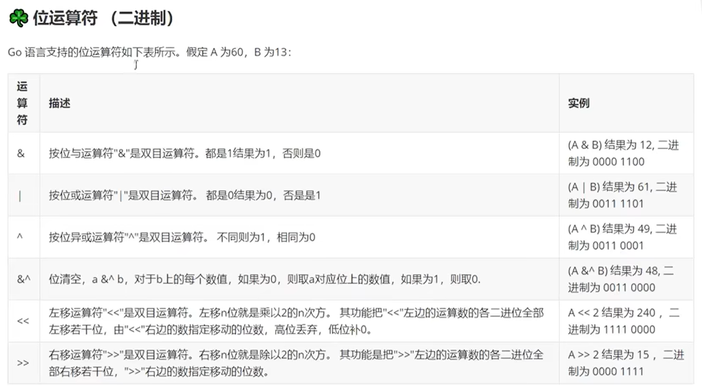
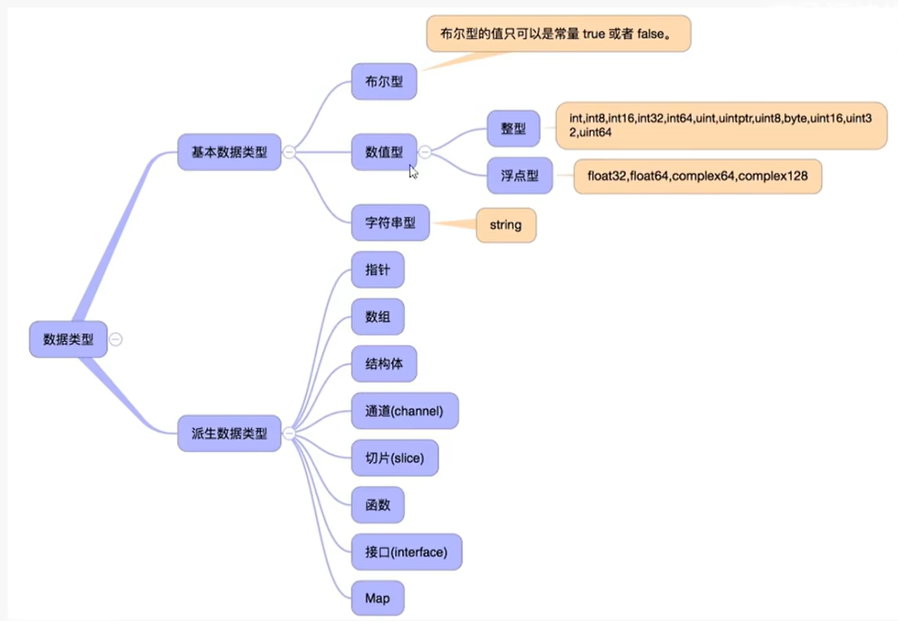
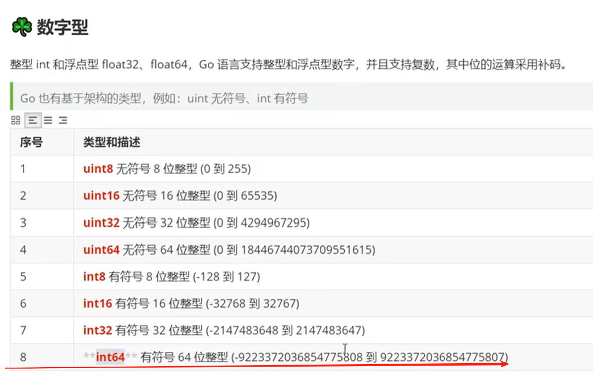
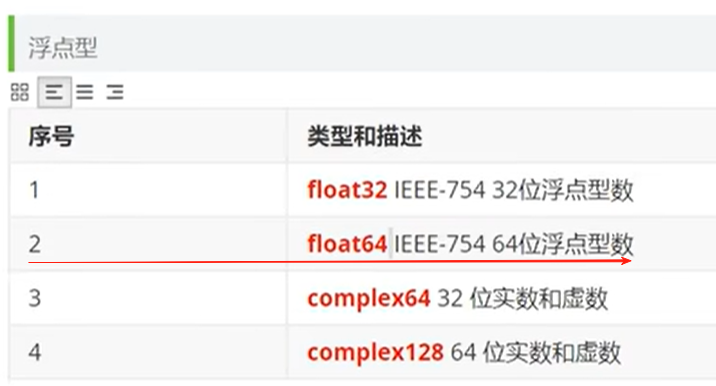
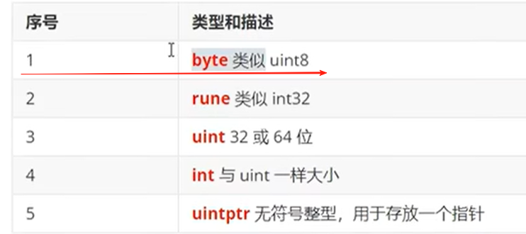

## Go语言学习
### 一个项目有且只能有一个main函数和main包\
### Go-----大型项目维护的最佳人选
#### ① Hello World
```go
package main

import "fmt"
func main() { // 这个单括号必须在这里，单独开一行会报错
    fmt.Println("Hello World!")
}
```

---

#### ② 基本的东西
// 单行注释  
/* 多行注释 */  
全局变量与局部变量：和c语言一样，就近原则也一样  
**变量定义**：var 变量名 数据类型 = 值
```go
package main
import "fmt"
func main() {
    
    var name string = "张三" // var 声明变量关键字 name 变量名 string 数据类型 = 值 name开辟一块地址，跟c语言一样
    var age int = 18
    fmt.Println("name:", name, "age:", age) // 变量定义了就要使用，不然会报错
    var isFlag bool = true  
    fmt.Printf("isFlag: %T, %t \n", isFlag, isFlag) // %T 打印类型 %t打印值
    
    var ( // 多个定义
		name1 string
		age1  int
		addr  string
	)
    name1 = "xx" // 赋值
	age1 = 22
	addr = "China"
	fmt.Println(name1, age1, addr)

	// var name string
	// name := "ss" -> 报错，因为上面已经定义/声明过name了
	name2 := "Bob"
	age2 := 12
	fmt.Println(name2, age2)
    fmt.Printf("name:%s, age:%d\n", name2, age2)

    var num int // 先声明
	num = 100
	fmt.Printf("num:%d\n, 内存地址:%p", num, &num) // 取地址符&

	// 常量const
    const URL string = "http://www.baidu.com"  // 显式定义
	const URL2 string = "http://www.baidu.com" // 隐式定义
	const f, g, h = 3.14, "sss", false         // 同时定义多个常量
	fmt.Println(URL, URL2, f, g, h)

    // iota
    const ( // iota 类似于c的枚举，从0开始
		ab = iota // iota 0   = 0
		ac // iota 1   = 1
		ad // iota 2   = 2
		ae = "haha" // iota 3
		af // iota 4   = "haha"  沿袭
		ag = 100  // iota 5  = 100 
		ah        // iota 6  = 100  沿袭
		aj = iota // iota 7  = 7 又恢复了
		i // iota 8  = 8 接着上面继续
	)
	const (
		ak = iota // 下一组的时候又从0开始了
		al = iota // = 1
	)
}
```
- 默认值
  1. string：空   
  2. int：0   
  3. float:0.0   
  4. bool：False  
  5.  切片，函数，指针变量：nil  

**:= 自动推导 短变量声明并初始化**
1. 不可提供数据类型 
2. 只能用在函数内部 
3. 必须只能是新变量才可赋值  

```go
package main
import "fmt"
func main() {
    // 变量交换
	var a int = 100
	var b int = 200
	b, a = a, b
	fmt.Printf("%d, %d\n", a, b)  // 对，跟python一样就这么简单
}
```

**运算符：** 很多，什么赋值运算符，比较运算符什么的，都跟python一样，这里说一下不怎么样的位运算符(二进制):


**输入与输出：** fmt包

1. 输出：
   - fmt.Println()  打印换行
   - fmt.Print()  打印
   - fmt.Printf()  格式化打印
2. 输入： 记得用去地址符&
   - fmt.Scanf() 没啥特别的，就是输入
   - fmt.Scan() 从标准输入读取由空白符分割的值 且不会因为遇到换行符而停止
   - fmt.Scanln() 与Scan()类似 但是会因为遇到换行符而停止

**分支结构:** 
1. if/else if/else 不用括号了
```go 
if score >= 90 && score <= 100 {
	fmrt.Println("A")
} else if score >= 80 && score < 90 {
	fmt.Println("B")
} else if score >= 70 && score < 80 {
	fmt.Println("C")
} else if score >= 60 && score < 70 {
	fmt.Println("D")
} else {
	fmt.Println("E")
}
// 多层嵌套 就近原则
if a == pwd {
	fmt.Println("请再次输入密码:")
	fmt.Scanln(&b)
	if b == pwd {
		fmt.Println("密码正确")
	} else {
		fmt.Println("密码错误")
	}
} else {
	fmt.Println("密码错误")
}
```
2. switch/case
```go
// 匹配 case
switch score {
	case 90:
	fmt.Println("A")
	case 80:
	fmt.Println("B")
	case 50, 60, 70:
	fmt.Println("C")
	default:
	fmt.Println("D")
}
	// switch 默认的条件 bool = true
switch {
	case false:
	fmt.Println("false")
	case true:
	fmt.Println("true")
	default:
	fmt.Println("default")
}
	// 运行结果：true

	// 这里没有延续C语言的一贯到底的作风(自带break属性），但是有个fallthrough，一键开启一贯到底（
switch score {
	case 90:
	fmt.Println("A")
	fallthrough  // 继续执行下一个case
	case 80:
	if score == 90{
		break
	}
	fmt.Println("B")
	fallthrough
	case 50, 60, 70:
	fmt.Println("C")
	default:
	fmt.Println("D")
}
```

**基本数据类型：**(内存空间分配的大小是不同的)

说实话，这些跟c语言真的很像啊



看范围就OK
```go
package main
import "fmt"

func main() {
	// 定义一个整型
	// byte uint8
	// rune int32
	// int int64
	var agr int = -200
	fmt.Printf("%d, %T\n", agr, agr)

	// 定义一个浮点型
	// 默认是六位小数打印 3.140000
	var money = 3.19
	fmt.Printf("%.1f, %T\n", money, money)  // 一位小数
	// 有个比四舍五入复杂的取舍方法
	// 首先满足基本的四舍五入，但是，如果是5的话，需要看后面是不是还有非0数字
	// 3.141501, %.3f是3.142,
	// 3,14150, %.3f是3.141,
	// 3.1415, %.3f是3.141,
	// 3.14151, %.3f是3.142

	// float64 尽量使用float64来定义
	var money2 float64 = -123.0000891  // 不会丢失精度
}
```

**循环结构：**
1. for循环 跟c语言又一样了，就少了个括号
```go
package main
import "fmt"

func main() {
	for i := 0; i < 10; i++ {
		fmt.Println(i)
	}
	// 简洁版
	i := 1
	for ; i <= 10; {  // 这个分号别忘记了
		fmt.Println(i)
		i++  // 忘了说了，这里没有++i
	}
	// 99乘表
	for j := 1; j <= 9; j++ {
		for i := 1; i <= j; i++ {
			fmt.Printf("%d * %d = %d\t", j, i, j*i)
			}
		fmt.Println()
	}

	// 获取字符串的长度 len
	fmt.Println(len("hello"))
	// 获取字符串的某个字符
	fmt.Println("hello"[0])
	fmt.Println("%c", "hello"[0])  // 这里单个字符说明一下：''单引号代表一个字符，""双引号代表一个字符串，字符是char类型，字符串是string类型，然后这个字符呢不会打印出来字母，而是打印出来ascii码
	
	// for range循环，遍历数组，切片...
	// for i, v := range "hello" {  // 这里i是索引，v是值}
	for i, v := range "hello" {
		fmt.Println(i, v)
	}
}

```

**函数基础：**
```go
package main

import "fmt"
/*
- 函数是基本的代码块，用于执行一个任务。
- Go 语言最少有个 main()函数。
- 你可以通过函数来划分不同功能，逻辑上每个函数执行的是指定的任务
- 函数声明告诉了编译器函数的名称，返回类型，和参数。
*/

func main() {
	fmt.Println("hello,world")
	// 调用函数 函数名()
	fmt.Println(add(1, 2))
}
//func 函数名(参数，参数...) 函数调用后的返回值 {
// 函数体 : 执行一段代码
// return 返回结果
//}
func add(a,b int) (int) {
	c := a + b
	return c
}
// 无参无返回值函数
func printinfo() {
	fmt.Println("hello,world")
}
// 有一个参数的函数
func myprint(msg string) {
	fmt.Println(msg)	
}
func myprintnum(int num) {
	fmt.Println(num)
}
// 多个参数的函数
func add2(a, b int) int {
	c := a + b
	return c
}
// 多个返回值的函数
func swap(a, b int) (int, int) {
	return b, a
}
// 形参与实参要一一对应，顺序，个数，类型 （跟C语言理解一样，这里不再赘述）

// ... 可变参数 个数不定
// getSum(1, 2, 3, 4, 5, 3, 6, 1, 100...)
func getSum(nums ...int) int {
	sum := 0

	for i := 0; i < len(nums); i++ {
		fmt.Println(nums[i])
		sum += nums[i]
	}

	fmt.Println("sum:"sum)
}

// 可变参数+其他参数，则可变参数必须放在最后
// 最多一个可变参数
```
**参数传递**
- **值类型**的数据：传递的是值，函数内部对参数的修改不会影响外部 int string bool float64 array struct ...
- **引用类型**的数据：操作的是数据的地址 slice map channel...

一般来说，值传递就是copy了一份给函数
```go
package main
import "fmt"
func main() {
	arr := [5]int{1,2,3,4,5}
	fmt.Println(arr) // [1,2,3,4,5]
	update(arr)
	fmt.Println(arr) // [1,2,3,4,5] arr没被改变
	// 切片 可以扩容的数组
	s1 := []int{1,2,3}
	fmt.Println(s1)
	update2(s1)
	fmt.Println(s1) // 没变
}

func update(arr2 [5]int) {
	fmt.Println(arr2)
	arr2[0] = 100
	fmt.Println(arr2) // [100,2,3,4,5] 但不会影响外面的arr
}
func update2(s2 []int) {
	fmt.Println(s2)
	s2[0] = 100
	fmt.Println(s2) //不会影响外面的arr
}
```
**作用域** 其实又跟C语言差不多...  
局部变量记得就近原则  
**defer** 延迟执行  
可以在函数中添加多个defer语句，当函数执行到最后是这些defer语句会按照**逆序执行**（栈）
```go
package main
import "fmt"

func main() {
	f("1")
	fmt.Println("2") 
	defer f("3")  // 会延迟到最后执行
	fmt.Println("4")
	defer f("5")
	fmt.Println("6")
	defer f("7")
	// 1 2 4 6 7 5 3
}
func f{s string} {
	fmt.Println(s)
}
```
需要注意的是，你defer的时候参数已经传入进去了，只是会放在最后执行而已
```go
package main
import "fmt"
func main() {
	a := 10
	fmt.Println(a) // 10
	defer f(a)
	a++
	fmt.Println(a) // 11
}
func f(a int) {
	fmt.Println("函数里的a:", a) // 10
}
```
函数在Go语言里是复合类型，可以看作是一种特殊的变量  
- 函数名(): 调用返回结果
- 函数名： 指向函数体的内存地址，一种特殊类型的指针变量

```go
package main
import "fmt"

// func() 本身就是一个数据类型
func main() {
	// f1 如果不加括号，函数就是一个变量
	// f1() 如果加了括号那就成了函数的调用
	fmt.Println("%t\n", f1) // func() 
	// 定义函数类型的变量
	var f5 func(int, int)
	f5 = f1
	fmt.Println(f5) // 打印出来是地址
	fmt.Println(f1) // 这俩打印出来地址是一样的
	f5(1, 2)
}

func f1(a, b int) {
	fmt.Println(a, b)
}
```
**匿名函数**(一次性)
```go
package main
import "fmt"
func main() {
	f1()
	f2 := f1() // 函数本身也是一个变量
	f2()

	// 匿名函数
	f3 := func() {
		fmt.Println("匿名函数")
	}
	f3()

	// 匿名函数自己调用自己
	func() {
		fmt.Println("匿名函数自己调用自己")
	}() // 括号表示匿名函数调用
}
```
**闭包**(函数嵌套) 高阶函数与回调函数  
- **高阶函数**：可以接受一个函数作为参数  
- **回调函数**：函数作为参数传递给另一个函数
```go
package main
import "fmt"
func main() { 
	r1 := add(1, 2)
	fmt.Println(r1)

	r2 := add(3, 4, add)
	fmt.Println(r2)
}

func oper(a, b int, fun func(int, int) int) int {
	r := fun(a, b)
	return r
}

func add(a, b int) int {
	return a + b
}
/*
一个外层函数中，有内层函效，该内层函数中，会作外层函效的局部变量并且该外层函效的返回值就是这个内层函效。
这个内层函效和外层函效的局部变量，统称为闭包结构.
局部变量的生命周期就会发生改变，正常的局部变量会随着函效的调用而创建，随着函数的结束而销毁
但是闭包结构中的外层函效的局部变量并不会随着外层函数的结束而销毁，因为内层函数还在继续使用
底
如下例：

	v1 := r1()
	fmt.Println(v1) // 1
	v2 := r1()
	fmt.Println(v2) // 2
	fmt.Println(r1()) // 3
	fmt.Println(r1()) // 4
	fmt.Println(r1()) // 5

	r2 := increment()
	v3 := r2()
	fmt.Println(v3) // 1
	fmt.Println(r1()) // 6
	fmt.Println(r2()) // 2
```