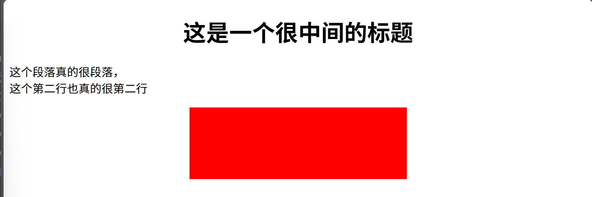
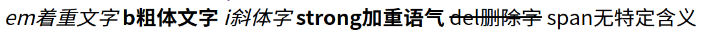
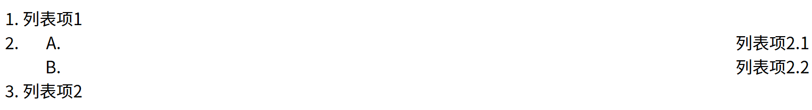
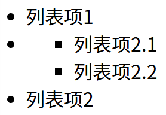
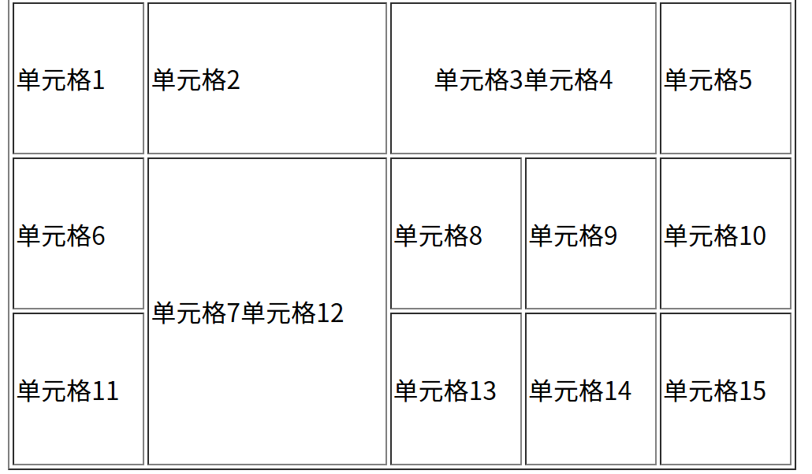
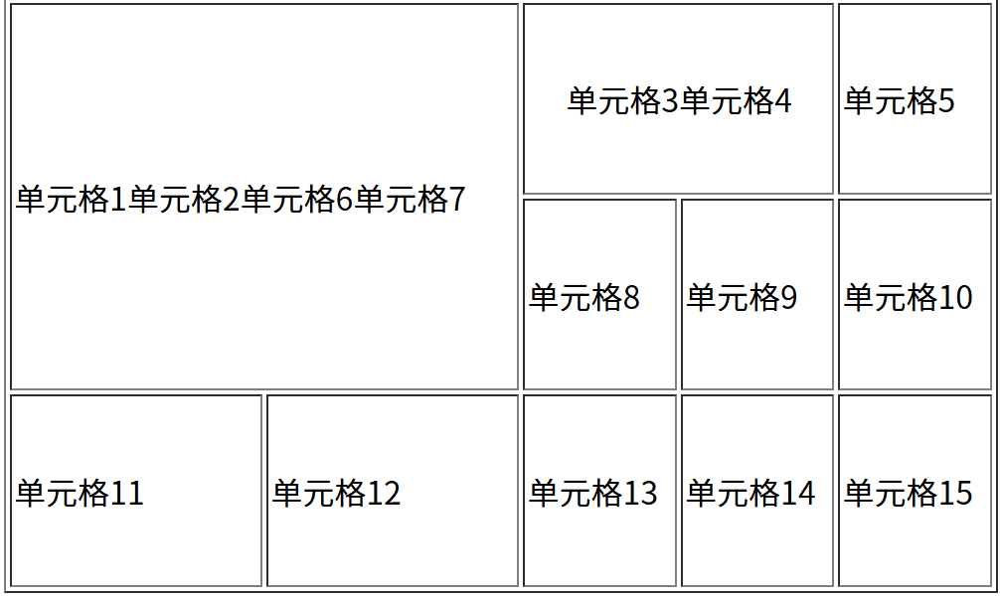
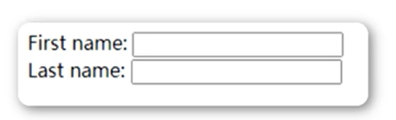
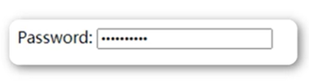

### HTML
#### ① 介绍与标签
- **介绍:** HTML5是用来描述网页的一种语言，被称为超文本标记语言，用HTML5编写文件，后缀以.html结尾  
- HTML是一种**标记**语言，标记语言是一套标记标签。标签是由尖括号包围的关键字，例如\<html>

标签有两种表现形式:
1. 双标签，例如\<html>\</html>
2. 单标签，例如\

第一个网页
```html
<html>
	<head>
		<title>我的第一个网页</title>
	</head>
	<body>
		Hello, 我的第一个网页
	</body>
</html>
```
1. **DOCTYPE声明**——不是基础骨架标签  
- DOCTYPE时document type的缩写，表示文档类型。  
\<!DOCTYPE html>是H5的声明位于文档最前面，处于标签之前。（避免浏览器怪异模式）  

基本骨架：
\<html>  
	\<head> \</head>  
	\<body> \</body>  
\</html>

快速生成个骨架的快捷键: **!+enter** 如下
```html
<!DOCTYPE html>
<html lang="en">
<head>
    <meta charset="UTF-8">
    <meta name="viewport" content="width=device-width, initial-scale=1.0">
    <title>Document</title>
</head>
<body>
    
</body>
</html>
```
2. **html标签**
- 定义HTML文档，这个元素浏览器看到后就明白这个是HTML文档了，所以你的其他元素要包裹在这里面，标签限定了文档的开始点和结束点

3. **head标签**
- head标签是HTML文档的头部，里面放置的是文档的元数据（各种属性和信息），包括文档的标题、在Web中的位置以及和其他文档的关系等等。这些信息**不会显示在网页上**，但是会为浏览器和搜索引擎提供信息。

4. **body标签**
- body元素定义文档的主体。body元素包含所有**可见**的元素，比如标题、段落、图像、表格、列表等等。
```html
<!DOCTYPE html>
<html>
	<head>
	</head>
	<body>
		我会显示在浏览器中
	</body>
</html>
```

5. **title标签**
- 1. 可定义文档的标题
- 2. 可显示在浏览器窗口的标题栏活状态栏上
- 3. \<title>标签是\<head>标签中唯一一个必须要求包含的东西
- 4. 有利于SEO（搜索引擎优化）优化。通过对网站 内容调整，满足搜索引擎排名需求
```html
<!DOCTYPE html>
<html>
	<head>
		<title>第一个页面</title>
	</head>
	<body>
		我会显示在浏览器中
	</body>
</html>
```

6. **meta**标签
- 用来描述一个HTML网页文档的属性，关键词等等。
- 就像下面说编码格式的例子一样:
```html
<!DOCTYPE html>
<html lang="en">
	<head>
		<meta charset="UTF-8">
		<title>第一个页面</title>
	</head>
	<body>
		我会显示在浏览器中
	</body>
</html>
```

---

#### ②标题
Heading是通过\<h1>-\<h6>标签来定义的。  
\<h1>最大，\<h6>最小

- 生成h1-h6快捷键：h$*6
```html
<h1>一级标题</h1>
<h2>二级标题</h2>
<h3>三级标题</h3>
<h4>四级标题</h4>
<h5>五级标题</h5>
<h6>六级标题</h6>
```
确保标题只用于标题。  
在标签中添加属性: align="left|center|right" 来**改变标题标签位置摆放**   
默认居左
```html
<body>
    <h1 align="center">
        这是一个很中间的标题
    </h1>
```

---

#### ③ 标签之段落、换行、水平线
1. 段落是通过\<p>标签定义的
```html
<p>这是一个段落</p>
<p>这是第二个段落</p>
```
2. 换行是通过<br>标签定义的 标准写法：`<br />` 这是一个空的HTML元素
```html
<p>这个<br>段落<br>演示了分行的效果</p>
这个
段落
演示了分行的效果
```
3. 水平线是通过<hr/>标签定义的
```html
<hr color="" width="" size="" align=""/>
```
- 属性
- 1.  color:设置水平线的颜色
- 2.  width:设置水平线的长度
- 3.  size:设置水平线的高度
- 4.  align:设置水平线的对齐方式(默认居中)， 可取left|right

```html
<h1 align="center">
        这是一个很中间的标题
    </h1>
    <p>这个段落真的很段落，<br>这个第二行也真的很第二行</p>
    <hr color="red" width="300px" size="100px" >
```
px是像素的意思  
效果图如下：


---

#### ④ 图片——网站中最多的元素
\标签定义HTML页面中的图像  
这玩意是单标签，不需要进行闭合操作哈
```html

```
- 属性：
- 1. src：路径（图片地址与名字）
- 2. alt：规定图像的替代文本（路径不对的时候显示这个东西）
- 3. width：规定图像的宽度
- 4. height：规定图像的高度
- 5. title：鼠标悬停在图片上给予提示

那路径肯定有相对路径与绝对路径啦，随便提一嘴：  
1. 绝对路径：电脑盘符存储与访问的具体地址
2. 相对路径：
   - 1. 子级关系：/
   - 2. 父级关系：../
   - 3. 同级关系：./

```html

```
一般设置width就可以了，不然图片会被拉伸不好看了

---

#### ⑤ 超链接
在标签\<a>中使用了**href**属性来描述链接的地址

默认情况下，链接将以下形式出现在浏览器中:
1. 一个未访问过的链接显示为蓝色字体并带有下划线
2. 访问过的链接显示为紫色并带有下划线。
3. 点击链接时，链接显示为红色并带有下划线。
- **特别提示**
后期我们会通过CSS样式修改掉这些效果
- 表现：鼠标放到链接上时会变成一只小手
```html
<p>你点这个会有惊喜：
	<a href="file:///C:/Users/Hao/Desktop/Notebook/html+css+js+vue/HTML/Cheat.html">
        surprise
    </a>
</p>
```
注意a里面要写东西，不然没链接点的地方啊（img也可以哦）

---

#### ⑥ 文本标签——显示不一样的文字


| 标签     | 描述           |
|----------|----------------|
| `<em>`   | 定义着重文字   |
| `<b>`    | 定义粗体文本   |
| `<i>`    | 定义斜体字     |
| `<strong>` | 定义加重语气   |
| `<del>`  | 定义删除字     |
| `<span>` | 元素没有特定的含义 |
```html
<em>em着重文字</em>
    <b>b粗体文字</b>
    <i>i斜体字</i>
    <strong>strong加重语气</strong>
    <del>del删除字</del>
    <span>span无特定含义</span></p>
```

这个加重语气啊，就用在那种很需要关注的字上，便于维护啊（如购物商城的价格）

---

#### ⑦ 列表标签——有序列表和无序列表
1. 有序列表：  
- 这是一列项目，用数字标记。  
- 始于\<ol>标签，结束于\</ol>标签
- 每个列表项始于\<li>标签，结束于\</li\>标签
```html
<ol>
	<li>列表项1</li>
	<li>列表项2</li>
</ol>
---
1. 列表项1
2. 列表项2
```
- \<ol>标签的type属性：
- 1. 1 表示用数字标号(1,2,3...)
- 2. a 表示用小写字母标号(a,b,c...)
- 3. A 表示用大写字母标号(A,B,C...)
- 4. i 表示用小写罗马数字标号(i,ii,iii...)
- 5. I 表示用大写罗马数字标号(I,II,III...)

这些个列表都可以嵌套哟：
```html
 <ol>
	<li>列表项1</li>
	<li>
		<ol align="right" type="A">
			<li>列表项2.1</li>
			<li>列表项2.2</li>
		</ol>
	</li>
<li>列表项2</li>
</ol>
```


2. 无序列表：  
- 这是一个项目的列表，用圆点标记。
- 始于\<ul>标签，结束于\</ul>标签
- 每个列表项始于\<li>标签，结束于\</li\>标签
- 常见应用场景：
- 1. 无序的列表效果
- 2. 导航效果
```html
<ul>
	<li>列表项1</li>
	<li>列表项2</li>
</ul>
```
至于这个导航效果嘛，看下例：
```html
<ul>
	<li>Xiaomi手机</li>
	<li>华为手机</li>
	<li>苹果手机</li>
	<li>OPPO手机</li>
</ul>
```
可以呈现一个个的情况~很方便
- \<ul>的type属性：
- 1. disc 默认，用圆点标号
- 2. circle 用圆圈标号
- 3. square 用方块标号
- 4. none 无标号

列表也可以嵌套哦：
```html
<ul>
	<li>列表项1</li>
	<li>
		<ul type="square">
			<li>列表项2.1</li>
			<li>列表项2.2</li>
		</ul>
	</li>
	<li>列表项2</li>
</ul>
```


这俩列表也能**相互嵌套**~  

两个都可以的**快捷键**：
- 快速生成**ol+li**的布局，ol>li*3 (数字根据自己需要的li数量更改)
- 快速生成**ul+li**的布局，ul>li*3 (数字根据自己需要的li数量更改)

---

#### ⑧ 表格
- 组成与特点：
- 1. 行，列，单元格
- 2. 单元格特点：同行等高，同列等宽

表格标签：
- 1. \<table>标签：定义表格
- 2. \<tr>标签：定义表格行
- 3. \<td>标签：定义表格列
```html
<table border="1" width="400px" height="200px">
	<tr>
		<td>表格列1</td>
		<td>表格列2</td>
	</tr>
	<tr>
		<td>表格列1</td>
		<td>表格列2</td>
	</tr>
</table>
```
只不过这生成没有线条而已  
- 快捷键：table>tr*3>td*2{单元格} (数字，{}内的都可以自己改)
  
- 表格属性：
- 1. border：设置表格的边框宽度
- 2. width：设置表格的宽度
- 3. height：设置表格的高度
- 4. align：设置表格的排列方式（这个玩意好多其实也有，可以自己玩一玩试一试）

##### 表格单元格合并
- 合并属性：
- 1. 水平合并：colspan
- 2. 垂直合并：rowspan

直接看两个例子上手吧：
```html
<table border="1" width="500px" height="300px" align="center"> 
	<tr>
		<td>单元格1</td>
		<td>单元格2</td>
		<td colspan="2" align="center">单元格3单元格4</td>
		<td>单元格5</td>
	</tr>
	<tr>
		<td>单元格6</td>
		<td rowspan="2">单元格7单元格12</td>
		<td>单元格8</td>
		<td>单元格9</td>
		<td>单元格10</td>
	</tr>
	<tr>
		<td>单元格11</td>
		<td>单元格13</td>
		<td>单元格14</td>
		<td>单元格15</td>
	</tr>
</table>
```


你可以看到，这个合并方法很简单，就把你下一个合并的写在一起就OK了，不用再单独去写被合并的了
- 水平合并：保留左边，删除右边
- 垂直合并：保留上边，删除下边

当然横竖一起合并也同理，不过一般先行合并再列合并：
```html
<table border="1" width="500px" height="300px" align="center"> 
	<tr>
		<td colspan="2" rowspan="2">单元格1单元格2单元格6单元格7</td>
		<td colspan="2" align="center">单元格3单元格4</td>
		<td>单元格5</td>
	</tr>
	<tr>
		<td>单元格8</td>
		<td>单元格9</td>
		<td>单元格10</td>
	</tr>
	<tr>
		<td>单元格11</td>
		<td>单元格12</td>
		<td>单元格13</td>
		<td>单元格14</td>
		<td>单元格15</td>
	</tr>
</table>
```


---

#### ⑨ Form表单
表单在Web网页用来给用户输入数据，比如用户名，密码，邮箱等等。  
所有的**用户输入**内容都用表单来提交。


表单由容器和控件组成，一般包含输入框与提交按钮等等。这些输入框，按钮就叫做空间，表单就是容器，它能够容纳各种各样的控件。
```html
<form action="url" method="get|post" name="表单名"></form>
```
- 属性说明：
- 1. action：表单提交的目标地址
- 2. method：表单提交方式，get或post
  - get：提交数据时，数据将显示在URL中，get方式数据量小，不安全
  - post：提交数据时，数据将不会显示在URL中，post方式数据量大，安全
- 3. name：表单名称


- 表单元素：
- 1. 表单标签
- 2. 表单域
- 3. 表单按钮
  
下面有两个常用的表单：
1. 文本框：  文本域通过\<input type="text">标签来设定
```html
<form>
	first name: <input type="text" name="firstname">
	<br>
	last name: <input type="text" name="lastname">
</form>
```


2. 密码框：密码字段通过标签\<input type="password">来设定

```html
<form>
	Password: <input type="password" name="pwd">
</form>
```

