### Pytorch入门教学
[【PyTorch深度学习快速入门教程（绝对通俗易懂！）【小土堆】】](https://www.bilibili.com/video/BV1hE411t7RN?p=13&vd_source=1e683c3cb93400956a910790b98ffccb)

#### ① 两大活宝函数dir()与help()

顾名思义，这张图首先将pytorch放入package包中，里面包括了1，2，3，4四个模块的内容。  
```python
dir(pytorch)  # 输出1，2，3，4
dir(pytorch.3)  # 输出a,b,c
help(pytorch.3.a)  # 输出a的详细内容(告诉你这玩意怎么使用)
```
- **总结**  
1. dir()函数，能让我们知道工具箱以及工具箱中的分隔区有什么东西
2. help()函数，能让我们知道每个工具是如何使用的，工具的使用方法

---

#### ② Dataset
首先区分Dataset与DataLoader，如图：

即前者是告诉我们数据在哪里以及是什么，后者是加载数据集（打包）  
简单实现读取图片：
```python
from torch.utils.data import Dataset
import os
from PIL import Image
class MyData(Dataset):
    def __init__(self, root_dir, label_dir):
        self.root_dir = root_dir
        self.label_dir = label_dir
        self.path = os.path.join(self.root_dir, self.label_dir)
        self.img_path = os.listdir(self.path)

    def __getitem__(self, idx):
        img_name = self.img_path[idx]
        img_item_path = os.path.join(self.root_dir, self.label_dir, img_name)
        img = Image.open(img_item_path)
        label = self.label_dir
        return img, label

    def __len__(self):
        return len(self.img_path)

root_dir = "D:\\python-learning\\pythonProject3\\hymenoptera_data\\train"
ants_label_dir = "ants"
bees_label_dir = "bees"
ants_dataset = MyData(root_dir, ants_label_dir)
bees_dataset = MyData(root_dir, bees_label_dir)
train_dataset = ants_dataset + bees_dataset
img, label = train_dataset[124]
img.show()
```
1. **__init__函数**: 
- 1. 将根目录和标签目录拼接成完整路径（self.path）。
- 2. 使用 os.listdir(self.path) 获取该目录下所有图像文件的文件名列表（self.img_path）。
- 3. 初始化时完成数据集的基本配置，例如路径和标签。
2. **__getitem__函数**:
- 根据索引 idx 返回数据集中的一张图像及其对应的标签。
3. **__len__函数**: 
- 返回数据集的总样本数量（即图像的数量）  

核心就在这三个**超函数**上。

---

#### ③ Tensorboard  
这里主要使用SummaryWriter，日志使用工具
```python
from torch.utils.tensorboard import SummaryWriter
import numpy as np
from PIL import Image
writer = SummaryWriter("logs")
image_path = r"D:\python-learning\pythonProject3\hymenoptera_data\train\bees\39747887_42df2855ee.jpg"
img_PIL = Image.open(image_path)
img_array = np.array(img_PIL)
# 从PIL到Numpy,需要在add_image()中制定shape中每一个数字/维的含义
print(type(img_array)) # array类型
print(img_array.shape)
writer.add_image("img", img_array, 1, dataformats='HWC')  # 这里你看官方文档，第二个是需要传入numpy数组/pytorch张量
# numpy默认格式是HWC，pytorch默认是CHW
for i in range(100):
    writer.add_scalar("y=x", 2*i, i)

writer.close()
```
注意：tensorboard需要在终端里输入logdir=事件文件所在文件夹名  
对于上述代码，就是"tensorboard --logdir=logs"  
- 其他add_...函数：
  1. add_image() 放照片 tensor/numpy.ndarray
  2. add_text() 放文本 str
  3. add_graph() 放网络结构 torch.nn.Module
  4. add_histogram() 放直方图(张良分布情况)
  5. add_scalar() 放标量 float

这是一个简单用**tensorboard**加载数据集的例子

```python
import torchvision
from torch.utils.tensorboard import SummaryWriter

dataset_transform = torchvision.transforms.Compose([
    torchvision.transforms.ToTensor()
])
train_set = torchvision.datasets.MNIST(root="./dataset", train=True, transform=dataset_transform, download=True)
test_set = torchvision.datasets.MNIST(root="./dataset", train=False, transform=dataset_transform, download=True)
print(test_set[0])  # 这是个tensor类型的图片

writer = SummaryWriter("logs")
for i in range(12):
    img, target = test_set[i]
    writer.add_image("Test_set", img, i)
    print(target)

writer.close()
```

---

#### ④ Transforms  
简单说就像这张图片所说：  
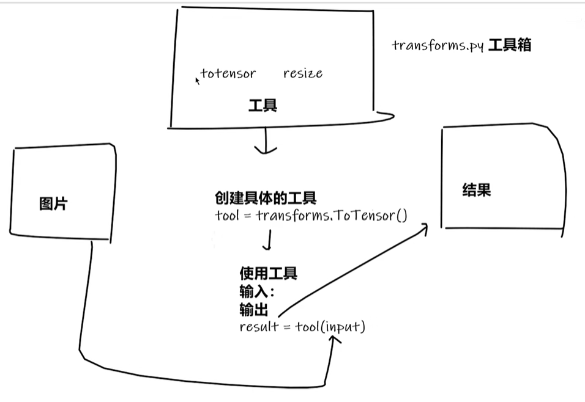
transforms，字如其名，就是数据预处理，比如**resize，normalize**等等。（转换器）  
首先有个__call__()方法：  
核心作用是 让类的实例像函数一样被调用。当你在类中定义 __call__ 方法后，该类的实例就可以直接通过 () 来调用，就像普通函数一样。  
调用方式：实例名直接加括号，如 obj()，会自动触发 __call__ 方法。
```python
class Person:
    def __call__(self, name):
        print("__call__" + "Hello" + name)
    
    def hello(self, name):
        print("Hello" + name)

person = Person()
person("Tom")  # __call__ HelloTom
person.hello("Tom")  # HelloTom
```
Transforms简单使用：
```python
from torchvision import transforms
from PIL import Image
from torch.utils.tensorboard import SummaryWriter
img_path = r"D:\python-learning\pythonProject3\hymenoptera_data\train\bees\17209602_fe5a5a746f.jpg"
img = Image.open(img_path)
# print(img)
writer = SummaryWriter("logs")
# 1. transforms的使用
tensor_trans = transforms.ToTensor()
tensor_img = tensor_trans(img)  # 转化为张量形式

writer.add_image("Tensor_img", tensor_img)

writer.close()
# 2. 为什么需要tensor数据类型
# -> 包装了一些神经网络需要的参数

```

一些常见的Transforms
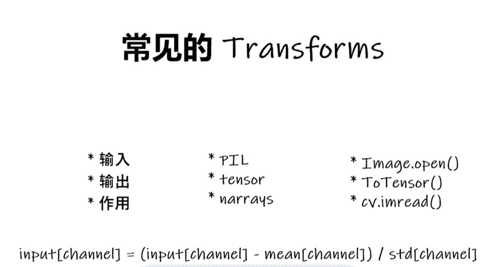
最下面这个公式是**transforms.Normalize**的计算公式，这里有对他的一些介绍：  
- 输入：一个形状为 (C, H, W) 的张量（CHW 格式），其中：
- 输出：标准化后的张量，每个通道的均值为 0，标准差为 1
```python
# 参数说明：
torchvision.transforms.Normalize(mean, std, inplace=False)
# mean：每个通道的均值（列表或元组），例如 [0.485, 0.456, 0.406]（对应 RGB 三个通道）
# std：每个通道的标准差（列表或元组），例如 [0.229, 0.224, 0.225]
# inplace：是否在原始张量上进行修改（默认 False，不修改原张量）
# -> 用另一个变量存储这个新的张量
```
为什么要用：
1. **标准化图像数据**：将图像像素值从 [0, 1] 或 [0, 255] 转换为均值为 0、标准差为 1 的分布。
2. **模型输入要求**：大多数预训练模型（如 ResNet、VGG）的输入数据需要经过 Normalize 处理，因为这些模型在训练时使用了特定的 mean 和 std。
3. **加速训练**：标准化后，数据分布更均匀，有助于神经网络更快收敛  

以下是常见的Transforms的运用，包括但不限于**ToTensor,Normalize,Resize,Compose,RandomCrop**  
其中Compose的用法点一下:
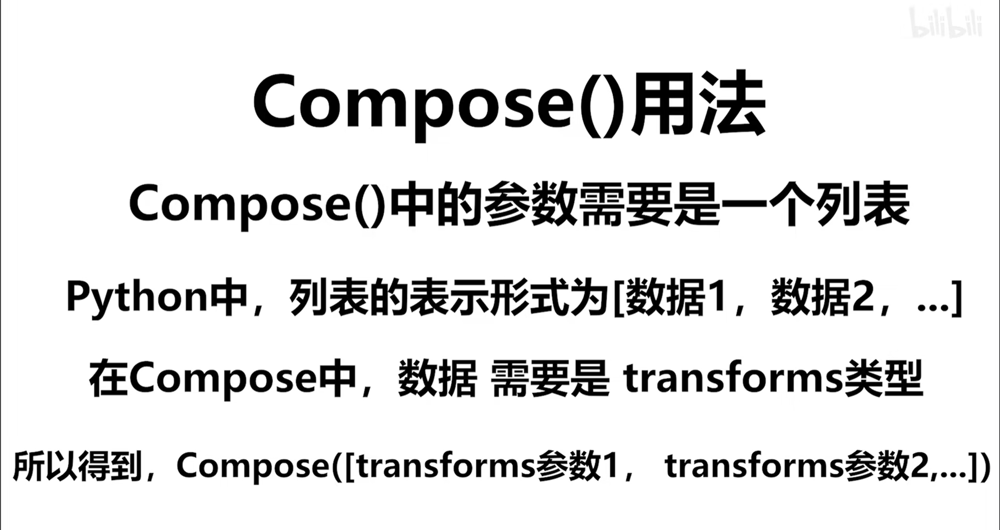
```python
from PIL import Image
from torch.utils.tensorboard import SummaryWriter
from torchvision import transforms

writer = SummaryWriter("logs")
img = Image.open(r"D:\python-learning\pythonProject3\20210614073808_64a08.jpeg")
print(img)

# ToTensor
trans_totensor = transforms.ToTensor()
img_tensor = trans_totensor(img)
writer.add_image("ToTensor", img_tensor)

# Normalize
print(img_tensor)
print(img_tensor[0][0][0])
trans_norm = transforms.Normalize([1, 1, 1], [1, 1, 1])
img_norm = trans_norm(img_tensor) # 需要传入tensor类型
print(img_norm[0][0][0])
writer.add_image("Normalize", img_norm, 2)

writer.close()

# Resize -> 两种缩放模式
print(img.size)
trans_resize = transforms.Resize((512, 512))
# img PIL -> resize -> img_resize PIL
img_resize = trans_resize(img)
# img_resize PIL -> totensor -> img_resize tensor
img_resize = trans_totensor(img_resize)
writer.add_image("Resize", img_resize, 0)
print(img_resize)

# Compose - resize - 2 (就是把上面两步合二为一)
trans_resize_2 = transforms.Resize(512)  # 等比缩放
# PIL -> PIL -> tensor
trans_compose = transforms.Compose([trans_resize_2, trans_totensor])
img_resize_2 = trans_compose(img)
writer.add_image("Resize", img_resize_2, 1)

# RandomCrop -> 随机裁剪
trans_random = transforms.RandomCrop((500, 1000))
trans_compose_2 = transforms.Compose([trans_random, trans_totensor])
for i in range(15):
    img_crop = trans_compose_2(img)
    writer.add_image("RandomCropHW", img_crop, i)
```

#### ⑤ Dataloader
基本运作方式如下图：打包数据，然后进行迭代
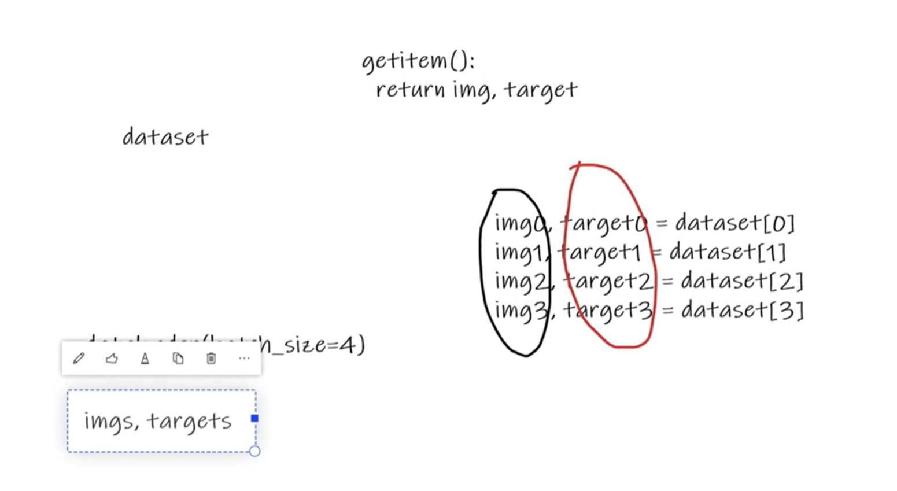

有很多个参数，可以自己打开Dataloader看看，这里介绍一下用的比较多的：
1. **batch_size:** 批次大小
2. **shuffle:** 是否打乱数据
3. **num_workers:** 多线程处理数据（windows 需要设置成0），也就是不用动
4. **drop_last:** 最后一个批次的数据是否丢弃 默认为False 
    1. 如果是**True**，则丢弃最后一个批次的数据
    2. 如果是**False**，则将最后一个批次的数据填充到batch_size，然后丢弃
```python
import torchvision

# 准备的测试数据集
from torch.utils.data import DataLoader
from torch.utils.tensorboard import SummaryWriter

test_data = torchvision.datasets.MNIST("./dataset", train=False, transform=torchvision.transforms.ToTensor())

test_loader = DataLoader(dataset=test_data, batch_size=64, shuffle=True, num_workers=0, drop_last=True)

# 测试数据集第一张图片及target
img, target = test_data[0]
print(img.shape)
print(target)
writer = SummaryWriter("dataloader")
for epoch in range(2):  # 训练批次
    step = 0
    for data in test_loader:  # 遍历数据集
        imgs, targets = data  # 打包好的数据
        # print(imgs.shape)
        # print(targets)
        imgs_nhwc = imgs.permute(0, 2, 3, 1)  # 维度重排
        writer.add_image(f"Epoch:{epoch}", imgs_nhwc, step, dataformats='NHWC')
        step += 1

writer.close()
```

---

#### ⑥ nn.Module
**nn.Module**：nn.Module是所有神经网络的基类，所有神经网络都是继承这个类，然后实现forward方法，这个方法就是神经网络的前向传播过程，**这个方法必须实现，否则会报错**。
```python
import torch
from torch import nn

class Simple_nn(nn.Module):
    def __init__(self):
        super().__init__()

    def forward(self, input):
        output = input + 1
        return output

simple_nn = Simple_nn()
x = torch.tensor(1.0)
output = simple_nn(x)
print(output)
```

---

#### ⑥ Convolution Layers 卷积层
最简单的说法：提取特征、降维
运作方式如下图：
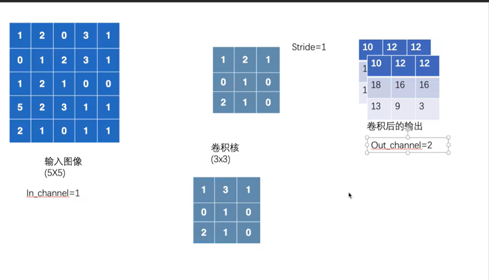
从官网找到的基本参数与计算shape的公式：
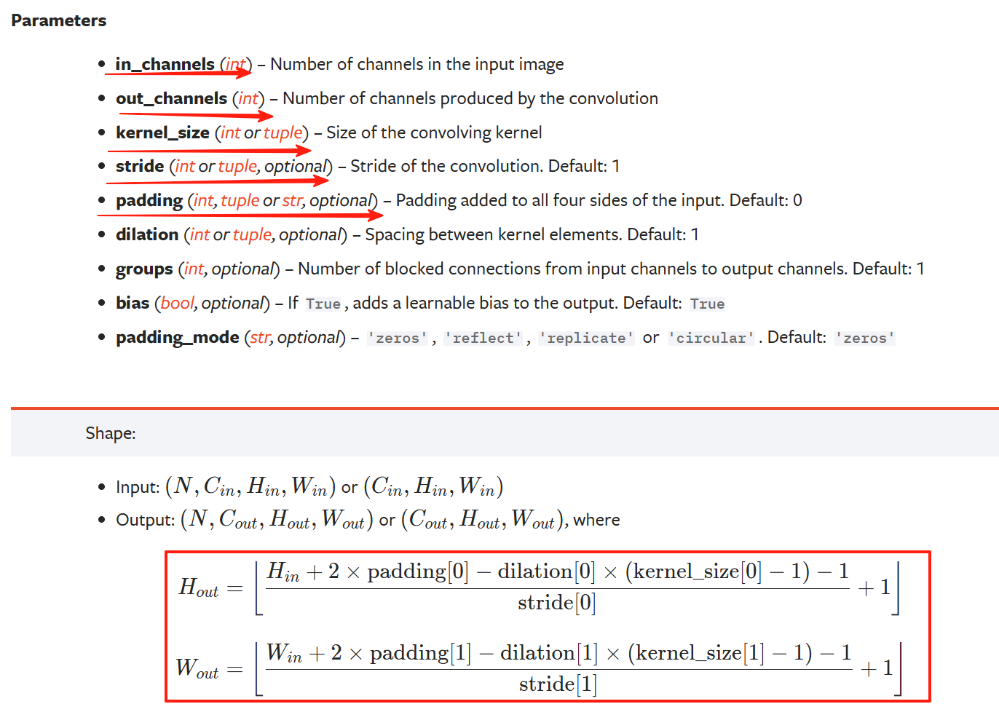
**通道**：图片的颜色通道，如RGB图片的通道数为3，灰度图片的通道数为1 可以理解为图片的维度
1. **in_channels:** 输入通道数，即输入图片的通道数
2. **out_channels**：输出通道数，即输出图片的通道数
3. **kernel_size：** 卷积核大小，即卷积核的宽高，也可以是tuple，如(3,3)
4. **stride：** 步长，即卷积核移动的步长，默认为1
5. **padding**：填充，即卷积核移动时，填充的像素数，默认为0
6. **dilation：** 空洞卷积，即卷积核移动时，卷积核的间隔数，默认为1  

有个图片：这是设置为2的时候
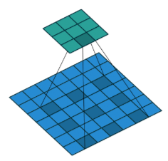

也就是说，卷积层会改变**通道数** -> 
1. 更多输出通道 = 更多特征检测器 = 更丰富的特征表示
2. 深度网络中通过增加通道数来学习更复杂的特征  


```python
import torch
import torch.nn.functional as F

input = torch.tensor([[1, 2, 0, 3, 1],
                      [0, 1, 2, 3, 1],
                      [1, 2, 1, 0, 0],
                      [5, 2, 3, 1, 1],
                      [2, 1, 0, 1, 1]])

kernel = torch.tensor([[1, 2, 1],
                       [0, 1, 0],
                       [2, 1, 0]])

input = torch.reshape(input, (1, 1, 5, 5))  #NCHW
kernel = torch.reshape(kernel, (1, 1, 3, 3))

print(input.shape)
print(kernel.shape)

output = F.conv2d(input, kernel, stride=1)
print(output)

output2 = F.conv2d(input, kernel, stride=2)
print(output2)

output3 = F.conv2d(input, kernel, stride=1, padding=1)
print(output3)
```
简单运用：  
在reshape的时候，自己不会算batch_size不要紧，设置为 **-1** 他会帮你算的

```python
import torch
import torchvision
from torch import nn
from torch.nn import Conv2d
from torch.utils.data import DataLoader
from torch.utils.tensorboard import SummaryWriter
from torchvision.utils import make_grid

dataset = torchvision.datasets.MNIST("./dataset", train=False, transform=torchvision.transforms.ToTensor(), download=True)

dataloader = DataLoader(dataset, batch_size=64)

class Simple_nn(nn.Module):
    def __init__(self):
        super(Simple_nn, self).__init__()
        self.conv1 = Conv2d(in_channels=1, out_channels=6, kernel_size=3, stride=1, padding=0)
        # MNIST 是单层灰度图像，跟彩色不一样，所以in_channels调为1

    def forward(self, x):
        x = self.conv1(x)
        return x

simple_nn = Simple_nn()

step = 0
writer = SummaryWriter("nn.cov2")
for data in dataloader:
    imgs, targets = data
    output = simple_nn(imgs)
    # print(imgs.shape)
    # print(output.shape)
    # writer.add_image("input", imgs, step, dataformats="NCHW")
    # output = torch.reshape(output, (-1, 3, 30, 30))
    # writer.add_image("output", output, step, dataformats="NCHW")
    # step += 1
    # 这个错误是因为TensorBoard的add_image方法要求图像通道数为1或3（灰度或RGB），但你的卷积层输出是6通道。我们需要将6通道的输出转换为可显示的格式。

    # 可视化输出特征图 (6通道)
    # 可视化输入图像 (单通道)
    img_grid = make_grid(imgs, normalize=True)
    writer.add_image("input", img_grid, step)

    # 可视化输出特征图 (6通道)
    # 方法1: 将6通道拆分为6个单通道图像
    output_reshaped = output.view(-1, 1, output.shape[2], output.shape[3])
    output_grid = make_grid(output_reshaped, nrow=6, normalize=True)
    writer.add_image("output_channels", output_grid, step)

    # 方法2: 取前3个通道作为RGB图像
    rgb_output = output[:, :3, :, :]  # 取前3个通道
    rgb_grid = make_grid(rgb_output, normalize=True)
    writer.add_image("output_rgb", rgb_grid, step)
    step += 1

writer.close()
```
---

#### ⑦ Pooling Layers 池化层
简单来说，池化是**压缩特征**，保留数据特征的同时减少数据量  
官方文档提供相关参数和计算shape公式如下图：
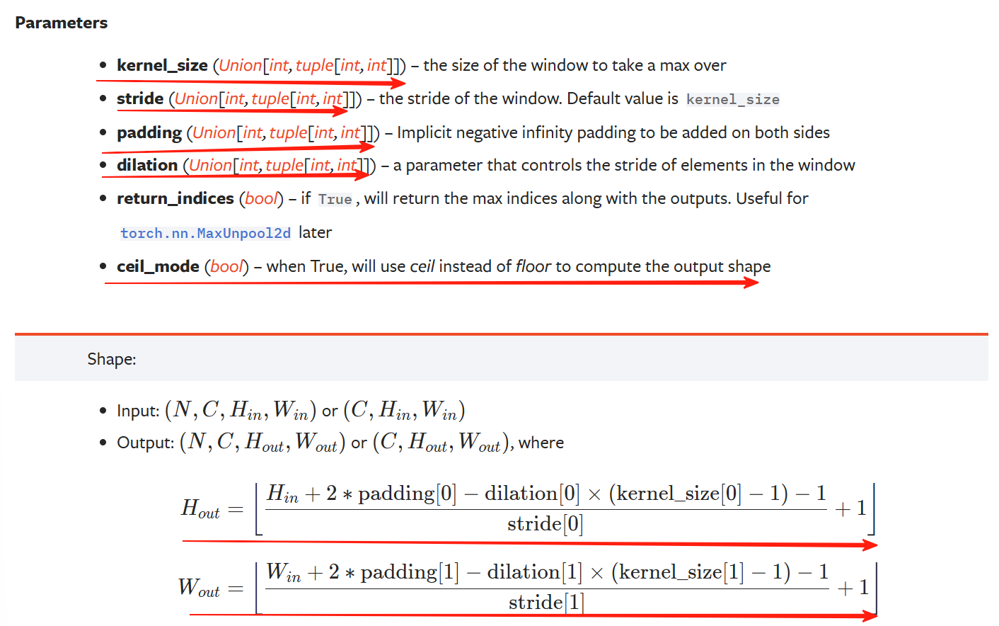
可以发现大部分一样，特别是那个计算公式  
关键要说一下那个**stride**:可以看到文档说默认值就是**kernel_size**核的大小  
有一个新东西：**ceiling_mode**   
1. 默认是False，如果为False，则使用 **floor（向下取整）**  
2. 如果为True，则使用 **ceil（向上取整）** 计算输出shape

最大池化**不改变通道数** -> 
1. 通道独立操作:
最大池化在每个通道上独立进行
2. 不涉及通道间的信息混合  

简单的示例运作关系图如下图：
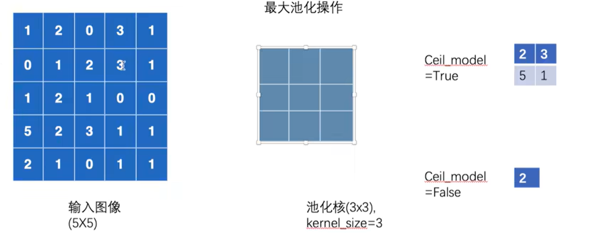
提取了每一块的最大值
```python
import torch
from torch import nn
from torch.nn import MaxPool2d
from torch.utils.tensorboard import SummaryWriter
from torch.utils.data import DataLoader
import torchvision

dataset = torchvision.datasets.MNIST("./dataset", train=False, transform=torchvision.transforms.ToTensor(), download=True)
dataloader = DataLoader(dataset, batch_size=64)
input = torch.tensor([[1, 2, 0, 3, 1],
                      [0, 1, 2, 3, 1],
                      [1, 2, 1, 0, 0],
                      [5, 2, 3, 1, 1],
                      [2, 1, 0, 1, 1]])

input = torch.reshape(input, (-1, 1, 5, 5))
print(input.shape)

class Simple(nn.Module):
    def __init__(self):
        super(Simple, self).__init__()
        self.maxpool1 = MaxPool2d(kernel_size=3, ceil_mode=True)

    def forward(self, input):
        output = self.maxpool1(input)
        return output

simple = Simple()
output = simple(input)
print(output)

step = 0
writer = SummaryWriter("logs")
for data in dataloader:
    imgs, targets = data
    writer.add_image("input", imgs, step, dataformats="NCHW")
    output = simple(imgs)
    writer.add_image("output", output, step, dataformats="NCHW")
    step += 1

writer.close()
```

---

#### ⑧ 非线性激活
为了引入非线性特征，符合非线性曲线，控制了输出范围，也防止了过拟合/梯度爆炸等问题

示例ReLU层：
```python
import torch
import torchvision.datasets
from torch import nn
from torch.nn import ReLU
from torch.nn import Sigmoid
from torch.utils.tensorboard import SummaryWriter
from torch.utils.data import DataLoader

dataset = torchvision.datasets.MNIST("./dataset", train=False, transform=torchvision.transforms.ToTensor(), download=True)

dataloader = DataLoader(dataset, batch_size=64)
# input = torch.tensor([[1, -0.5],
#                       [-1, 3]])
#
# input = torch.reshape(input, (-1, 1, 2, 2))
# print(input.shape)

class Simple_nn(nn.Module):
    def __init__(self):
        super(Simple_nn, self).__init__()
        self.ReLU1 = ReLU()
        self.Sigmoid1 = Sigmoid()

    def forward(self, input):
        output = self.Sigmoid1(input)
        return output

# simple = Simple_nn()
# output = simple(input)
# print(output)

simple = Simple_nn()

writer = SummaryWriter("logs")
step = 0
for data in dataloader:
    imgs, targets = data
    writer.add_image("input", imgs, step, dataformats="NCHW")
    output = simple(imgs)
    writer.add_image("output", output, step, dataformats="NCHW")
    step += 1

writer.close()
```
值得一提的是，ReLU还有一个参数：  
 **inplace**，表示是否直接修改输入数据，而不是创建新的张量。True表示直接修改输入数据，False表示创建新的张量。
```python
input = -1
ReLU(input, inplace=True)
input = 0
Output = ReLU(input, inplace=False)
input = -1
Output = 0
```

---

#### ⑨ Linear Layers 线性层/Fully Connected Layer 全连接层 （以及其他层的科普）
它的核心功能是对**输入数据进行线性变换**，即通过矩阵乘法和加法操作将输入映射到新的特征空间。  
- **公式**：y = Wx + b   


关键作用：
1. **特征提取：** 线性层通过权重矩阵W
将输入数据从低维空间映射到高维空间（或反之），从而提取新的特征。
   - 例如，在卷积神经网络（CNN）中，线性层常用于将卷积层输出的特征图**展平后**(Flatten)，映射到分类所需的输出维度。
2. 分类与回归任务
   - **分类任务**：作为网络的最后一层，输出每个类别的得分（例如配合 Softmax 函数）。
   - **回归任务**：直接输出连续值的预测结果（例如房价预测）。

参数学习

权重 W 和偏置 b 是通过**反向传播**算法优化的可训练参数，模型通过调整它们来最小化损失函数。
其实里面有很多的内层
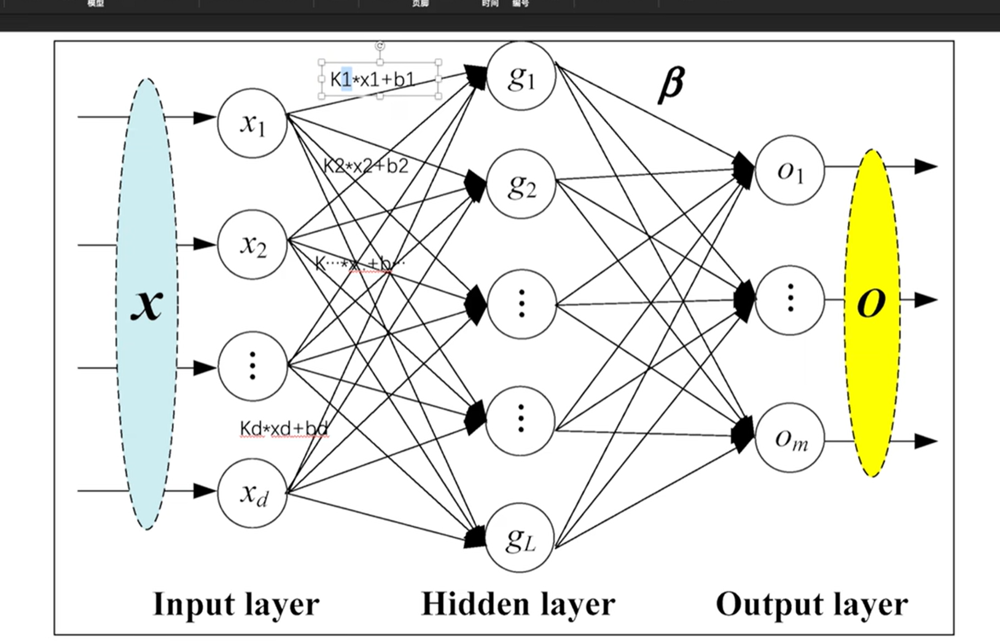
这其实就是运作原理，里面有参数，**就是权重和偏置**
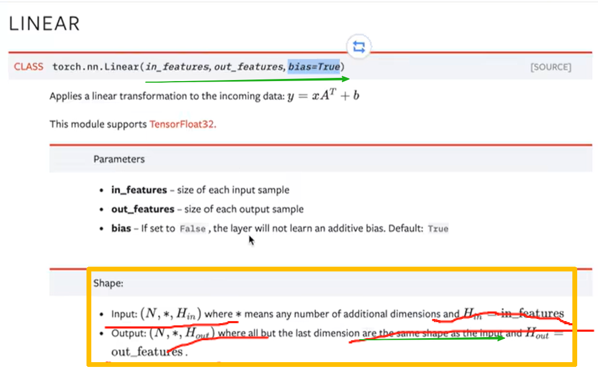
这个里面有三个参数，最后那个叫做偏置。前两个维度是输入的维度（展平后的特征维度）和输出的维度
```python
import torch
import torchvision
from torch import nn
from torch.nn import Linear
from torch.utils.data import DataLoader

dataset = torchvision.datasets.MNIST("./dataset", train=False, transform=torchvision.transforms.ToTensor(), download=True)

dataloader = DataLoader(dataset, batch_size=64)

class Simple_nn(nn.Module):
    def __init__(self):
        super(Simple_nn, self).__init__()
        self.linear1 = Linear(28, 10)

    def forward(self, input):
        output = self.linear1(input)
        return output

simple = Simple_nn()

for data in dataloader:
    imgs, targets = data
    print(imgs.shape)
    # output = torch.reshape(imgs, (1, 1, 1, -1))
    torch.flatten(imgs)  # 还有个参数，是否覆盖当前值/另一个变量存储
    print(imgs.shape)
    output = simple(imgs)
    print(output.shape)
```
这是别的层：
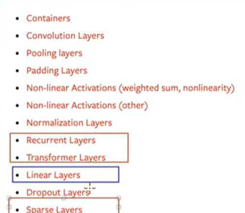
稍微说一下Dropout层：作用是防止过拟合

---

**小实战**

初步复现CIFAR10模型：
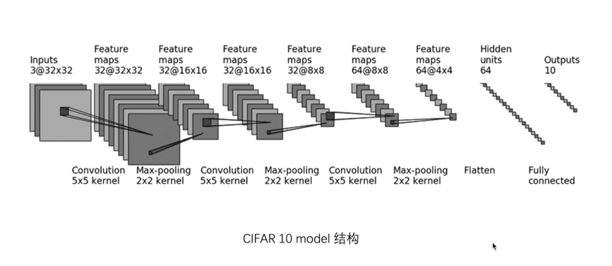
很清楚的结构，只需要一个个写入就可以了。  
这里会有一个函数Sequential的使用，可以理解为合并步骤吧  
- 但是首先在卷积层的时候就要确定**那一堆参数**，这个时候就要根据图片里传入的数据和之前提到的计算公式来解方程确定满足的参数各为多少了  
- padding='same' 可以自动计算，将输入尺寸，大小保持一致
```python
import torch
from torch import nn
from torch.nn import Conv2d, MaxPool2d, Flatten, Linear, Sequential
from torch.utils.tensorboard import SummaryWriter

class Simple_nn(nn.Module):
    def __init__(self):
        super(Simple_nn, self).__init__()
        # self.conv1 = Conv2d(3, 32, 5, padding=2)  # 公式计算
        # self.maxpool1 = MaxPool2d(2)
        # self.conv2 = Conv2d(32, 32, 5, padding=2)
        # self.maxpool2 = MaxPool2d(2)
        # self.conv3 = Conv2d(32, 64, 5, padding=2)
        # self.maxpool3 = MaxPool2d(2)
        # self.flatten = Flatten()
        # self.linear1 = Linear(1024, 64)  # 这个地方不一定知道in_features是多少，可以先运行上面看看展开是多少
        # self.linear2 = Linear(64, 10)
        self.model1 = Sequential(
            Conv2d(3, 32, 5, padding=2),
            MaxPool2d(2),
            Conv2d(32, 32, 5, padding=2),
            MaxPool2d(2),
            Conv2d(32, 64, 5, padding=2),
            MaxPool2d(2),
            Flatten(),
            Linear(1024, 64),
            Linear(64, 10)
        )
    def forward(self, x):
        # x = self.conv1(x)
        # x = self.maxpool1(x)
        # x = self.conv2(x)
        # x = self.maxpool2(x)
        # x = self.conv3(x)
        # x = self.maxpool3(x)
        # x = self.flatten(x)
        # x = self.linear1(x)
        # x = self.linear2(x)
        x = self.model1(x)
        return x
simple_nn = Simple_nn()
print(simple_nn)
input = torch.ones((64, 3, 32, 32))  # 创建了一个形状为64×3×32×32、所有元素为1的四维张量，常用于表示一个批次的图像数据（如RGB图像），作为深度学习模型的输入占位符或测试数据。
output = simple_nn(input)
print(output.shape)

writer = SummaryWriter("logs")
writer.add_graph(simple_nn, input)
writer.close()
```

---

#### ⑩ Loss 损失函数
作用和计算基本原理就如下图：
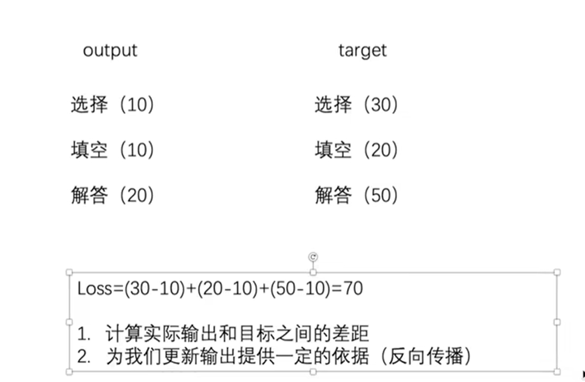
更详细的例子解释如下：首先有个狗，狗对应的标签是1.计算公式如下：class就是我们现在的目标类别。
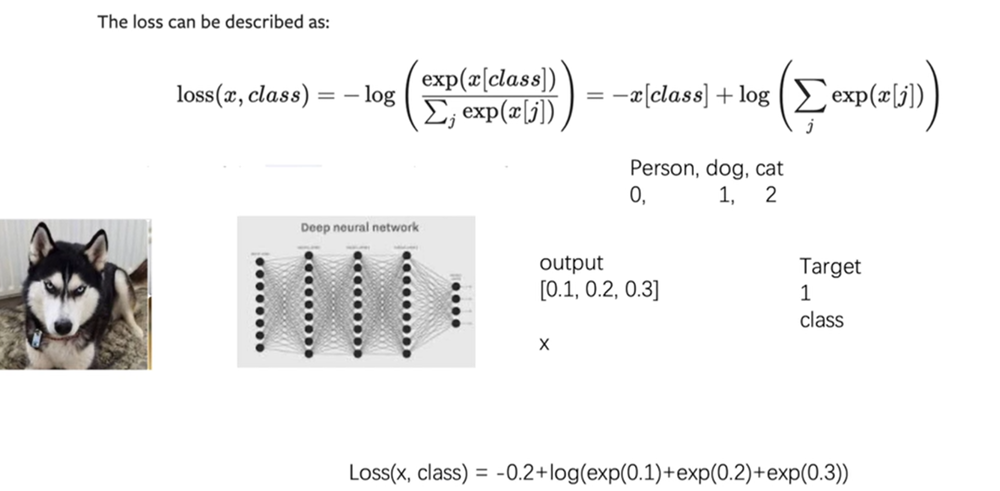

```python
import torch
from torch.nn import L1Loss
from torch import nn
from torch.utils.data import DataLoader
import torchvision
from torch.nn import Conv2d, MaxPool2d, Flatten, Linear, Sequential
from torch.utils.tensorboard import SummaryWriter

dataset = torchvision.datasets.CIFAR10("./dataset", train=False, transform=torchvision.transforms.ToTensor(), download=True)
dataloader = DataLoader(dataset, batch_size=64)

inputs = torch.tensor([1, 2, 3], dtype=torch.float32)
targets = torch.tensor([1, 2, 5], dtype=torch.float32)

inputs = torch.reshape(inputs, (1, 1, 1, 3))
targets = torch.reshape(targets, (1, 1, 1, 3))

loss = L1Loss(reduction='sum')  # 回归损失
result = loss(inputs, targets)

loss_mse = nn.MSELoss()
result_mse = loss_mse(inputs, targets)

print(result)
print(result_mse)

x = torch.tensor([0.1, 0.2, 0.3])
y = torch.tensor([1])
x = torch.reshape(x, (1, 3))
loss_cross = nn.CrossEntropyLoss()
result_cross = loss_cross(x, y)
print(result_cross)


class Simple_nn(nn.Module):
    def __init__(self):
        super(Simple_nn, self).__init__()
        # self.conv1 = Conv2d(3, 32, 5, padding=2)  # 公式计算
        # self.maxpool1 = MaxPool2d(2)
        # self.conv2 = Conv2d(32, 32, 5, padding=2)
        # self.maxpool2 = MaxPool2d(2)
        # self.conv3 = Conv2d(32, 64, 5, padding=2)
        # self.maxpool3 = MaxPool2d(2)
        # self.flatten = Flatten()
        # self.linear1 = Linear(1024, 64)  # 这个地方不一定知道in_features是多少，可以先运行上面看看展开是多少
        # self.linear2 = Linear(64, 10)
        self.model1 = Sequential(
            Conv2d(3, 32, 5, padding=2),
            MaxPool2d(2),
            Conv2d(32, 32, 5, padding=2),
            MaxPool2d(2),
            Conv2d(32, 64, 5, padding=2),
            MaxPool2d(2),
            Flatten(),
            Linear(1024, 64),
            Linear(64, 10)
        )
    def forward(self, x):
        # x = self.conv1(x)
        # x = self.maxpool1(x)
        # x = self.conv2(x)
        # x = self.maxpool2(x)
        # x = self.conv3(x)
        # x = self.maxpool3(x)
        # x = self.flatten(x)
        # x = self.linear1(x)
        # x = self.linear2(x)
        x = self.model1(x)
        return x

loss2 = nn.CrossEntropyLoss()  # 交叉熵 分类损失
simple = Simple_nn()
for data in dataloader:
    imgs, targets = data
    outputs = simple(imgs)
    result_loss = loss2(outputs, targets)
    print(result_loss)
```
其中涉及到三个较为简单的损失函数：
1. **L1 Loss**：平均绝对误差 其中那个reduction是计算方法，有sum和mean两种，sum是求和，mean是求平均。（默认是求平均值）
    - 适用于回归任务（预测连续值）


$$
\text{L1 Loss} = \frac{1}{N} \sum_{i=1}^{N} |y_i - \hat{y}_i|
$$
2. **MSE Loss**：均方误差 
    - 适用于回归任务（预测连续值） 且对大误差更敏感

$$
\text{MSE Loss} = \frac{1}{N} \sum_{i=1}^{N} (y_i - \hat{y}_i)^2
$$
3. **CrossEntropy Loss**：交叉熵损失
    - 适用于分类任务
    - 这玩意要求输入状：(batch_size, num_classes)
    - 输出状：(batch_size) (类别索引)

$$
\text{CrossEntropy Loss} = -\sum_{i=1}^{C} y_i \log(\text{Softmax}(x_i))
$$

---

#### ⑪ Optimizer 优化器
优化器：根据梯度来调整参数  
反向传播来计算梯度，根据梯度来更新参数，实现loss最小化
```python
import torch
from torch.nn import L1Loss
from torch import nn
from torch.utils.data import DataLoader
import torchvision
from torch.nn import Conv2d, MaxPool2d, Flatten, Linear, Sequential
from torch.utils.tensorboard import SummaryWriter

dataset = torchvision.datasets.CIFAR10("./dataset", train=False, transform=torchvision.transforms.ToTensor(), download=True)
dataloader = DataLoader(dataset, batch_size=64)

class Simple_nn(nn.Module):
    def __init__(self):
        super(Simple_nn, self).__init__()
        self.model1 = Sequential(
            Conv2d(3, 32, 5, padding=2),
            MaxPool2d(2),
            Conv2d(32, 32, 5, padding=2),
            MaxPool2d(2),
            Conv2d(32, 64, 5, padding=2),
            MaxPool2d(2),
            Flatten(),
            Linear(1024, 64),
            Linear(64, 10)
        )
    def forward(self, x):
        x = self.model1(x)
        return x

loss = nn.CrossEntropyLoss()
simple = Simple_nn()
optim = torch.optim.SGD(simple.parameters(), lr=0.01)  # 随机梯度下降
for epoch in range(20):  # 训练批次
    running_loss = 0.0
    for data in dataloader:
        imgs, targets = data
        outputs = simple(imgs)
        result_loss = loss(outputs, targets)
        optim.zero_grad()  # 先清0每个点的梯度（会影响现在）
        result_loss.backward()  # 反向传播算梯度
        optim.step()  # 优化器，调整参数
        running_loss = running_loss + result_loss
    print(running_loss)
```

---

#### ⑫ 现有网络模型的使用，修改，保存，读取

1. **预训练（使用与修改）**
```python
import torchvision
from torchvision.models import VGG16_Weights
from torch import nn
vgg16_false = torchvision.models.vgg16(weights=None)  # pretrained=False
# False：初始化过的参数 True：参数是在训练集上训练好的
vgg16_true = torchvision.models.vgg16(weights=VGG16_Weights.DEFAULT)
# pretrained=True 这种写法被淘汰了
print(vgg16_true)
# 输出默认参数的模型
train_data = torchvision.datasets.CIFAR10("./dataset", train=True, transform=torchvision.transforms.ToTensor(), download=True)
vgg16_true.classifier.add_module('add_linear', nn.Linear(1000, 10))
# 这一步是在原来的模型后面加了一个全连接层 classifier.add_module是在这个模块里加 第一个参数是名字
print(vgg16_true)

print(vgg16_false)
vgg16_false.classifier[6] = nn.Linear(4096, 10) # 更改第六个层为这个层
```
第一个更改的模型：
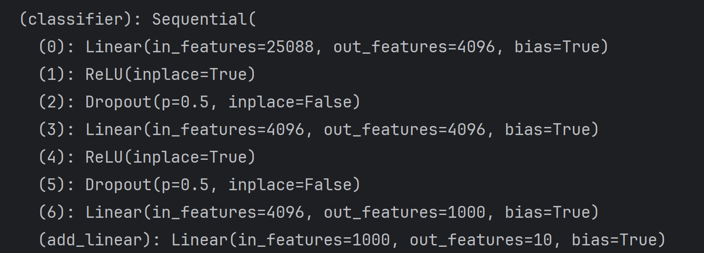
第二个更改的模型：
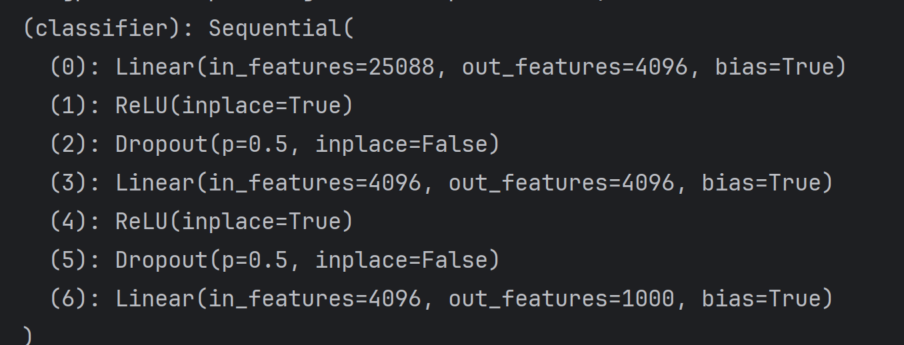

2. **保存**(save)

```python
import torch
import torchvision
from torch import nn
from torchvision.models import VGG16_Weights
vgg16 = torchvision.models.vgg16(weights=None)
# 保存方式1, 模型结构 + 模型参数
torch.save(vgg16, "vgg16_method1.pth")

# 保存方式2, 模型参数（官方推荐）
torch.save(vgg16.state_dict(), "vgg16_method.pth")

# 陷阱
class Simple(nn.Module):
    def __init__(self):
        super(Simple, self).__init__()
        self.conv1 = nn.Conv2d(3, 64, kernel_size=3)

    def forward(self, x):
        x = self.conv1(x)
        return x

simple = Simple()
torch.save(simple, "Simple_method.pth")
```

3. **读取**(load)

```python
import torch

# 方式1-> 保存方式1，加载模型
import torchvision

from test_model_save import * # 这一行对应上面的那个文件，是要为那个“陷阱”做铺垫的，从那个文件引入Simple类
model = torch.load("vgg16_method1.pth") # 前面保存下来的模型
# print(model)

# 方式2，加载模型
vgg16 = torchvision.models.vgg16(weights=None)
vgg16.load_state_dict(torch.load("vgg16_method.pth"))  # 前面保存下来的模型
# print(vgg16)

# 陷阱 记得引入Simple类！
simple = Simple()
model2 = torch.load("Simple_method.pth")
print(model2)
```

---

#### ⑬ 完整模型训练过程

首先我们把这个要一直用的模型写在这里，作为model.py文件
```python
import torch
from torch import nn

# 搭建神经网络
class Simple(nn.Module):
    def __init__(self):
        super(Simple, self).__init__()
        self.model = nn.Sequential(
            nn.Conv2d(3, 32, 5, 1, 2),
            nn.MaxPool2d(2),
            nn.Conv2d(32, 32, 5, 1, 2),
            nn.MaxPool2d(2),
            nn.Conv2d(32, 64, 5, 1, 2),
            nn.MaxPool2d(2),
            nn.Flatten(),
            nn.Linear(64 * 4 * 4, 64),
            nn.Linear(64, 10)
        )

    def forward(self, x):
        x = self.model(x)
        return x

if __name__ == '__main__':
    simple = Simple()
    input = torch.ones((64, 3, 32, 32))
    output = simple(input)
    print(output.shape)
```

```python
import torch.optim
import torchvision
from model import *  # 引入上段的模型
from torch.utils.tensorboard import SummaryWriter
# 准备数据集
from torch import nn
from torch.utils.data import DataLoader
import time

train_data = torchvision.datasets.CIFAR10(root="./dataset", train=True, transform=torchvision.transforms.ToTensor(), download=True)
test_data = torchvision.datasets.CIFAR10(root="./dataset", train=False, transform=torchvision.transforms.ToTensor(), download=True)

# length 长度
train_data_size = len(train_data)
test_data_size = len(test_data)
print(f"训练数据集的长度为：{train_data_size}")
print(f"训练数据集的长度为：{test_data_size}")

# 用dataloader来加载数据集
train_dataloader = DataLoader(train_data, batch_size=64)
test_dataloader = DataLoader(test_data, batch_size=64)

# 创建网络模型
simple = Simple()

# 损失函数
loss_fn = nn.CrossEntropyLoss()

# 优化器
# learning_size = 0.01
# 1e-2 = 1 x (10)^(-2) = 1 / 100 = 0.01
learning_size = 1e-2
optimizer = torch.optim.SGD(simple.parameters(), lr=learning_size)

# 设置训练网络的一些参数
# 记录训练的次数
total_train_step = 0
# 记录测试的次数
total_test_step = 0
# 训练的轮数
epoch = 15

writer = SummaryWriter("logs")

start_time = time.time()
for i in range(epoch):
    print(f"-------第{i+1}轮训练开始-------")

    # 训练步骤开始
    simple.train()
    for data in train_dataloader:
        imgs, targets = data
        outputs = simple(imgs)
        loss = loss_fn(outputs, targets)

        # 优化器优化模型
        optimizer.zero_grad()
        loss.backward()
        optimizer.step()

        total_train_step += 1
        if total_train_step % 100 == 0: # 每100个step打印一次训练信息
            end_time = time.time()
            print(end_time - start_time)
            print(f"训练次数；{total_train_step}， Loss：{loss}")
            writer.add_scalar("train_loss", loss.item(), total_train_step)

    # 测试步骤开始
    simple.eval()
    total_test_loss = 0
    total_accuracy = 0
    with torch.no_grad():  # 测试的时候不需要梯度
        for data in test_dataloader:
            imgs, targets = data
            outputs = simple(imgs)
            loss = loss_fn(outputs, targets)
            total_test_loss += loss.item()
            accuracy = (outputs.argmax(1) == targets).sum()  # argmax()返回每行最大值的索引，0和1分别表示以列判断和以行判断
            total_accuracy += accuracy

    print(f"整体测试集上的Loss：{total_test_loss}")
    print(f"整体测试集上的正确率：{total_accuracy/test_data_size}")
    writer.add_scalar("test_loss", total_test_loss, total_test_step)
    writer.add_scalar("test_accuracy", total_accuracy/test_data_size, total_test_step)
    total_test_step += 1

    torch.save(simple, f"simple_{i}.pth")
    print("模型已保存")

writer.close()
```

#### ⑭ GPU训练
相较于上一个模块，只多一个步骤: **.cuda()**  
并且也只需要在这三个地方加上.cuda()就行了：
1. 网络模型
2. 数据（输入，标注）
3. 损失函数

看如下例子就OK:
```python
import torch.optim
import torchvision
from torch.utils.tensorboard import SummaryWriter
# 准备数据集
from torch import nn
from torch.utils.data import DataLoader
import time

train_data = torchvision.datasets.CIFAR10(root="./dataset", train=True, transform=torchvision.transforms.ToTensor(), download=True)
test_data = torchvision.datasets.CIFAR10(root="./dataset", train=False, transform=torchvision.transforms.ToTensor(), download=True)

# length 长度
train_data_size = len(train_data)
test_data_size = len(test_data)
print(f"训练数据集的长度为：{train_data_size}")
print(f"训练数据集的长度为：{test_data_size}")

# 用dataloader来加载数据集
train_dataloader = DataLoader(train_data, batch_size=64)
test_dataloader = DataLoader(test_data, batch_size=64)

# 创建网络模型
class Simple(nn.Module):
    def __init__(self):
        super(Simple, self).__init__()
        self.model = nn.Sequential(
            nn.Conv2d(3, 32, 5, 1, 2),
            nn.MaxPool2d(2),
            nn.Conv2d(32, 32, 5, 1, 2),
            nn.MaxPool2d(2),
            nn.Conv2d(32, 64, 5, 1, 2),
            nn.MaxPool2d(2),
            nn.Flatten(),
            nn.Linear(64 * 4 * 4, 64),
            nn.Linear(64, 10)
        )

    def forward(self, x):
        x = self.model(x)
        return x
simple = Simple()
if torch.cuda.is_available():  # 第一个GPU
    simple = simple.cuda()  # GPU

# 损失函数
loss_fn = nn.CrossEntropyLoss()  # 第二个GPU
if torch.cuda.is_available():
    loss_fn = loss_fn.cuda()
# 优化器
# learning_size = 0.01
# 1e-2 = 1 x (10)^(-2) = 1 / 100 = 0.01
learning_size = 1e-2
optimizer = torch.optim.SGD(simple.parameters(), lr=learning_size)

# 设置训练网络的一些参数
# 记录训练的次数
total_train_step = 0
# 记录测试的次数
total_test_step = 0
# 训练的轮数
epoch = 50

writer = SummaryWriter("logs")

start_time = time.time()
for i in range(epoch):
    print(f"-------第{i+1}轮训练开始-------")

    # 训练步骤开始
    simple.train()
    for data in train_dataloader:
        imgs, targets = data
        if torch.cuda.is_available():  # 第三个GPU，下面的测试的时候也要
            imgs = imgs.cuda()
            targets = targets.cuda()
        outputs = simple(imgs)
        loss = loss_fn(outputs, targets)

        # 优化器优化模型
        optimizer.zero_grad()
        loss.backward()
        optimizer.step()

        total_train_step += 1
        if total_train_step % 100 == 0:
            end_time = time.time()
            print(end_time - start_time)
            print(f"训练次数；{total_train_step}， Loss：{loss}")
            writer.add_scalar("train_loss", loss.item(), total_train_step)

    # 测试步骤开始
    simple.eval()
    total_test_loss = 0
    total_accuracy = 0
    with torch.no_grad():
        for data in test_dataloader:
            imgs, targets = data
            if torch.cuda.is_available():  # 判断是否有GPU可用
                imgs = imgs.cuda()
                targets = targets.cuda()
            outputs = simple(imgs)
            loss = loss_fn(outputs, targets)
            total_test_loss += loss.item()
            accuracy = (outputs.argmax(1) == targets).sum()
            total_accuracy += accuracy

    print(f"整体测试集上的Loss：{total_test_loss}")
    print(f"整体测试集上的正确率：{total_accuracy/test_data_size}")
    writer.add_scalar("test_loss", total_test_loss, total_test_step)
    writer.add_scalar("test_accuracy", total_accuracy/test_data_size, total_test_step)
    total_test_step += 1

    torch.save(simple, f"simple_{i}.pth")
    print("模型已保存")

writer.close()
```
可以发现，就只加了这三个地方的小小判断，但是有点小复杂  

这里做最后的测试：也包括了GPU第二种写法
```python
import torch
import torchvision.transforms
from torch import nn
from PIL import Image

image_path = "./dog.png"
image = Image.open(image_path)

image = image.convert("RGB") # 改变图片的通道数 png是四通道，RGB是三通道

transform = torchvision.transforms.Compose([torchvision.transforms.Resize((32, 32)),
                                            torchvision.transforms.ToTensor()])
image = transform(image)
print(image.shape)

class Simple(nn.Module):
    def __init__(self):
        super(Simple, self).__init__()
        self.model = nn.Sequential(
            nn.Conv2d(3, 32, 5, 1, 2),
            nn.MaxPool2d(2),
            nn.Conv2d(32, 32, 5, 1, 2),
            nn.MaxPool2d(2),
            nn.Conv2d(32, 64, 5, 1, 2),
            nn.MaxPool2d(2),
            nn.Flatten(),
            nn.Linear(64 * 4 * 4, 64),
            nn.Linear(64, 10)
        )

    def forward(self, x):
        x = self.model(x)
        return x


device = torch.device("cuda" if torch.cuda.is_available() else "cpu")  # 加载设备GPU
model = torch.load("simple_49.pth", map_location=device)
model = model.to(device)  # GPU
print(model)
image = torch.reshape(image, (1, 3, 32, 32))
image = image.to(device)  # GPU
model.eval()
with torch.no_grad():
    output = model(image)

print(output)
print(output.argmax(1))
```