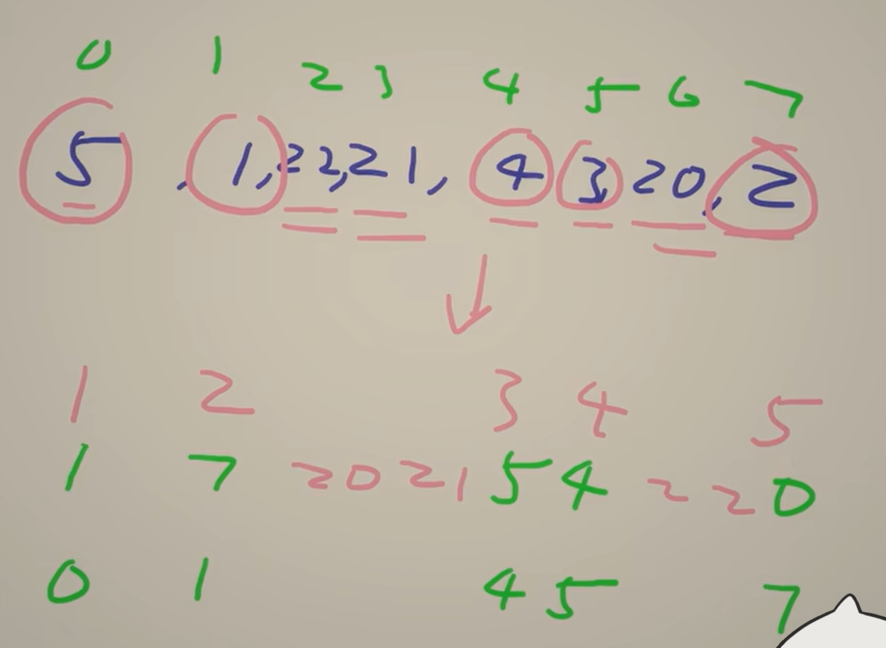

## 双指针 相向双指针
子数组 子串问题 满足单调性
#### 前置知识：

[两数之和 三数之和【基础算法精讲 01】](https://www.bilibili.com/video/BV1bP411c7oJ?vd_source=1e683c3cb93400956a910790b98ffccb)  
[盛最多水的容器 接雨水【基础算法精讲 02】](https://www.bilibili.com/video/BV1Qg411q7ia?vd_source=1e683c3cb93400956a910790b98ffccb)  
相向双指针：在有序的找组合；最大盛水量；回文数

### Ⅰ单序列双指针

#### ①相向双指针

[16 最接近的三数之和](https://leetcode.cn/problems/3sum-closest/)  
除了三数之和基本做法之外，设 s=nums[i]+nums[j]+nums[k]，为了判断 s 是不是与 target 最近的数，我们还需要用一个变量 minDiff 维护 ∣s−target∣ 的最小值。  
如果闲的慌可以看看[18 四数之和](https://leetcode.cn/problems/4sum/)  

```python
class Solution:
    def threeSumClosest(self, nums: List[int], target: int) -> int:
        nums.sort()
        n = len(nums)
        min_diff = inf
        for i in range(n - 2):
            x = nums[i]
            if i > 0 and x == nums[i-1]:
                continue
            s1 = x + nums[i+1] + nums[i+2]
            if s1 > target:
                if s1 - target < min_diff: # 更新min_diff 
                    min_diff = s1 - target
                    ans = s1
                break
            s2 = x + nums[-1] + nums[-2]
            if s2 < target:
                if target - s2 < min_diff: # 更新min_diff 
                    min_diff = target - s2
                    ans = s2
                continue
            j = i + 1
            k = n - 1
            while j < k:
                s = x + nums[j] + nums[k]
                if s == target:
                    return s
                if s > target:
                    if s - target < min_diff: # 更新min_diff 
                        min_diff = s - target
                        ans = s
                    k -= 1
                else:
                    if target - s < min_diff: # 更新min_diff 
                        min_diff = target - s
                        ans = s
                    j += 1
        return ans
```

[611 有效三角形的个数](https://leetcode.cn/problems/valid-triangle-number/)  
这一题两种做法，一种相向双指针（我写的依托，看答案写的好）；另一种是同向双指针（类似滑窗，因为滑动窗口本质上就是同向双指针）  

**一定要记得确定研究对象捏！！**

**1.枚举最长边 相向双指针**  
先确定研究对象：a + b > **c**   
c单独在右边

```python
class Solution:
    def triangleNumber(self, nums: List[int]) -> int:
        nums.sort()
        ans = 0
        for k in range(2, len(nums)):
            c = nums[k]
            i = 0  # a=nums[i]
            j = k - 1  # b=nums[j]
            while i < j:
                if nums[i] + nums[j] > c:
                    # 由于 nums 已经从小到大排序
                    # nums[i]+nums[j] > c 同时意味着：
                    # nums[i+1]+nums[j] > c
                    # nums[i+2]+nums[j] > c
                    # ...
                    # nums[j-1]+nums[j] > c
                    # 从 i 到 j-1 一共 j-i 个
                    ans += j - i
                    j -= 1
                else:
                    # 由于 nums 已经从小到大排序
                    # nums[i]+nums[j] <= c 同时意味着
                    # nums[i]+nums[j-1] <= c
                    # ...
                    # nums[i]+nums[i+1] <= c
                    # 所以在后续的内层循环中，nums[i] 不可能作为三角形的边长，没有用了
                    i += 1
        return ans
```

**2.枚举最短边 a，问题变成计算满足 c−b<a 的 (b,c) 个数 + 同向双指针**  
这限制了c和b不能隔太远

```python
class Solution:
    def triangleNumber(self, nums: List[int]) -> int:
        nums.sort()
        n = len(nums)
        ans = 0
        for i in range(n - 2):
            a = nums[i]
            if a == 0:  # 三角形的边不能是 0
                continue
            j = i + 1
            for k in range(i + 2, n):
                while nums[k] - nums[j] >= a:
                    j += 1 # b，c隔得太远了
                # 如果 a=nums[i] 和 c=nums[k] 固定不变
                # 那么 b 可以是 nums[j],nums[j+1],...,nums[k-1]，一共有 k-j 个
                ans += k - j # 这个可以避免重复做一样的工作，我的代码就是没这么改善
        return ans
```

其实没有很难啦。。。只是看看不同思路和改进的代码  

[923 三数之和的多种可能](https://leetcode.cn/problems/3sum-with-multiplicity/description/)

```python
class Solution:
    def threeSumMulti(self, arr: List[int], target: int) -> int:
        MOD = 10**9 + 7
        arr.sort()  # 排序
        n = len(arr)
        count = 0

        for i in range(n):
            # 新目标值
            new_target = target - arr[i]
            j, k = i + 1, n - 1

            while j < k:
                # 当前双指针的和
                current_sum = arr[j] + arr[k]
                if current_sum < new_target:
                    j += 1
                elif current_sum > new_target:
                    k -= 1
                else: # 思考重复情况可能遇到的 等不等于?怎么计数？怎么移动？
                    # 处理重复元素的情况
                    if arr[j] == arr[k]:
                        count += (k - j + 1) * (k - j) // 2 # 现在全是一样的数字，C(k-j+1,2)
                        count %= MOD
                        break # break跳出内层循环，继续外层循环
                    else:
                        # 计算 arr[j] 和 arr[k] 的频率
                        left = 1
                        while j + 1 < k and arr[j] == arr[j + 1]:
                            # j + 1 < k 是为了避免下标越界
                            left += 1
                            j += 1

                        right = 1
                        while k - 1 > j and arr[k] == arr[k - 1]:
                            # k - 1 > j 是为了避免下标越界
                            right += 1
                            k -= 1

                        # 组合数
                        count += left * right # C(left,2) * C(right,2)
                        count %= MOD
                        j += 1
                        k -= 1

        return count
```

#### ③背向双指针
两个指针从数组中的同一个位置出发，一个向左，另一个向右，背向移动  
[1793](https://leetcode.cn/problems/maximum-score-of-a-good-subarray/description/) 单调栈or双指针 -> 看成矩形的问题，用双指针解决

#### ④原地修改--栈 
有可能相向，同向，各种可能都有，最重要的是要模拟
[27.移除元素](https://leetcode.cn/problems/remove-element/submissions/)
```python
class Solution:
    def removeElement(self, nums: List[int], val: int) -> int:
        stack_size = 0
        for x in nums:
            if x != val:
                nums[stack_size] = x
                stack_size += 1
        return stack_size
```
变形一点：[80.删除有序数组中的重复项II](https://leetcode.cn/problems/remove-duplicates-from-sorted-array-ii/)  
补药写屎山代码啊！优化成跟前一个比就行了
```python
class Solution:
    def removeDuplicates(self, nums: List[int]) -> int:
        stack_size = 2  # 栈的大小，前两个元素默认保留
        for i in range(2, len(nums)):
            if nums[i] != nums[stack_size - 2]:  # 和栈顶下方的元素比较
                nums[stack_size] = nums[i]  # 入栈
                stack_size += 1
        return min(stack_size, len(nums))
```
真的是简单题吗？？？？？    
[1089.复写0](https://leetcode.cn/problems/duplicate-zeros/)
```python
class Solution:
    def duplicateZeros(self, arr: List[int]) -> None:
        """
        Do not return anything, modify arr in-place instead.
        """
        n = len(arr)
        zeros = arr.count(0)  # 统计数组中零的数量
        i = n - 1  # 从数组的末尾开始
        j = n + zeros - 1  # 模拟扩展后的数组末尾
        
        # 从后向前复制元素
        while i >= 0:
            if j < n:  # 如果当前索引在原数组范围内
                arr[j] = arr[i]
            if arr[i] == 0:  # 如果是零，需要多写一次
                j -= 1
                if j < n:  # 确保在数组范围内
                    arr[j] = 0
            i -= 1
            j -= 1
```
因为从前搞会覆盖后面的，所以第一步想到从后向前覆盖是对的。但是不会维护的时候模拟的规则。。多做吧
[442.数组中重复的数据](https://leetcode.cn/problems/find-all-duplicates-in-an-array/)
```python
class Solution:
    def findDuplicates(self, nums: List[int]) -> List[int]:
        if not nums:
            return []
        res = []
        n = len(nums)
        for i in range(n):
            num = abs(nums[i])
            if nums[num - 1] < 0:
                res.append(num)
            else:
                nums[num - 1] = -nums[num - 1]
        return res    
```
**为什么能想到“原地哈希”法？**

这道题目要求找出数组中所有出现**两次**的元素（其他元素出现一次），且需要：
1. **时间复杂度 O(n)**
2. **空间复杂度 O(1)**（不能使用额外空间）

常规方法（如哈希表）需要 O(n) 额外空间，而排序需要 O(n log n) 时间。因此，必须利用题目特性寻找更优解。

---

**关键观察**
1. **数值范围限定**：题目说明数组元素范围是 `[1, n]`（n 是数组长度）。
   - 这意味着我们可以用数组**索引**本身来标记数字是否出现过。
2. **正负号标记**：
   - 遍历数组时，将 `nums[num - 1]` 取负号，表示数字 `num` 出现过。
   - 如果发现 `nums[num - 1]` 已经是负数，说明 `num` 是重复的。

---

**为什么这种方法有效？**
- **索引映射**：数字 `num` 直接映射到索引 `num - 1`（因为数组从 0 开始）。
- **负号标记**：
  - 第一次遇到 `num` 时，将 `nums[num - 1]` 设为负数，相当于“标记已出现”。
  - 第二次遇到 `num` 时，发现 `nums[num - 1]` 已经是负数，说明 `num` 重复。
  - 利用**输入数据**的特性：数值范围 [1, n] 允许用索引映射。  
  - **标记法**替代哈希表：用**正负号**代替额外空间，实现 O(1) 空间复杂度。

进阶：
[41.缺失的第一个正数](https://leetcode.cn/problems/first-missing-positive/description/)
```python
class Solution:
    def firstMissingPositive(self, nums: List[int]) -> int:
        # n = len(nums)
        # for i in range(n):
        #     while 1 <= nums[i] <= n and nums[nums[i] - 1] != nums[i]: # 一直交换交换到他在对的位置上
        #         nums[nums[i] - 1], nums[i] = nums[i], nums[nums[i] - 1]
        # for i in range(n):
        #     if nums[i] != i + 1:
        #         return i + 1
        # return n + 1
        n = len(nums)
        for i in range(n): # 预处理负数为不可取到的数字->数组外的
            if nums[i] <= 0:
                nums[i] = n + 1
        for i in range(n): # 步骤同442 原地哈希->变负号了说明下标加1的数字出现过
            num = abs(nums[i])
            if num <= n: # 大于n的在数组外面，就不用考虑了
                nums[num - 1] = -abs(nums[num - 1]) # 为什么也要abs？要维护已经有过的负号，不然负号变成㊣了
        for i in range(n):
            if nums[i] > 0: # ㊣说明没有出现过，直接返回i+1
                return i + 1 
        # 证明都出现过
        return n + 1
```
```math
\therefore \text{有个原地哈希的模板} \downarrow \text{原地哈希}
```
```python
n = len(nums)
for i in range(n):
    num = abs(nums[i])
    if num <= n: # 大于n的在数组外面，就不用考虑了
        nums[num - 1] = -abs(nums[num - 1]) # 为什么也要abs？要维护已经有过的负号，不然负号变成㊣了
```
模板题 [287.寻炸重复数](https://leetcode.cn/problems/find-the-duplicate-number/)
### Ⅱ双序列
顾名思义有两个数组，同时遍历就好啦
#### ① 双指针
[88.合并两个有序数组](https://leetcode.cn/problems/merge-sorted-array/description/)
```python
class Solution:
    def merge(self, nums1: List[int], m: int, nums2: List[int], n: int) -> None:
        """
        Do not return anything, modify nums1 in-place instead.
        """
        p1, p2, p = m - 1, n - 1, m + n - 1
        while p2 >= 0: # 只有这个条件和下面不一样，这样更简洁
            if p1 >= 0 and nums1[p1] > nums2[p2]:
                nums1[p] = nums1[p1]
                p1 -= 1
            else:
                nums1[p] = nums2[p2]
                p2 -= 1
            p -= 1
```
是对我代码的简化，直接看p2有没有结束来合并两种情况
[1855.下标对中的最大距离](https://leetcode.cn/problems/maximum-distance-between-a-pair-of-values/)  
要优化着想~二分/双指针——最远的都可以，后面的肯定不会比现在的长
```python
class Solution:
    def maxDistance(self, nums1: List[int], nums2: List[int]) -> int:
        # n2 = len(nums2)
        # ans = 0
        # for i, x in enumerate(nums1):
        #     left = i
        #     right = n2 - 1
        #     j = -1
        #     while left <= right:
        #         mid = (left + right) // 2
        #         if nums2[mid] >= x:
        #             left = mid + 1
        #             j = mid
        #         elif nums2[mid] < x:
        #             right = mid - 1
        #     if j != -1:
        #         ans = max(ans, j - i)
        # return ans
        i, j = 0, 0
        max_dist = 0
        while i < len(nums1) and j < len(nums2):
            if nums1[i] <= nums2[j]:
                max_dist = max(max_dist, j - i)
                j += 1
            else:
                i += 1
        return max_dist
```
模拟过程，考虑多种情况  
[925.长键按入](https://leetcode.cn/problems/long-pressed-name/submissions/629499080/)  
```python
class Solution:
    def isLongPressedName(self, name: str, typed: str) -> bool:
        # i = j = 0
        # n, m = len(name), len(typed)
        
        # while i < n and j < m:
        #     # 当前字符匹配
        #     if name[i] == typed[j]:
        #         i += 1
        #         j += 1
        #     else:
        #         # 不匹配时，检查是否是长按情况
        #         if j > 0 and typed[j] == typed[j-1]:
        #             j += 1
        #         else:
        #             return False
        
        # # 处理typed剩余的长按字符
        # while j < m and typed[j] == typed[j-1]:
        #     j += 1
        
        # # 只有当name和typed都遍历完才返回True
        # return i == n and j == m
        i, j = 0, 0
        while j < len(typed):
            if i < len(name) and name[i] == typed[j]:
                i += 1
            elif j == 0 or typed[j] != typed[j-1]:
                return False
            j += 1
        return i == len(name)
```
去题单里后面几题都有点问题。。。  

双指针：**强调两指针处的值**，遍历一个直到找到那个特殊值，另一个用while来移动是他成为特殊值  

[2337.移动片段得到字符串](https://leetcode.cn/problems/move-pieces-to-obtain-a-string/)
```python
class Solution:
    def canChange(self, start: str, target: str) -> bool:
        if start.replace('_', '') != target.replace('_', ''):
            return False
        j = 0
        for i, c in enumerate(start): # 枚举一个
            if c == '_': # 不断遍历直到找到特殊值L/R
                continue
            while target[j] == '_':  # while 维护另一个
                j += 1
            if i != j and (c == 'L') == (i < j):
                return False
            j += 1
        return True
```

还有两个思考题：  
[986.区间列表的交集](https://leetcode.cn/problems/interval-list-intersections/)  
[844.比较含退格的字符串](https://leetcode.cn/problems/backspace-string-compare/description/) 做到O(1)
#### ② 判断子序列
[392.判断子序列](https://leetcode.cn/problems/is-subsequence/description/)  

请直接看进阶问题:
多个比较，每次都O(n)去比对，很慢  
```math
\therefore \text{将O(n) 优化为O(1)!!! 哈希？但不够好：动态规划!}
```
能否 **「一步到位」** 呢？比如 s=abc，t=ahbgdc，能否 O(1) 算出下一个字母 a 的位置，下一个字母 b 的位置，下一个字母 c 的位置？

可以。定义 **nxt[i][c] 表示 t 中下标 ≥i 的最近字母 c 的下标。** 如果 c 不存在，则规定 nxt[i][c]=n，用 n 表示没找到。
```python
class Solution:
    def isSubsequence(self, s: str, t: str) -> bool:
        # i = 0
        # for j in t:
        #     if i == len(s):
        #         break
        #     if s[i] == j:
        #         i += 1
        # return True if i == len(s) else False
        n = len(t)
        nxt = [[n] * 26 for _ in range(n + 1)]
        for i in range(n - 1, -1, -1): # 从后往前遍历，这样 nxt[i][c] 就表示 t 中下标 ≥i 的最近字母 c 的下标
            nxt[i] = nxt[i + 1][:]
            nxt[i][ord(t[i]) - ord('a')] = i

        # 这个写法无论 s 为空还是 t 为空，都能算出正确答案
        i = -1
        for c in s:
            i = nxt[i + 1][ord(c) - ord('a')]
            if i == n:  # c 不在 t 中，说明 s 不是 t 的子序列
                return False
        return True  # s 是 t 的子序列
```
-  [524.通过删除字母匹配到字典里最长单词](https://leetcode.cn/problems/longest-word-in-dictionary-through-deleting/description/) 同样代码，改一点点就行了


### Ⅲ 三指针
#### (1) 同向/相向三指针
[2367.等差三元组的数目](https://leetcode.cn/problems/number-of-arithmetic-triplets/description/)
```python
class Solution:
    def arithmeticTriplets(self, nums: List[int], diff: int) -> int:
        ans, i, j = 0, 0, 1
        for x in nums:
            while nums[j] + diff < x:
                j += 1
            if nums[j] + diff > x:
                continue
            while nums[i] + diff * 2 < x:
                i += 1
            if nums[i] + diff * 2 == x:
                ans += 1
        return ans
```
类似同向双指针的方法

[2563](https://leetcode.cn/problems/count-the-number-of-fair-pairs/description/)
相向双指针

#### (2) 类似越长越合法
[795.区间子数组个数](https://leetcode.cn/problems/number-of-subarrays-with-bounded-maximum/description/)
```python
class Solution:
    def numSubarrayBoundedMax(self, nums: List[int], left: int, right: int) -> int:
        ans, i, k = 0, -1, -1
        for j, x in enumerate(nums):
            if x > right:
                i = j
            if x >= left:
                k = j
            ans += k - i
        return ans
```
[详细题解](https://leetcode.cn/problems/number-of-subarrays-with-bounded-maximum/solutions/1988198/tu-jie-yi-ci-bian-li-jian-ji-xie-fa-pyth-n75l/)

[2444](https://leetcode.cn/problems/count-subarrays-with-fixed-bounds/description/) 过两天来看吧。。指针现在难以消化了
```python
    pass
```

### Ⅳ 分组循环
**适用场景:** 按照题目要求，数组会被分割成若干组，每一组的判断/处理逻辑是相同的。  

当你发现了要找一个满足特殊要求的子数组，并且需要不断**向后执行相似操作**来找到**最值**的，可以考虑分组循环！

**核心思想：**

- **外层循环**负责遍历组之前的准备工作（记录开始位置），和遍历组之后的统计工作（更新答案最大值）。
- **内层循环**负责遍历组，找出这一组最远在哪结束。  

这个写法的好处是，各个逻辑块分工明确，也不需要特判最后一组（易错点）。以我的经验，这个写法是所有写法中最不容易出 bug 的，推荐大家记住。

[2760.最长奇偶子数组](https://leetcode.cn/problems/longest-even-odd-subarray-with-threshold/description/)
```python
class Solution:
    def longestAlternatingSubarray(self, nums: List[int], threshold: int) -> int:
        # 我做的！！！
        # ans = 0
        # n = len(nums)
        # for i, x in enumerate(nums):
        #     if x % 2 != 0 or x > threshold:
        #         continue
        #     j = i
        #     while j < n - 1 and nums[j] % 2 != nums[j+1] % 2 and nums[j+1] <= threshold:
        #         j += 1
        #     ans = max(ans, j - i + 1)
        # return ans
        n = len(nums)
        ans = i = 0
        while i < n:
            if nums[i] > threshold or nums[i] % 2:
                i += 1  # 直接跳过
                continue
            start = i  # 记录这一组的开始位置
            i += 1  # 开始位置已经满足要求，从下一个位置开始判断
            while i < n and nums[i] <= threshold and nums[i] % 2 != nums[i - 1] % 2:
                i += 1
            # 从 start 到 i-1 是满足题目要求的（并且无法再延长的）子数组
            ans = max(ans, i - start)
        return ans

```
灵神好在哪里？**避免了重复**！  
他的i直接从下一个地方不为同一字符的地方开始了
```math
\therefore 模板如下：
```
```python
n = len(nums)
i = 0
while i < n:
    start = i
    while i < n and ...:
        i += 1
    # 从 start 到 i-1 是一组
    # 下一组从 i 开始，无需 i += 1
```
如果有特殊条件：只需在结束是时候特判就行了，不然就简单题卡卡卡过不去了。。  
[3456.找出长度为k的特殊子字符串](https://leetcode.cn/problems/find-special-substring-of-length-k/)
- 解法一
```python
class Solution:
    def hasSpecialSubstring(self, s: str, k: int) -> bool:
        i = 0
        n = len(s)
        ans = False
        while i < n:
            start = i
            i += 1
            while i < n and s[i] == s[i-1]:
                i += 1
            if i - start == k: # 结束时特判就行
                ans = True
                break
        return ans
            
```

- 解法二  
  
同时引出有另一种做法的题目
```python
class Solution:
    def hasSpecialSubstring(self, s: str, k: int) -> bool:
        cnt = 0
        for i, c in enumerate(s):
            cnt += 1
            if i == len(s) - 1 or c != s[i + 1]:
                if cnt == k:
                    return True
                cnt = 0
        return False
```
遍历 s 的同时，**维护连续相同子串长度 cnt**，遇到子串末尾就看看 cnt=k 是否成立，成立就立刻返回 true。  
-> **关键就是维护连续相同子串长度 cnt**，其他题目不一样的条件可以变  
应用：[3499.操作后的最大活跃区段数I](https://leetcode.cn/problems/maximize-active-section-with-trade-i/description/)  


- [978.最长湍流子数组](https://leetcode.cn/problems/longest-turbulent-subarray/description/)    
- [3185.最长的严格递增/递减子数组](https://leetcode.cn/problems/longest-strictly-increasing-or-strictly-decreasing-subarray/)  
这俩思路基本一致，有几个很好的思维方式：
1. 情况多 -> 转化为(nums[i+1] - nums[i]) * (nums[i] - nums[i-1]) < 0
2. 聚焦于**i为中心**讨论点！补药i-1为中心！边界不好写
3. 记得特判相等的情况
4. ans = 1 而不等于 0？ 根据题目条件变化！  

```python
class Solution:
    def maxTurbulenceSize(self, arr: List[int]) -> int:
        i = 0
        n = len(arr)
        ans = 1
        while i < n - 1:
            if arr[i] == arr[i+1]:
                i += 1
                continue
            start = i
            i += 1
            # while i < n - 1 and (arr[i+1] - arr[i]) * (arr[i] - arr[i-1]) < 0:
            while i < n - 1 and ((arr[i+1] > arr[i] and arr[i] < arr[i-1]) or (arr[i+1] < arr[i] and arr[i] > arr[i-1])):
                i += 1
            ans = max(ans, i - start + 1)
        return ans
```
**进阶**：  

[3499.操作后最大活跃区段数I](https://leetcode.cn/problems/maximize-active-section-with-trade-i/description/)  
```python
class Solution:
    def maxActiveSectionsAfterTrade(self, s: str) -> int:
        # total1 = mx = cnt = 0
        # pre0 = -inf
        # for i, b in enumerate(s):
        #     cnt += 1
        #     if i == len(s) - 1 or b != s[i + 1]:  # i 是这一段的末尾
        #         if b == '1':
        #             total1 += cnt
        #         else:
        #             mx = max(mx, pre0 + cnt)
        #             pre0 = cnt
        #         cnt = 0
        # return total1 + mx
        i = 0
        n = len(s)
        ans = 0
        mx = 0
        cnt = 0
        pre_num = -inf # 写的时候在取最大值时就知道-inf最好了，-1等有可能影响取值
        while i < n:
            start = i
            i += 1
            while i < n and s[i] == s[i-1]:
                i += 1
            if s[i-1] == '1': # 是1
                ans += i - start
            else: # 是0
                cnt = i - start
                mx = max(mx, cnt + pre_num)
                pre_num = cnt
        return ans + mx
```
- 统计0/1的个数
- 最重要的是有个维护**pre和cnt**的操作，和前面提到的技巧一样->找连续的最大0区段
  

[2948.交换得到字典序最小的数组](https://leetcode.cn/problems/make-lexicographically-smallest-array-by-swapping-elements/description/)  

本质上是分组循环，只是这交换比较难找到规律，在这个例子中可以发现根据相邻值是否相差<=limit 来分成不同的组，而不同的组里可以发现可以先按值的大小排序，但是每个组的排完序的相对位置要不变（下标所占的位置不可变）...  


[讲解](https://www.bilibili.com/video/BV19N411j7Dj/)
```python
class Solution:
    def lexicographicallySmallestArray(self, nums: List[int], limit: int) -> List[int]:
        # 1. 将nums带着下标排序
        n = len(nums)
        a = sorted(zip(nums, range(n)))
        ans = [0] * n

        # 2. 分组循环
        # 外层循环：准备工作 + 更新答案
        # 内层循环：找最长的连续段的末尾位置
        i = 0
        while i < n:
            st = i
            i += 1
            while i < n and a[i][0] - a[i-1][0] <= limit:
                i += 1
            # 从st 到 i-1 这一段都是满足要求
            # 3. 提出a[st:i] 中的下标
            idx = sorted(i for _, i in a[st:i])
            for j, (x, _) in zip(idx, a[st:i]):  # 有序的下标对应有序的数字
                ans[j] = x
        return ans
```

### Ⅲ 额外例题
[75.颜色分类](https://leetcode.cn/problems/sort-colors/description/)  
O(1) 空间复杂度 -> 指针  

有如下几种做法，还有灵神的插入排序法，都要掌握，培养算法思维！  
**要掌握技巧：指针维护头部/尾部的位置**
- **1.单指针**

用ptr维护**头部**的位置
```python
class Solution:
    def sortColors(self, nums: List[int]) -> None:
        n = len(nums)
        ptr = 0
        for i in range(n):
            if nums[i] == 0:
                nums[i], nums[ptr] = nums[ptr], nums[i]
                ptr += 1
        for i in range(ptr, n):
            if nums[i] == 1:
                nums[i], nums[ptr] = nums[ptr], nums[i]
                ptr += 1
```
上述要遍历两次，有没有遍历一次的做法？
- **2.双指针**

维护的是**尾部**和**头部**，用两个指针分别维护0和2
```python
class Solution:
    def sortColors(self, nums: List[int]) -> None:
        n = len(nums)
        p0, p2 = 0, n - 1
        i = 0
        while i <= p2:
            while i <= p2 and nums[i] == 2:
                nums[i], nums[p2] = nums[p2], nums[i]
                p2 -= 1
            if nums[i] == 0:
                nums[i], nums[p0] = nums[p0], nums[i]
                p0 += 1
            i += 1
```

- **3.插入排序**  


本题思路
对 nums 执行**插入排序**，也就是对 i=0,1,2,…,n−1 依次执行如下过程：

现在前缀 nums[0] 到 nums[i−1] 是有序的，我们把 nums[i] 插入到这个有序前缀中，从而把前缀 nums[0] 到 nums[i] 变成有序的。  
算法执行完后，nums 就是一个有序数组了。  
[题解](https://leetcode.cn/problems/sort-colors/solutions/3679069/on-cha-ru-pai-xu-jian-ji-xie-fa-pythonja-zk60/)
```python
class Solution:
    def sortColors(self, nums: List[int]) -> None:
        p0 = p1 = 0
        for i, x in enumerate(nums):
            nums[i] = 2
            if x <= 1:
                nums[p1] = 1
                p1 += 1
            if x == 0:
                nums[p0] = 0
                p0 += 1
```
