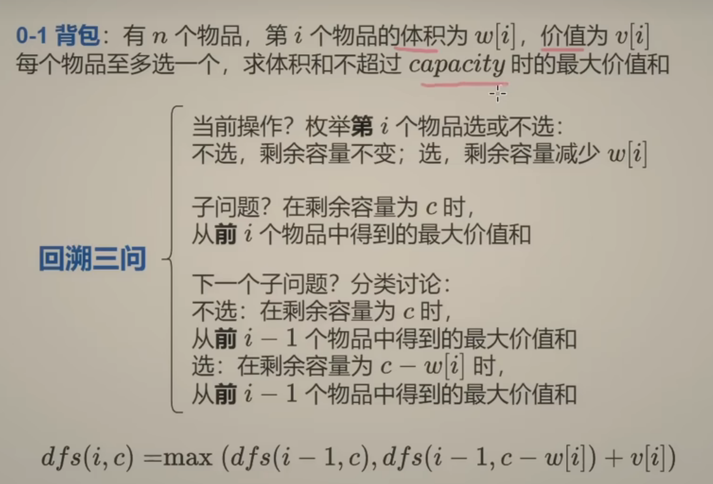
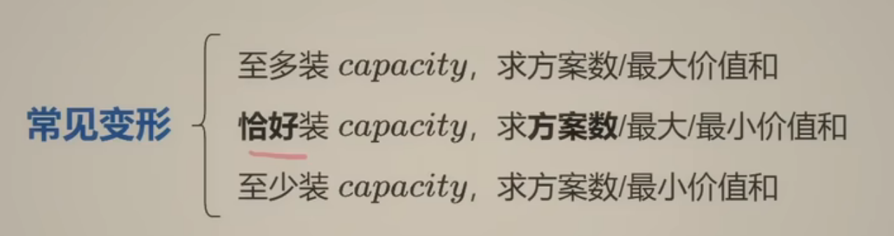
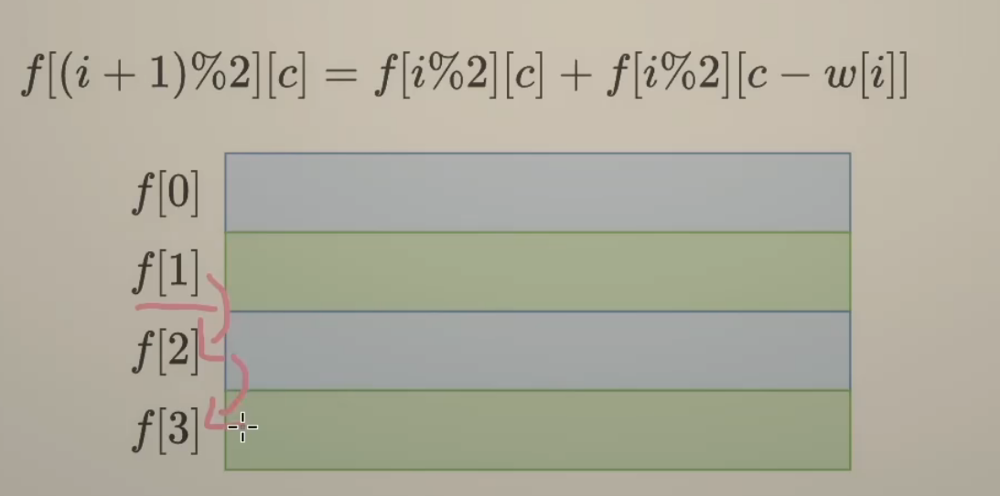
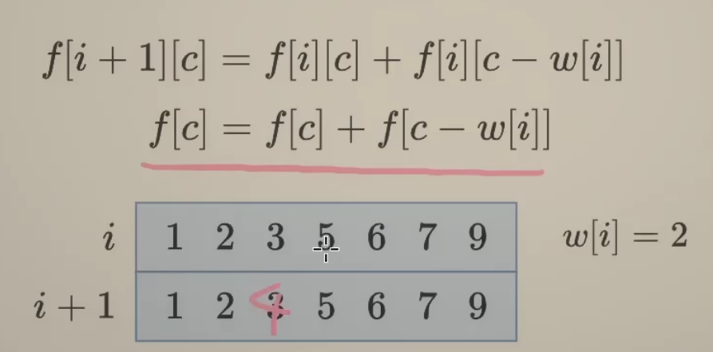
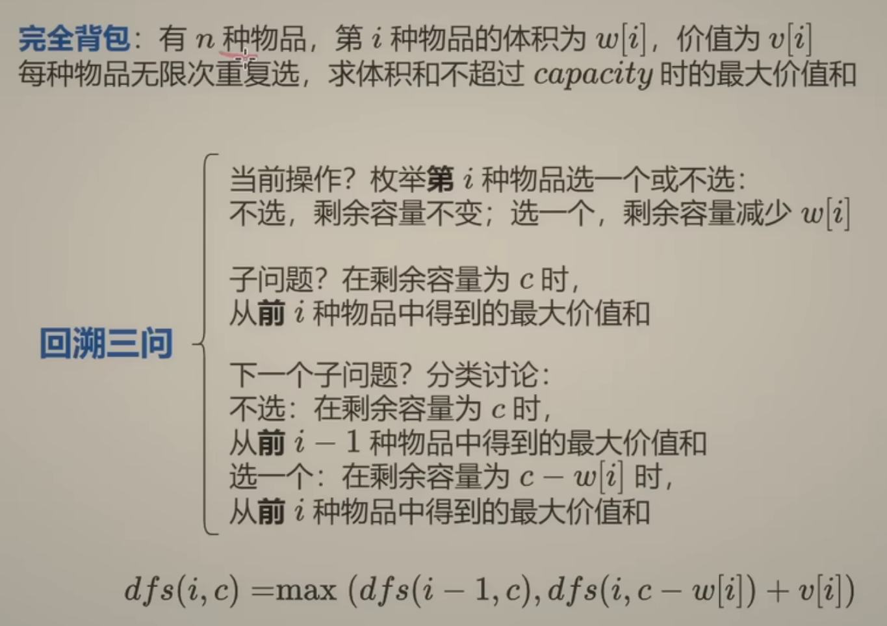

## DP动态规划 第18讲

前置知识：[0-1背包 完全背包【基础算法精讲 18】](https://www.bilibili.com/video/BV16Y411v7Y6?vd_source=1e683c3cb93400956a910790b98ffccb)  
### 0-1背包 

01背包基础代码:  

```python
def zero_one_knapsack(capacity, w, v):  
    #w 是重量，v是价值
    n = len(w)

    @cache
    def dfs(i, c):  
        if i < 0:  # 没有物品了
            return 0  
        if c < w[i]:  # 当前物品重量大于背包容量，无法选择
            return dfs(i - 1, c)  
        return max(dfs(i - 1, c), v[i] + dfs(i - 1, c - w[i]))  

    return dfs(n - 1, capacity) # 从最后一个物品开始递归
```


### 基础入门0-1背包：
[416.分割等和子集](https://leetcode.cn/problems/partition-equal-subset-sum/)  
[494.目标和](https://leetcode.cn/problems/target-sum/)  
-> **恰好**等于目标值

```python
class Solution:
    def findTargetSumWays(self, nums: List[int], target: int) -> int:
        # p # 正数的和
        # s-p  # 负数的和 其中s是sum(nums)
        # p-(s-p) = t # 正-负 = 目标值
        # 2p=s+t
        # p=(s+t)/2 # 最终变形： p是这样的数字，且不可能为负数和奇数
        # 原问题变成：从nums选一些数字，加起来恰好等于某个值
        target += sum(nums)
        if target < 0 or target % 2:
            return 0
        target //= 2
        n = len(nums)

        # @cache
        # def dfs(i, c):
        #     if i < 0:
        #         return 1 if c == 0 else 0
        #     # c == 0 是现在刚好为0了，符合是一种方案；其他!=0就不是
        #     if c < nums[i]:
        #         return dfs(i-1, c)
        #     return dfs(i-1, c) + dfs(i-1, c-nums[i])
        # return dfs(n-1, target)
        f = [[0] * (target + 1) for _ in range(n+1)] # f数组
        f[0][0] = 1 # 边界条件的翻译 表示前0个数字和为0有1种方案 对应48行
        for i, x in enumerate(nums):    # 遍历nums数组
            for c in range(target+1):  # 遍历target+1个和值 (所有可能的值)
                if c < x:
                    f[i+1][c] = f[i][c]
                else:
                    f[i+1][c] = f[i][c] + f[i][c-x]
        return f[n][target]
```
#### 状态定义  
f[i][c] 表示在考虑**前** i 个数字的情况下，能够构造出和为 c 的不同表达式的数目
#### **关于f[i][c]的维度**  
**第一维**：代表考虑到nums数组中的**前**i个元素。因此，它的长度是n+1，其中n是数组nums的长度。这是因为我们需要包括从0个元素到全部n个元素的所有情况。  

**第二维**：代表目标和c。根据问题转换后的逻辑，我们需要找到一个子集，其和等于(sum(nums) + target) / 2。  

这个值被存储在变量target中，并且我们构建了一个长度为target + 1的数组来追踪所有可能的和，直到这个新的target值。因此，第二维的长度是target + 1，确保了对于每个可能的和，我们都有相应的空间来存储结果。  

#### 优化(空间)
- **滚动数组：** 发现每次只用两个数组参与状态转移，所以干脆省点空间就用两个数组-> %2即可  

```python
f = [[0] * (target + 1) for _ in range(2)]
        f[0][0] = 1
        for i, x in enumerate(nums):
            for c in range(target+1):
                if c < x:
                    f[(i+1)%2][c] = f[i%2][c]
                else:
                    f[(i+1)%2][c] = f[i%2][c] + f[i%2][c-x]
        return f[n%2][target]
```
- **一个数组：** 把i和i+1数组合并，但从前往后算是错的->从后向前算是对的

```python
f = [0] * (target + 1)
        f[0] = 1
        for x in nums:
            for c in range(target, x-1, -1):
                f[c] = f[c] + f[c-x]
        return f[target]
```
[2915.和为target的最长子序列的长度](https://leetcode.cn/problems/length-of-the-longest-subsequence-that-sums-to-target/)  
0-1背包模板，但是返回值不一样，这个返回的是最值问题，所以返回的是长度  

**点一下关键点**：  
f[0][0] = 0  前0个元素和为0的长度为0  
f[i+1][c] = max(f[i][c], f[i][c-x] + 1) +1是表示长度+1  

**494 是求方案数的，要初始化成 0。如果是恰好型背包并且要计算最大最小，那么初始值就和 inf 有关。**  
#### 同时学了个新技巧：  
**dfs.cache_clear()**  
本题你直接dfs代码会有空间超出限制，所以用这个清理技巧来防止空间爆了

### 完全背包
#### 322题 零钱兑换  

**特点：可以重复选**  
[322](https://leetcode.cn/problems/coin-change/description/)
```python
class Solution:
    def coinChange(self, coins: List[int], amount: int) -> int:
        # n = len(coins)
        # @cache
        # def dfs(i, c):
        #     if i < 0:
        #         return 0 if c == 0 else inf
        #     if c < coins[i]:
        #         return dfs(i - 1, c)
        #     return min(dfs(i-1, c), dfs(i, c-coins[i]) + 1)
        # ans = dfs(n-1, amount)
        # return ans if ans < inf else -1
        n = len(coins)
        f = [[inf] * (amount+1) for _ in range(n+1)]
        f[0][0] = 0
        for i, x in enumerate(coins):
            for j in range(amount + 1):
                if j < x: # 不够了只能不选
                    f[i+1][j] = f[i][j]
                else: # 不选的下一个和选的取最小 发现取的i的值没变：因为可以重复选
                    f[i+1][j] = min(f[i][j], f[i+1][j-x] + 1) # 1是选1次选这个硬币
        return f[n][amount] if f[n][amount] < inf else -1
```
