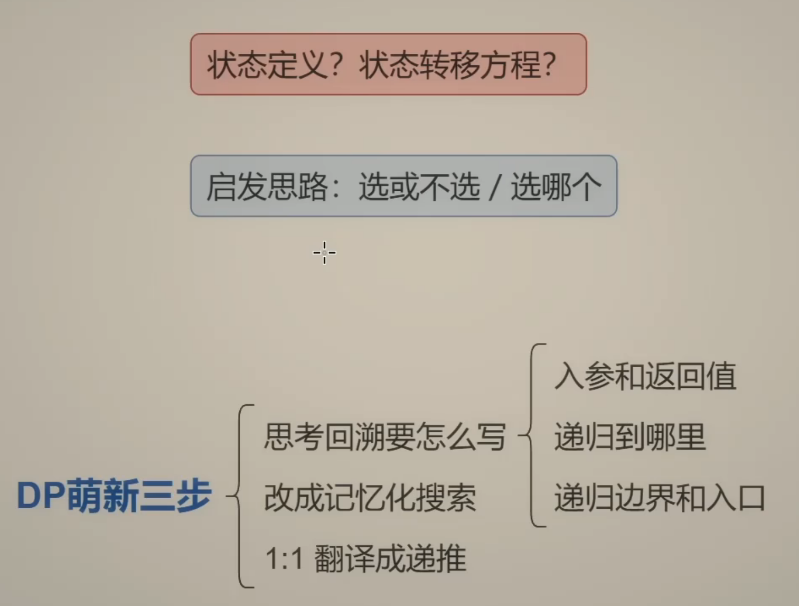
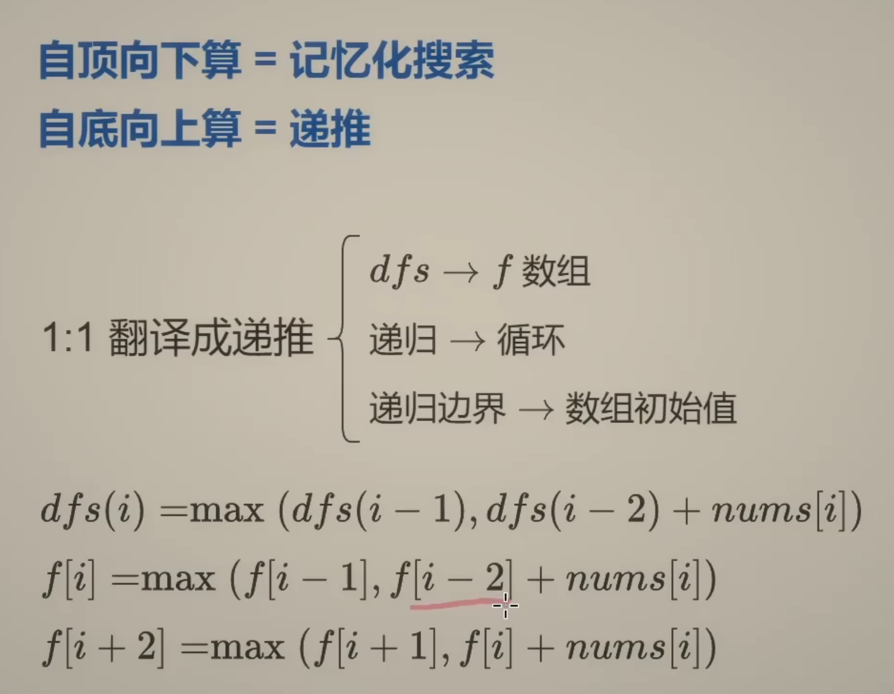
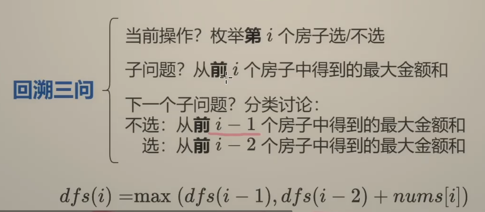
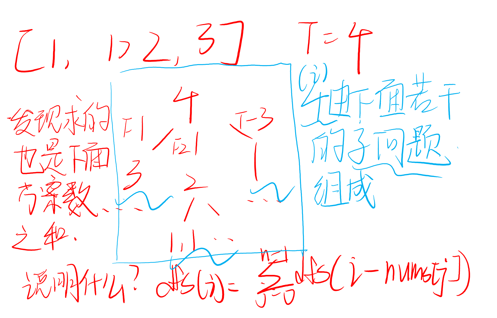

## DP 爬楼梯 打家劫舍
前置知识：[【动态规划入门：从记忆化搜索到递推【基础算法精讲 17】】](https://www.bilibili.com/video/BV1Xj411K7oF?vd_source=1e683c3cb93400956a910790b98ffccb)  

思考清楚：f数组是从**前**或者**后**面的元素得来的，枚举的是当前元素选or不选！
#### 如何思考动态规划问题？  
可以先从回溯递归开始想，后面改成记忆化搜素，再改成f数组动态规划  

**记忆化搜索 ->  递推 ->  状态转移方程**  
@cache装饰器/memo数组  

  
注意有个下标防止越界的做法：  
f[i] = max(f[i-1], f[i-2] + nums[i])  
**同时+2变成正的** 但nums[i]不用变（对应状态位置没变） 

#### ①打家劫舍
[198.打家劫舍](https://leetcode.cn/problems/house-robber/description/)

```python
class Solution:
    def rob(self, nums: List[int]) -> int:
        # n = len(nums)
        # @cache 记忆化搜素
        # def dfs(i):
        #     if i < 0:
        #         return 0
        #     return max(dfs(i-1), dfs(i-2) + nums[i])
        # return dfs(n-1)

        # n = len(nums) 1：1翻译成递推
        # f = [0] * (n + 2)
        # for i, x in enumerate(nums):
        #     f[i+2] = max(f[i+1], f[i] + x)
        # return f[n+1] # f[-1]

        f0 = f1 = 0 # 最终空间优化
        for x in nums:
            f0, f1 = f1, max(f1, f0 + x)
        return f1
```
#### ②爬楼梯
[70.爬楼梯](https://leetcode.cn/problems/climbing-stairs/)  
和推广: [377.组合总数IV](https://leetcode.cn/problems/combination-sum-iv/)  
这里只对377进行讲解。  
[题解](https://leetcode.cn/problems/combination-sum-iv/solutions/2706336/ben-zhi-shi-pa-lou-ti-cong-ji-yi-hua-sou-y52j/)  
核心：和爬楼梯一样，定义 dfs(i) 表示爬 i 个台阶的方案数。

考虑最后一步爬了 x=nums[j] 个台阶，那么问题变成爬 i−x 个台阶的方案数，即 dfs(i−x)。

所以有

$dfs(i) = \sum_{j=0}^{n-1} dfs(i - nums[j])$

**注：如果 nums[j]>i 则跳过。**

回顾一下，70 那题可以看作 nums=[1,2]，有

dfs(i)=dfs(i−1)+dfs(i−2)

递归边界：dfs(0)=1。爬 0 个台阶的方案数是 1。
也可以这样理解，我们从 target 开始往下爬，刚好爬到底部（递归边界）此时就找到了一个合法的方案，返回 1。

递归入口：dfs(target)，也就是答案。

```python
class Solution:
    def combinationSum4(self, nums: List[int], target: int) -> int:
        # n = len(nums)
        # @cache
        # def dfs(i):
        #     if i == 0:
        #         return 1
        #     return sum(dfs(i - x) for x in nums if x <= i)
        # return dfs(target)
        f = [0] * (target + 1)
        f[0] = 1
        for i in range(1, target + 1):
            f[i] = sum(f[i - x] for x in nums if x <= i)
        return f[target] 
```
进阶一点：  
[2266.统计打字方案数](https://leetcode.cn/problems/count-number-of-texts/description/)  
思想：本质上是 70. 爬楼梯，每次可以跳 1 到 3 或者 1 到 4 个台阶，计算跳 cnt 个台阶的方案数。其中 cnt 表示连续相同子串的长度。

对于字符不为 7 或 9 的情况，定义一个类似爬楼梯的 DP，即 f[i] 表示长为 i 的只有一种字符的字符串所对应的文字信息种类数，我们可以将末尾的 1 个、2 个或 3 个字符变成一个字母，那么问题变成长为 i−1,i−2,i−3 的只有一种字符的字符串所对应的文字信息种类数，即

**f[i]=f[i−1]+f[i−2]+f[i−3]**  

其中加法是因为三种方案互斥，根据**加法原理**相加。

对于字符为 7 或 9 的情况，定义 g[i] 表示长为 i 的只有一种字符的字符串对应的文字信息种类数，可以得到类似的转移方程

**g[i]=g[i−1]+g[i−2]+g[i−3]+g[i−4]**  

由于各个组（连续相同子串）的打字方案互相独立，根据**乘法原理**，把各个组的方案数相乘，即为答案。

认识一个新函数：**groupby()**
```python
from itertools import groupby

# 基本用法
data = [1, 1, 2, 3, 3, 3, 4, 4]
for key, group in groupby(data):
    print(f"Key: {key}, Group: {list(group)}")

# 输出:
# Key: 1, Group: [1, 1]
# Key: 2, Group: [2]
# Key: 3, Group: [3, 3, 3]
# Key: 4, Group: [4, 4]
```
##### 关键点：  
1.只对**连续**的相同元素进行分组  
2.返回一个迭代器，产生(key, group)对  
3.需要先排序才能对非连续相同元素分组

#### ③最大子数组和