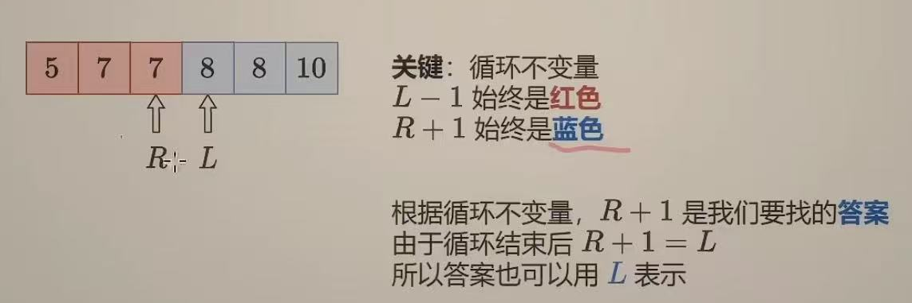
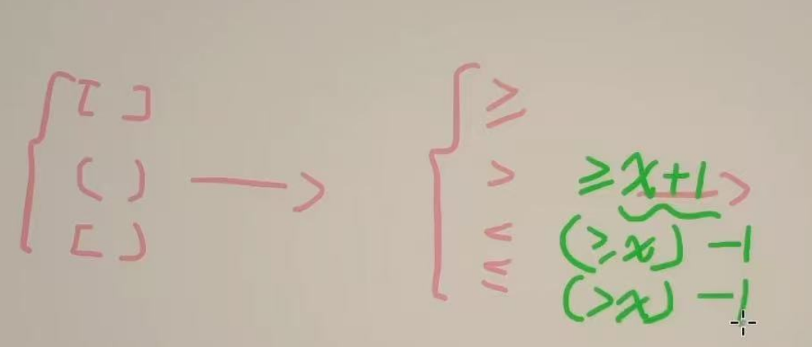
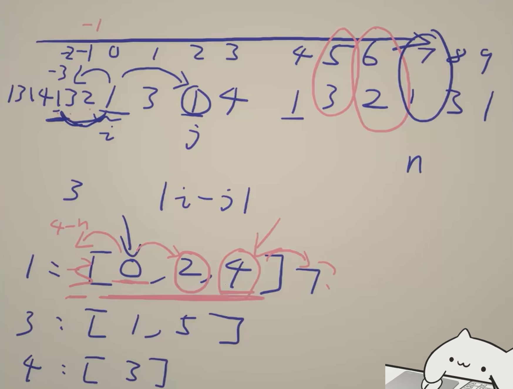

## 二分算法
前置知识：[二分查找 红蓝染色法【基础算法精讲 04】](https://www.bilibili.com/video/BV1AP41137w7/?spm_id_from=333.337.search-card.all.click&vd_source=ab8f6cb2a78f8a26a792e44477726c95)  

***有序有序有序！！***  
这是闭区间的写法，我也一般用闭区间）  
 
**找的是第一个大于等于target的元素下标**  
常用的可以用一个库：**bisect**  

bisect_left(a, x)： ≥ x  
bisect_right(a, x)： > x  

**关键区别：**
当列表中存在与 x 相同的值时，bisect_left 会返回最左侧的插入位置，而 bisect_right 返回最右侧的插入位置。（下标）  
**如：**
```python
import bisect

a = [1, 2, 4, 4, 4, 6]

# 查找值为4的插入位置
left = bisect.bisect_left(a, 4)   # 返回2（第一个4的位置）
right = bisect.bisect_right(a, 4) # 返回5（最后一个4的下一个位置）

print(left, right)  # 输出: 2 5
```
### ① 二分查找
模板：
```python
def lower_bound(self, nums: List[int], target: int) -> int:
        left, right = 0, len(nums) - 1  # 闭区间 [left, right]
        while left <= right:  # 区间不为空
            # 循环不变量：
            # nums[left-1] < target
            # nums[right+1] >= target
            mid = (left + right) // 2
            if nums[mid] >= target: 
                right = mid - 1  # 范围缩小到 [left, mid-1]
            else:
                left = mid + 1  # 范围缩小到 [mid+1, right]
        # 循环结束后 left = right+1
        # 此时 nums[left-1] < target 而 nums[left] = nums[right+1] >= target
        # 所以 left 就是第一个 >= target 的元素下标
        return left
```
nums[mid] > target 与nums[mid] <= target 的话，找的就是>target的第一个下标 ~ 一个最左边，一个最右边  
**接下来四种常见的变形写法：**  


简单例题：  
[34 在排序数组中查找元素第一个和最后一个位置](https://leetcode.cn/problems/find-first-and-last-position-of-element-in-sorted-array/description/)
```python
class Solution:
    # lower_bound 返回最小的满足 nums[i] >= target 的下标 i
    # 如果数组为空，或者所有数都 < target，则返回 len(nums)
    # 要求 nums 是非递减的，即 nums[i] <= nums[i + 1]
    def lower_bound(self, nums: List[int], target: int) -> int:
        left, right = 0, len(nums) - 1  # 闭区间 [left, right]
        while left <= right:  # 区间不为空
            # 循环不变量：
            # nums[left-1] < target
            # nums[right+1] >= target
            mid = (left + right) // 2
            if nums[mid] >= target:
                right = mid - 1  # 范围缩小到 [left, mid-1]
            else:
                left = mid + 1  # 范围缩小到 [mid+1, right]
        # 循环结束后 left = right+1
        # 此时 nums[left-1] < target 而 nums[left] = nums[right+1] >= target
        # 所以 left 就是第一个 >= target 的元素下标
        return left

    def searchRange(self, nums: List[int], target: int) -> List[int]:
        start = self.lower_bound(nums, target)
        if start == len(nums) or nums[start] != target:
            return [-1, -1]  # nums 中没有 target
        # 如果 start 存在，那么 end 必定存在
        end = self.lower_bound(nums, target + 1) - 1
        return [start, end]
```


**进阶题**：  
[2080.区间内查询数字的频率](https://leetcode.cn/problems/range-frequency-queries/)
- 很好的思路：**反向转换**为统计对应数字出现的下标位置->哈希表存储！（一般思路也是统计下标位置，这直接反过来统计对应数字出现的下标就行了）

```python
class RangeFreqQuery:
    def __init__(self, arr: List[int]):
        pos = defaultdict(list)
        for i, x in enumerate(arr):
            pos[x].append(i)
        self.pos = pos

    def query(self, left: int, right: int, value: int) -> int:
        a = self.pos[value]
        return bisect_right(a, right) - bisect_left(a, left)


# Your RangeFreqQuery object will be instantiated and called as such:
# obj = RangeFreqQuery(arr)
# param_1 = obj.query(left,right,value)
```
推广相似题: [3488.距离最小相等元素查询](https://leetcode.cn/problems/closest-equal-element-queries/description/)  
- 除了上题技巧，多了一个更牛逼的哨兵：表示前后循环距离的下标扩展！
- 想到二分来简化遍历！从O($n^2$)到O($n\log n$)的优化！

 
```python
class Solution:
    def solveQueries(self, nums: List[int], queries: List[int]) -> List[int]:
        indices = defaultdict(list)
        for i, x in enumerate(nums):
            indices[x].append(i)

        n = len(nums)
        for p in indices.values():
            # 前后各加一个哨兵 这样下面就不用写一堆判断了
            i0 = p[0]
            p.insert(0, p[-1] - n) # 为什么只考虑首尾？你想想再远的还有必要考虑吗
            p.append(i0 + n)

        for qi, i in enumerate(queries):
            p = indices[nums[i]]
            if len(p) == 3:
                queries[qi] = -1
            else:
                j = bisect_left(p, i) # 我是遍历，n**2了，这里直接二分就好啦
                queries[qi] = min(i - p[j - 1], p[j + 1] - i)
        return queries
```
思想一致的两个题：  
[1146.快照数组](https://leetcode.cn/problems/snapshot-array/description/)  
[981.基于时间的键值储存](https://leetcode.cn/problems/time-based-key-value-store/)  
都是基于一个思路：每次更新不复制数组 -> 创建一个(key, value, timestamp) 的结构，每次查询对应timestamp的时候去**二分查找**就行了   
这里给出1146答案
```python
class SnapshotArray:

    def __init__(self, length: int):
        self.cur_snap_id = 0
        self.history = defaultdict(list)

    def set(self, index: int, val: int) -> None:
        self.history[index].append((self.cur_snap_id, val))

    def snap(self) -> int:
        self.cur_snap_id += 1
        return self.cur_snap_id - 1

    def get(self, index: int, snap_id: int) -> int:
        j = bisect_left(self.history[index], (snap_id + 1,)) - 1
        return self.history[index][j][1] if j >= 0 else 0


# Your SnapshotArray object will be instantiated and called as such:
# obj = SnapshotArray(length)
# obj.set(index,val)
# param_2 = obj.snap()
# param_3 = obj.get(index,snap_id)
```


### ② 二分答案
“花费一个 log 的时间，增加了一个条件。” —— 二分答案

- 「求最小」和二分查找求「排序数组中某元素的第一个位置」是类似的，按照红蓝染色法，左边是不满足要求的（红色），右边则是满足要求的（蓝色）。

- 「求最大」的题目则相反，左边是满足要求的（蓝色），右边是不满足要求的（红色）。这会导致二分写法和上面的「求最小」有一些区别。

以开区间二分为例：

- **求最小**：check(mid) == true 时更新 right = mid，反之更新 left = mid，最后返回 right。
- **求最大**：check(mid) == true 时更新 left = mid，反之更新 right = mid，最后返回 left。
对于开区间写法，简单来说 check(mid) == true 时更新的是谁，最后就返回谁。
#### §2.1 求最小
**题目求什么，就二分什么。**

**答疑**  
问：如何把二分答案与数组上的二分查找联系起来？

答：假设范围是 [2,3,4,5]，我们相当于在一个虚拟数组 [check(2),check(3),check(4),check(5)] 中二分找第一个（或者最后一个）值为 true 的 check(i)。这同样可以用红蓝染色法思考。  

**总结**:  
在练习时，请注意「求最小」和「求最大」的二分写法上的区别。  
[1283.使结果不超过阈值的最小除数](https://leetcode.cn/problems/find-the-smallest-divisor-given-a-threshold/description/)
```python
class Solution:
    def smallestDivisor(self, nums: List[int], threshold: int) -> int:
        check = lambda m: sum((x - 1) // m for x in nums) <= threshold - len(nums)
        return bisect_left(range(max(nums)), True, 1, key=check)
```
更详细的讲解：
[2187讲解](https://leetcode.cn/problems/minimum-time-to-complete-trips/)
```python
pass
```
