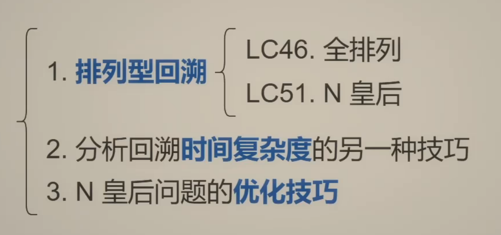
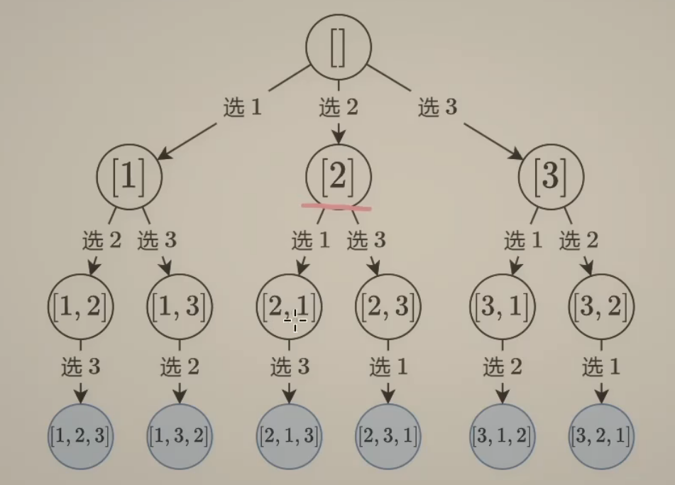
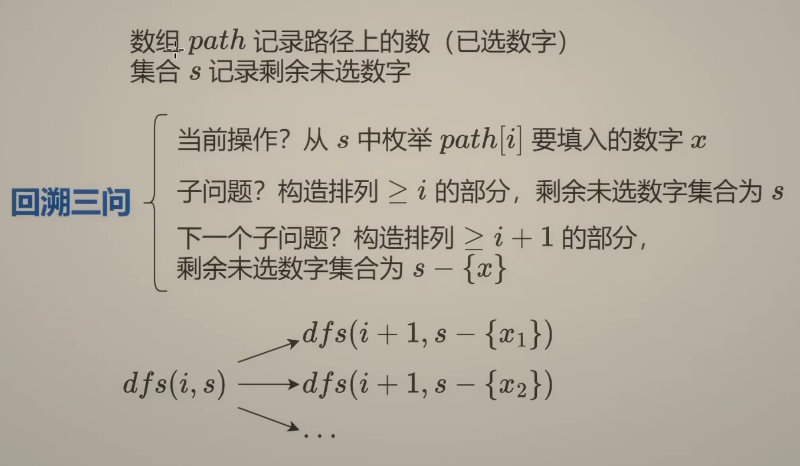
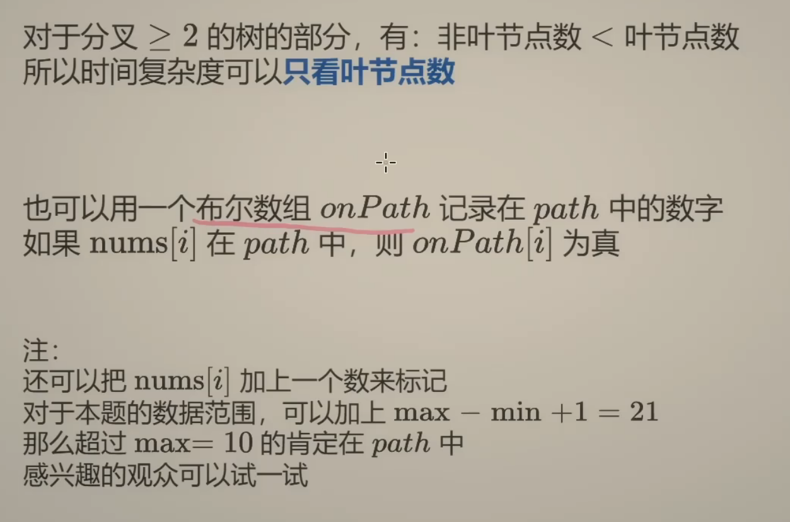

## 排列型回溯
[【回溯算法套路③排列型回溯+N皇后【基础算法精讲 16】】](https://www.bilibili.com/video/BV1mY411D7f6?vd_source=1e683c3cb93400956a910790b98ffccb)  

[46.全排列](https://leetcode.cn/problems/permutations/description/)

画这样一棵树：

