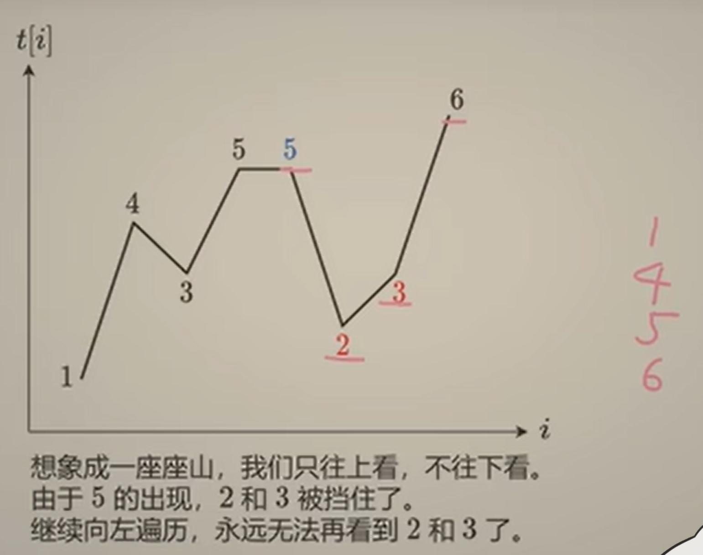
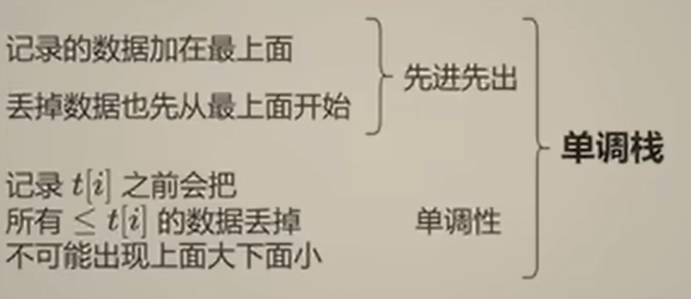
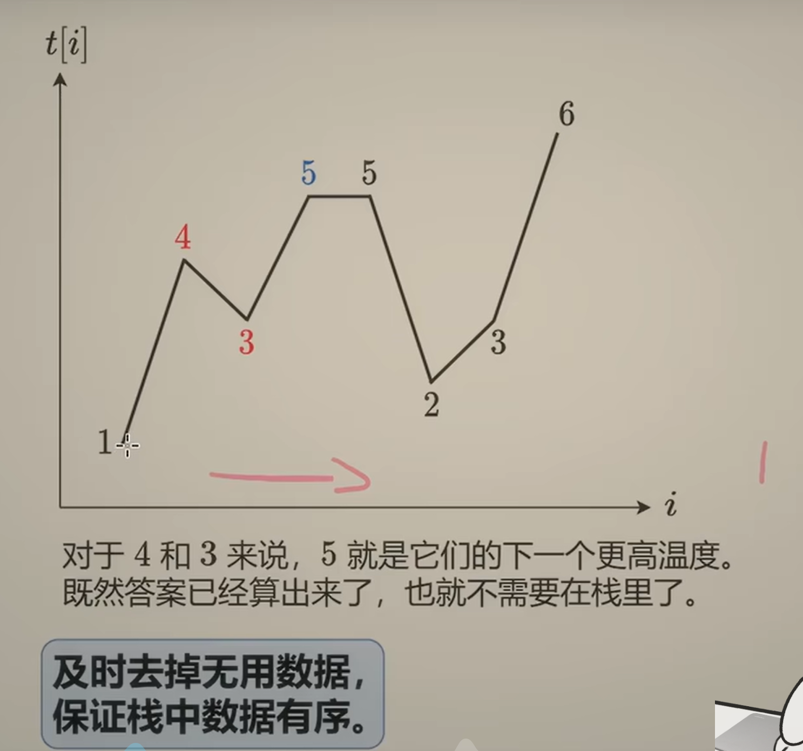
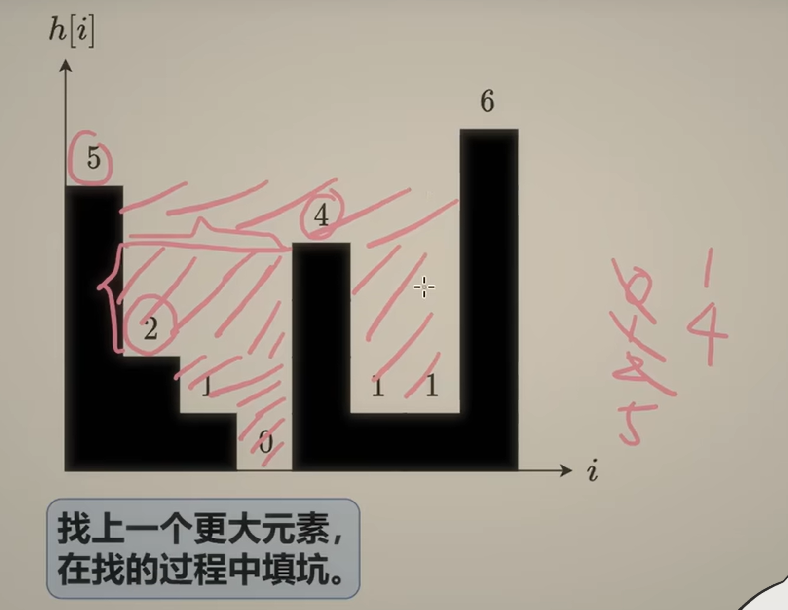

## 单调栈
[题单](https://leetcode.cn/discuss/post/3579480/ti-dan-dan-diao-zhan-ju-xing-xi-lie-zi-d-u4hk/)
### ① 基础/进阶
#### §1.1 基础
基础: [【单调栈【基础算法精讲 26】】](https://www.bilibili.com/video/BV1VN411J7S7?vd_source=1e683c3cb93400956a910790b98ffccb)  
**上一个/下一个 最大/最小 元素 ——> 单调栈**  
模板题:[739.每日温度](https://leetcode.cn/problems/daily-temperatures/description/)  
- 从右到左遍历

这样保证这个数组的数据是单调的

-  从左到右遍历

while循环里注意技巧：  
题目要计算什么，**while循环里就写什么**
```python
class Solution:
    def dailyTemperatures(self, temperatures: List[int]) -> List[int]:
        # # 从左到右
        # for i, j in enumerate(temperatures):
        #     while st and j > temperatures[st[-1]]:
        #         t = st.pop()
        #         ans[t] = i - t
        #     st.append(i)
        # return ans

        # 从右到左
        n = len(temperatures)
        st = []
        ans = [0] * (n)
        for i in range(n-1, -1, -1):
            x = temperatures[i]
            while st and x >= temperatures[st[-1]]:
                st.pop()
            if st:
                ans[i] = st[-1] - i
            st.append(i)
        return ans
```

接雨水的另一种做法: -> **单调栈**  
[42.接雨水](https://leetcode.cn/problems/trapping-rain-water/description/)  
从前后缀分解/相向双指针(**竖着算**) --> 单调栈(**横着算**)  


```python
class Solution:
    def trap(self, height: List[int]) -> int:
        ans = 0
        st = []
        for i, h in enumerate(height):
            while st and h >= height[st[-1]]:
                bottom_h = height[st.pop()]
                if not st:
                    break
                left = st[-1]
                dh = min(height[left], h) - bottom_h
                ans += dh * (i - left - 1)
            st.append(i)
        return ans
```

[853.车队](https://leetcode.cn/problems/car-fleet/description/)  
1. 思考我们要维护的**单调元素**是什么？
2. 思考单调性是**维护单调递减还是单调递增**可以在最后得到答案？

主要看最后，维护的t表明有几个车队
```python
class Solution:
    def carFleet(self, target: int, position: List[int], speed: List[int]) -> int:
        new_list = sorted(zip(position, speed))
        time_list = []
        for j, x in new_list:
            time_list.append((target - j) / x)
        st = []
        ans = 0
        for t in time_list:
            while st and t >= st[-1]: # 就维护答案思路有点问题 # t之前的车手比t块，那么他们会组成一个车队，
                st.pop()
            st.append(t)  #由于他们会组成一个车队并且时间是t 直接留下速度＋车队
        return len(st)
```
#### §1.2 进阶
[1019.链表中的下一个更大节点](https://leetcode.cn/problems/next-greater-node-in-linked-list/description/)  
我记得有个差不多的，就是当你发现不止一个值需要记录的时候，只需用()把他们保存为一组就行了  # 是我的shi山
```python
# Definition for singly-linked list.
# class ListNode:
#     def __init__(self, val=0, next=None):
#         self.val = val
#         self.next = next
class Solution:
    def nextLargerNodes(self, head: Optional[ListNode]) -> List[int]:
        # ans = [0] * 10 ** 4
        # i = 0
        # st = []
        # while head:
        #     while st and head.val > st[-1][0]:
        #         val, index = st.pop()
        #         ans[index] = head.val
        #     st.append((head.val, i))
        #     i += 1
        #     head = head.next
        # for _, i in st:
        #     ans[i] = 0
        # return ans[:i+1]
        ans = []
        st = []  # 单调栈（节点值，节点下标）
        while head:
            while st and st[-1][0] < head.val:
                ans[st.pop()[1]] = head.val  # 用当前节点值更新答案
            st.append((head.val, len(ans)))  # 当前 ans 的长度就是当前节点的下标
            ans.append(0)  # 占位 可以说是先变成0，后面如果发现了更大的就换
            head = head.next
        return ans

    """
    # 链表转成数组
        tmp = []

        while head:
            tmp.append(head.val)
            head = head.next
    """
```

[654.最大二叉树](https://leetcode.cn/problems/maximum-binary-tree/description/)
```python
# Definition for a binary tree node.
# class TreeNode:
#     def __init__(self, val=0, left=None, right=None):
#         self.val = val
#         self.left = left
#         self.right = right
class Solution:
    def constructMaximumBinaryTree(self, nums: List[int]) -> Optional[TreeNode]:
        # if not nums:
        #     return 
        # cnt = max(nums)
        # i = nums.index(cnt)
        # t = TreeNode(val=cnt, left=self.constructMaximumBinaryTree(nums[:i]), right=self.constructMaximumBinaryTree(nums[i+1:]))
        # return t
        st = []
        for num in nums:
            cur = TreeNode(num)
            while st and num > st[-1].val:
                cur.left = st.pop()
            if st:
                st[-1].right = cur
            st.append(cur)
        return st[0]
```
- 分为以下步骤来单调栈：
1. 当节点值**大于**栈顶时，弹出栈顶作为当前节点的**左孩子**（可以理解为维护不了单调栈了要弹出，比当前节点这个较大值**更早出现**，因此在左边
2. 栈顶的右孩子就是**当前节点**（比栈顶**晚**出现，就在其右边
3. 当前节点加入栈
### ② 矩形

[84.柱状图中最大的矩形](https://leetcode.cn/problems/largest-rectangle-in-histogram/description/)
```python
class Solution:
    def largestRectangleArea(self, heights: List[int]) -> int:
        heights = [0] + heights + [0]
        st = []
        ans = 0
        for i, h in enumerate(heights):
            while st and heights[st[-1]] > h:
                dh = heights[st.pop()]
                dw = i - st[-1] - 1
                ans = max(ans, dh * dw)
            st.append(i)
        return ans 
```
很巧妙的点:
1. 首先理解到**怎么求**：找i左右第一个小于h的元素，然后求出h*(i-st[-1]-1)，有点像接雨水，可以好好理解
2. **首尾加0**：头部的 0 处理弹出最后一个有效元素的时候stack[-1]有意义；尾部的 0 处理末尾的升序有效元素也能被弹出  

[1793.好子数组的最大分数](https://leetcode.cn/problems/maximum-score-of-a-good-subarray/)
```python
class Solution:
    def maximumScore(self, nums: List[int], k: int) -> int:
        # n = len(nums)
        # left = [-1] * n
        # st = []
        # for i, x in enumerate(nums):
        #     while st and x <= nums[st[-1]]:
        #         st.pop()
        #     if st:
        #         left[i] = st[-1]
        #     st.append(i)

        # right = [n] * n
        # st.clear()
        # for i in range(n - 1, -1, -1):
        #     x = nums[i]
        #     while st and x <= nums[st[-1]]:
        #         st.pop()
        #     if st:
        #         right[i] = st[-1]
        #     st.append(i)

        # ans = 0
        # for h, l, r in zip(nums, left, right):
        #     if l < k < r:  # 相比 84 题多了这一行
        #         ans = max(ans, h * (r - l - 1))
        # return ans
        n = len(nums)
        ans = min_h = nums[k]
        i = j = k
        for _ in range(n - 1):
            if j == n - 1 or i > 0 and nums[i - 1] > nums[j + 1]:
                i -= 1
                min_h = min(min_h, nums[i])
            else:
                j += 1
                min_h = min(min_h, nums[j])
            ans = max(ans, min_h * (j - i + 1))
        return ans
```
### ③ 贡献法

### ④ 最小字典序
