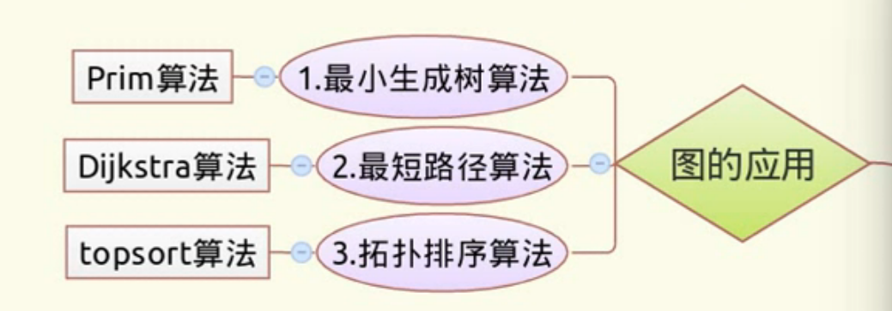

## 图论核心概念分类整理

### 一、顶点相关
1. **度(Degree)**
   - 无向图：连接边的总数
   - 有向图：
     - 入度(In-degree)：指向该顶点的边数
     - 出度(Out-degree)：从该顶点指出的边数
  
2. **特殊顶点**
   - 孤立顶点：度数为0
   - 叶顶点：度数为1

### 二、边相关
1. **边权**：表示距离/成本的数值
2. **方向性**
   - 有向边：(u,v)有序对
   - 无向边：{u,v}无序对
3. **特殊边**
   - 自环：顶点连接自身
   - 平行边：两顶点间多条边

### 三、图类型
1. **基础分类**
   - 简单图：无自环和平行边
   - 多重图：允许平行边
   - 伪图：允许自环和平行边
2. **特殊图型**
   - 完全图：每对顶点间都有边（边数=n(n-1)/2）
   - 树：无环连通图（边数=n-1）
   - 二分图：顶点可分两个独立集合
   - DAG：有向无环图

### 四、路径与连通
1. **路径**：无重复顶点的边序列
2. **环**：首尾相同的路径(长度≥3)
3. **连通性**
   - 无向图：任意两顶点连通
   - 有向图：
     - 强连通：双向可达
     - 弱连通：忽略方向后连通

### 五、图指标
1. **直径**：最长最短路径
2. **密度**：实际边数/最大可能边数
3. **稀疏图**：边数≪|V|²
4. **稠密图**：边数≈|V|²

### 六、表示方法
G = (V, E) V是顶点集，E是边集
1. **邻接矩阵**：V×V矩阵  
- 缺点：
  1. 空间复杂度高 O(V²)
  2. 边查找复杂度高，在点多边少的情况下浪费内存（很多0）
  3. 找邻接点要遍历->优化：变成**邻接表**
- 实现：
```python
class GraphAdjMatrix:
    def __init__(self, num_vertices):
        self.num_vertices = num_vertices
        self.matrix = [[0] * num_vertices for _ in range(num_vertices)]
    
    def add_edge(self, v1, v2, weight=1):
        if 0 <= v1 < self.num_vertices and 0 <= v2 < self.num_vertices:
            self.matrix[v1][v2] = weight
            # 如果是无向图，还需要添加反向边
            self.matrix[v2][v1] = weight
    
    def remove_edge(self, v1, v2):
        if 0 <= v1 < self.num_vertices and 0 <= v2 < self.num_vertices:
            self.matrix[v1][v2] = 0
            self.matrix[v2][v1] = 0
    
    def __str__(self):
        return '\n'.join([' '.join(map(str, row)) for row in self.matrix])

# 使用示例
g = GraphAdjMatrix(5)
g.add_edge(0, 1)
g.add_edge(0, 4)
g.add_edge(1, 2)
g.add_edge(1, 3)
g.add_edge(1, 4)
g.add_edge(2, 3)
g.add_edge(3, 4)
print("邻接矩阵表示的图:")
print(g)
# 邻接矩阵表示的图:
# 0 1 0 0 1
# 1 0 1 1 1
# 0 1 0 1 0
# 0 1 1 0 1
# 1 1 0 1 0
```

2. **邻接表**：顶点→邻居列表
```python
from collections import defaultdict

class GraphAdjList:
    def __init__(self):
        self.graph = defaultdict(list)
    
    def add_edge(self, u, v, weight=None):
        # 对于无向图，需要添加双向边
        self.graph[u].append((v, weight) if weight is not None else v)
        self.graph[v].append((u, weight) if weight is not None else u)
    
    def remove_edge(self, u, v):
        # 从u的邻接表中移除v
        self.graph[u] = [neighbor for neighbor in self.graph[u] 
                        if neighbor != v and (isinstance(neighbor, tuple) and neighbor[0] != v)]
        # 从v的邻接表中移除u
        self.graph[v] = [neighbor for neighbor in self.graph[v] 
                        if neighbor != u and (isinstance(neighbor, tuple) and neighbor[0] != u)]
    
    def get_neighbors(self, u):
        return self.graph[u]
    
    def __str__(self):
        return '\n'.join([f"{node}: {neighbors}" for node, neighbors in self.graph.items()])

# 使用示例
g = GraphAdjList()
g.add_edge(0, 1)
g.add_edge(0, 4)
g.add_edge(1, 2, 5)  # 带权边
g.add_edge(1, 3)
g.add_edge(1, 4)
g.add_edge(2, 3)
g.add_edge(3, 4)
print("\n邻接表表示的图:")
print(g)
# 邻接表表示的图:
# 0: [1, 4]
# 1: [0, (2, 5), 3, 4]
# 4: [0, 1, 3]
# 2: [(1, 5), 3]
# 3: [1, 2, 4]
```
### 七、图的遍历方式
1. **深度优先搜索(DFS)**：从起点开始，访问一个顶点，然后递归访问它的所有邻居，直到没有邻居为止，再返回上一个顶点，继续访问它的下一个邻居，直到所有顶点都被访问完。
```python
def dfs(graph, start):
    visited = set()
    stack = [start]
    
    while stack:
        vertex = stack.pop()
        if vertex not in visited:
            print(vertex, end=' ')
            visited.add(vertex)
            # 将邻居按逆序压入栈，以保持顺序
            neighbors = graph.get_neighbors(vertex)
            # 处理带权图的情况
            if neighbors and isinstance(neighbors[0], tuple):
                neighbors = [n[0] for n in neighbors]
            stack.extend(reversed(neighbors))
```
2. **广度优先搜索(BFS)**：从起点开始，访问一个顶点，然后访问它的所有邻居，直到没有邻居为止，再访问下一个邻居，直到所有顶点都被访问完。
```python
from collections import deque

def bfs(graph, start):
    visited = set()
    queue = deque([start])
    
    while queue:
        vertex = queue.popleft()
        if vertex not in visited:
            print(vertex, end=' ')
            visited.add(vertex)
            neighbors = graph.get_neighbors(vertex)
            # 处理带权图的情况
            if neighbors and isinstance(neighbors[0], tuple):
                neighbors = [n[0] for n in neighbors]
            queue.extend(neighbors)
```


### 八、图的应用

#### ① 最小生成树算法 (Minimum Spanning Tree) MST  
在**无向图**中求一颗树(**n-1**条边,**无环**,连通**所有点**)而且这棵树的**边权和最小**
- **Prim算法**：（加点法）从任意顶点开始，每次选择距离当前顶点最近的未访问顶点，并将其加入树中。  
```python
import heapq

def prim_mst(graph):
    # 示例图（邻接表表示，格式：节点: [(邻居, 权重), ...]）  
    # 初始化
    mst = []  # 存储最小生成树的边
    visited = set()  # 已访问的节点
    start_node = next(iter(graph))  # 从任意节点开始（这里取第一个）
    visited.add(start_node)
    
    # 使用优先队列（最小堆）存储候选边 (weight, u, v)
    edges = [
        (weight, start_node, neighbor)
        for neighbor, weight in graph[start_node]
    ]
    heapq.heapify(edges)
    
    while edges and len(visited) < len(graph):
        weight, u, v = heapq.heappop(edges)
        if v not in visited:
            visited.add(v)
            mst.append((u, v, weight))
            # 将v的邻边加入堆
            for neighbor, weight in graph[v]:
                if neighbor not in visited:
                    heapq.heappush(edges, (weight, v, neighbor))
    
    return mst
```

- **Kruskal算法**：（加边法）按照边权从小到大排序，依次选择权重最小的边，如果这条边不会形成环，则加入最小生成树中。  
```python
class UnionFind:
    """并查集（用于检测环）"""
    def __init__(self, nodes):
        self.parent = {node: node for node in nodes}
    
    def find(self, u):
        while self.parent[u] != u:
            self.parent[u] = self.parent[self.parent[u]]  # 路径压缩
            u = self.parent[u]
        return u
    
    def union(self, u, v):
        root_u = self.find(u)
        root_v = self.find(v)
        if root_u != root_v:
            self.parent[root_v] = root_u

def kruskal_mst(graph):
    # 提取所有边并排序
    edges = []
    for u in graph:
        for v, weight in graph[u]:
            edges.append((weight, u, v))
    edges.sort()  # 按权重升序排序
    
    mst = []
    uf = UnionFind(graph.keys())
    
    for weight, u, v in edges:
        if uf.find(u) != uf.find(v):  # 检查是否形成环
            uf.union(u, v)
            mst.append((u, v, weight))
        if len(mst) == len(graph) - 1:  # 边数 = 顶点数 - 1
            break
    
    return mst
```
- 最小生成树算法对比（Prim vs Kruskal）

| **对比维度**       | **Prim算法**                              | **Kruskal算法**                          |
|--------------------|-------------------------------------------|------------------------------------------|
| **核心思想**       | 从单个顶点逐步扩展生成树                   | 按边权重排序后逐步合并不连通的组件        |
| **数据结构**       | 优先队列（最小堆）                         | 并查集（Union-Find）                     |
| **时间复杂度**     | O(E log V)（二叉堆）                      | O(E log E)（排序主导）                   |
| **空间复杂度**     | O(V)（存储节点）                          | O(E)（存储所有边）                       |
| **适用场景**       | 稠密图（边数多）                          | 稀疏图（边数少）                        |
| **是否需要连通图** | 必须连通                                  | 可以处理非连通图                        |
| **实现复杂度**     | 中等                                      | 简单                                    |
| **典型应用**       | 网络设计、电路布线                        | 聚类分析、地理网络                      |
| **边处理方式**     | 动态考察邻接边                            | 静态排序后处理                          |
| **起始点依赖**     | 依赖                                      | 不依赖                                  |

1. **Prim算法特点**：
   - 适合邻接矩阵存储的稠密图
   - 需要维护优先队列
   - 类似Dijkstra算法的实现方式

2. **Kruskal算法特点**：
   - 适合边列表存储的稀疏图
   - 需要先对边排序
   - 使用并查集高效检测环

**选择建议**
- 当图非常稠密（E ≈ V²）时选择Prim
- 当图比较稀疏（E << V²）时选择Kruskal
- 需要处理非连通图时只能选择Kruskal

#### ② 最短路径算法
在**有向图**中求**任意两点**的最短路径，即求**点对之间的最短路径**。  
- **Dijkstra算法**：（贪心算法）从起始点开始，每次选择距离起始点最近的未访问顶点，并将其加入路径中.（单源最短路径，适用于**无负权边**!!!）  [灵神解释](https://leetcode.cn/problems/network-delay-time/solutions/2668220/liang-chong-dijkstra-xie-fa-fu-ti-dan-py-ooe8/)
```python
import heapq
# 以下默认使用邻接表
# graph = {
#     'A': {'B': 4, 'C': 2},
#     'B': {'A': 4, 'C': 1, 'D': 5},
#     'C': {'A': 2, 'B': 1, 'D': 8},
#     'D': {'B': 5, 'C': 8}
# }
# 1.优先队列（最小堆优化）

def dijkstra(graph, start):
    # 初始化距离字典
    distances = {node: float('infinity') for node in graph}
    distances[start] = 0
    
    # 使用最小堆存储 (当前距离, 当前节点)
    heap = [(0, start)]
    
    while heap:
        current_distance, current_node = heapq.heappop(heap)
        
        # 如果当前距离 > 已记录的距离，跳过（避免重复处理）
        if current_distance > distances[current_node]:
            continue
        
        # 遍历邻居
        for neighbor, weight in graph[current_node].items():
            distance = current_distance + weight
            
            # 如果找到更短路径，更新并加入堆
            if distance < distances[neighbor]:
                distances[neighbor] = distance
                heapq.heappush(heap, (distance, neighbor))
    
    return distances

# 2.普通实现(适合稠密图)

def dijkstra_no_heap(graph, start):
    distances = {node: float('infinity') for node in graph}
    distances[start] = 0
    visited = set()
    
    while len(visited) < len(graph):
        # 找到未访问的最小距离节点
        current_node = None
        min_distance = float('infinity')
        for node in graph:
            if node not in visited and distances[node] < min_distance:
                current_node = node
                min_distance = distances[node]
        
        if current_node is None:
            break
        
        visited.add(current_node)
        
        # 更新邻居距离
        for neighbor, weight in graph[current_node].items():
            if neighbor not in visited:
                new_distance = distances[current_node] + weight
                if new_distance < distances[neighbor]:
                    distances[neighbor] = new_distance
    
    return distances
```
