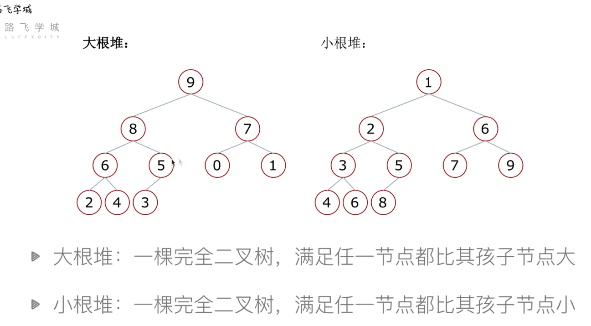
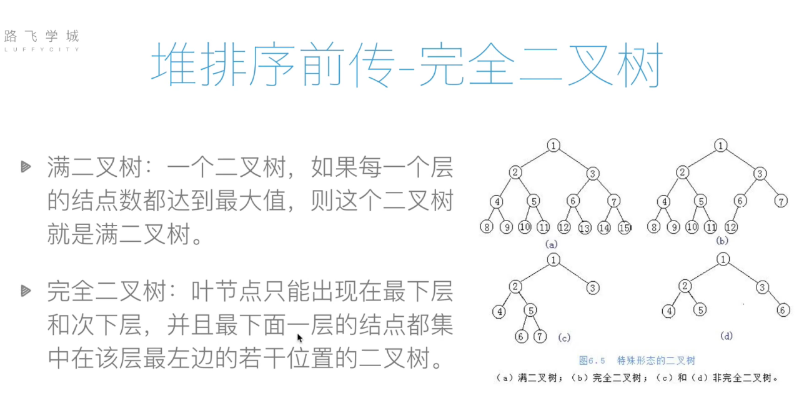

## 堆
代码讲解：[堆与向下调整函数](https://www.bilibili.com/video/BV1mp4y1D7UP?p=27&vd_source=1e683c3cb93400956a910790b98ffccb)  
**堆的类型**  
**最大堆（Max Heap）：** 每个父节点的值都大于或等于其子节点的值  
**最小堆（Min Heap）：** 每个父节点的值都小于或等于其子节点的值
  

**堆的性质:** 堆是一个完全二叉树，可以用数组高效表示

 
**对于索引i的节点：**

父节点索引：(i-1)//2

左子节点索引：2*i + 1

右子节点索引：2*i + 2

堆的根节点（数组第一个元素）总是最大（最大堆）或最小（最小堆）的元素

**堆的应用**  
优先队列

堆排序

图算法（如Dijkstra算法）

求Top K问题  

举例：堆排序和向下调整函数
```python
def sift(li, low, high): # 堆排序 -> 从上往下调整 向下调整函数
    """
    :param li: 列表
    :param low: 堆的根节点位置
    :param high: 堆的最后一个元素的位置
    :return:
    """
    i = low  # i最开始指向根节点
    j = 2 * i + 1  # j开始是左孩子
    tmp = li[low]  # 把堆顶存起来
    while i <= high:  # 只要j位置有数
        if j + 1 <= high and li[j + 1] > li[j]:  # 如果右孩子有并且比较大
            j += 1  # j指向右孩子
        if li[j] > tmp:
            li[i] = li[j]
            i = j  # 往下看一层
            j = 2 * i + 1
        else:  # tmp更大，把tmp放到i的位置上
            li[i] = tmp  # 把tmp放到某一级领导位置上
            break
    else:
        li[i] = tmp  # 把tmp放到叶子节点上


def heap_sort(li): # 堆排序
    n = len(li)
    for i in range((n - 2) // 2, -1, -1):
        # i 表示建堆的时候调整的部分的根的下标
        sift(li, i, n - 1)
    # 建堆完成了
    for i in range(n - 1, -1, -1):  # 表示从n-1到0，倒序
        # i z指向当前堆的最后一个元素
        li[0], li[i] = li[i], li[0]
        sift(li, 0, i - 1)  # i-1是新的high
```
------
python的内置模块：**heapq**  
常用技巧：
```python
1. 堆化操作
import heapq
# 将列表原地转换为堆（最小堆）
heap = [3, 1, 4, 1, 5, 9, 2]
heapq.heapify(heap)  # 时间复杂度O(n)
# 结果：heap = [1, 1, 2, 3, 5, 9, 4]
1. 压入元素
heapq.heappush(heap, 0)  # 添加元素并保持堆结构
# heap = [0, 1, 1, 3, 5, 9, 4, 2]
自定义排序的堆
当需要根据复杂条件排序时，可以存储元组：
heap = []
# 按第一个元素排序，相同时按第二个元素排序
heapq.heappush(heap, (priority, value, other_info))
1. 弹出最小元素(因为是小根堆，其实就是弹出堆顶元素)
smallest = heapq.heappop(heap)  # 弹出并返回最小元素
# smallest = 0, heap = [1, 1, 2, 3, 5, 9, 4]
1. 查看最小元素（不弹出）
smallest = heap[0]  # 只查看不弹出
```

堆是heap，但是q？-> queue 优先队列  
python但是只支持小根堆，怎么构建大根堆？  

**实现最大堆的技巧**  
Python的heapq模块只实现最小堆，可以通过存储负数来实现最大堆：

```python
import heapq
max_heap = []
heapq.heappush(max_heap, -3)
heapq.heappush(max_heap, -1)
heapq.heappush(max_heap, -4)

largest = -heapq.heappop(max_heap)  # 4
```
典型运用大根堆：[1046 最后一块石头的重量](https://leetcode.cn/problems/last-stone-weight/)  
可以看看题解，有个手撕全部heap类的大佬
```python
class Solution:
    def lastStoneWeight(self, stones: List[int]) -> int:
        heap = [-stone for stone in stones] # 构建大根堆
        heapq.heapify(heap)

        while len(heap) > 1:
            x, y = heapq.heappop(heap), heapq.heappop(heap)
            if x != y:
                heapq.heappush(heap, x-y)
        
        if heap: return -heap[0] # 如果heap不为空，返回堆顶元素，否则返回0
        return 0
```

