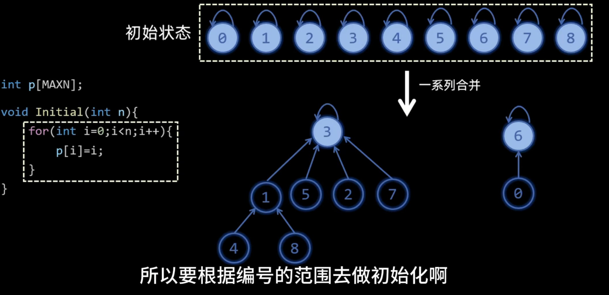

## 并查集
[讲解](https://www.bilibili.com/video/BV1zZRSYUEWV?vd_source=1e683c3cb93400956a910790b98ffccb)  

先从一道周赛题目引入：[450场周赛Q2 3551.数位和排序需要的最小交换次数](https://leetcode.cn/problems/minimum-swaps-to-sort-by-digit-sum/description/)  
哦吼，第二题卡住了？最后处理排序发现考虑了那么多情况还是错？没辙了，看到讲解发现wssb...  

[视频讲解](https://www.bilibili.com/video/BV1Z3JGzwEU9/?t=3m37s&vd_source=ab8f6cb2a78f8a26a792e44477726c95)  
你会发现最后变成了一个**环形结构**，每一次都会独立出去一个节点，即要搞k-1次 
```math
\therefore 找到有多少环就行了
```
这就等价于找连通块的个数，用并查集解决  
在「排序前的元素下标」与「排序后的元素下标」之间连边，得到一个图。

- 为什么是下标连边而不是元素值连边？因为元素值和下标是一一对应的，下标的范围更小，可以用数组记录。

通过上面的例子可知，图中每个大小为 **k 连通块**（有 k 个点和 k 条边，是个环），需要**k−1 次**交换操作，加到答案中。

- 为什么是 k−1 次？因为交换的过程中，除了最后一个数，其余每个数都不会等于其目标位置。这可以用反证法证明，如果在中途就出现某个数在其目标位置（这个数无需交换）的情况，那么意味着我们找到了一个更小的环，这与实际情况矛盾。视频讲解中给出了基于置换的解释，可以看看。

也可以用 **n 减去连通块的个数（每个连通块可以少操作一次）**，即为答案。


**推导公式：**


---

**并查集**可分为三个部分来理解：
- 合并
- 查询
- 集合  

-> 高效的处理**集合**的**查询**和**合并**


每个地方存每个节点的父节点编号，对应到下面图中的数组：
 
 
对应到下述代码：代表相当于**father/parent**  
代表元相当于根节点  

```python
def __init__(self, n: int):
        # 一开始有 n 个集合 {0}, {1}, ..., {n-1}
        # 集合 i 的代表元是自己，大小为 1
        self._fa = list(range(n))  # 代表元
        self._size = [1] * n  # 集合大小
        self.cc = n  # 连通块个数
```

 

对应到下述代码：
```python
# 返回 x 所在集合的代表元
    # 同时做路径压缩，也就是把 x 所在集合中的所有元素的 fa 都改成代表元
    def find(self, x: int) -> int:
        # 如果 fa[x] == x，则表示 x 是代表元
        if self._fa[x] != x:
            self._fa[x] = self.find(self._fa[x])  # fa 改成代表元
        return self._fa[x]

    # 判断 x 和 y 是否在同一个集合
    def is_same(self, x: int, y: int) -> bool:
        # 如果 x 的代表元和 y 的代表元相同，那么 x 和 y 就在同一个集合
        # 这就是代表元的作用：用来快速判断两个元素是否在同一个集合
        return self.find(x) == self.find(y)

    # 把 from 所在集合合并到 to 所在集合中
    # 返回是否合并成功
    def merge(self, from_: int, to: int) -> bool:
        x, y = self.find(from_), self.find(to)
        if x == y:  # from 和 to 在同一个集合，不做合并
            return False
        self._fa[x] = y  # 合并集合。修改后就可以认为 from 和 to 在同一个集合了
        self._size[y] += self._size[x]  # 更新集合大小（注意集合大小保存在代表元上）
        # 无需更新 _size[x]，因为我们不用 _size[x] 而是用 _size[find(x)] 获取集合大小，但 find(x) == y，我们不会再访问 _size[x]
        self.cc -= 1  # 成功合并，连通块个数减一
        return True
```
提到一个**路径压缩**的技巧:  
从直接递归调用->每次的回溯最后都让此节点直接指向**根节点**
 
变成->
 

可以通过递归看到，递归深度越低，查找效率越高 -> 树的高度要低一点，于是又引出如下合并的优化：
 
 
这部分代码就看图就行了，C++看得懂反正  

**总模板：**  
```python
class UnionFind:
    def __init__(self, n: int):
        # 一开始有 n 个集合 {0}, {1}, ..., {n-1}
        # 集合 i 的代表元是自己，大小为 1
        self._fa = list(range(n))  # 代表元
        self._size = [1] * n  # 集合大小
        self.cc = n  # 连通块个数

    # 返回 x 所在集合的代表元
    # 同时做路径压缩，也就是把 x 所在集合中的所有元素的 fa 都改成代表元
    def find(self, x: int) -> int:
        # 如果 fa[x] == x，则表示 x 是代表元
        if self._fa[x] != x:
            self._fa[x] = self.find(self._fa[x])  # fa 改成代表元
        return self._fa[x]

    # 判断 x 和 y 是否在同一个集合
    def is_same(self, x: int, y: int) -> bool:
        # 如果 x 的代表元和 y 的代表元相同，那么 x 和 y 就在同一个集合
        # 这就是代表元的作用：用来快速判断两个元素是否在同一个集合
        return self.find(x) == self.find(y)

    # 把 from 所在集合合并到 to 所在集合中
    # 返回是否合并成功
    def merge(self, from_: int, to: int) -> bool:
        x, y = self.find(from_), self.find(to)
        if x == y:  # from 和 to 在同一个集合，不做合并
            return False
        self._fa[x] = y  # 合并集合。修改后就可以认为 from 和 to 在同一个集合了
        self._size[y] += self._size[x]  # 更新集合大小（注意集合大小保存在代表元上）
        # 无需更新 _size[x]，因为我们不用 _size[x] 而是用 _size[find(x)] 获取集合大小，但 find(x) == y，我们不会再访问 _size[x]
        self.cc -= 1  # 成功合并，连通块个数减一
        return True

    # 返回 x 所在集合的大小
    def get_size(self, x: int) -> int:
        return self._size[self.find(x)]  # 集合大小保存在代表元上
```


### 并查集（Union-Find）应用场景

并查集是一种高效处理 **动态连通性问题** 的数据结构，核心功能是 **合并集合** 与 **查询连通性**。以下是典型应用场景及示例：

---

#### 一、基础应用场景

##### 1. 连通性问题
- **场景**：判断两个元素是否属于同一集合
- **经典问题**：
  - 图的连通分量统计（如岛屿问题、社交网络好友关系）
  - 检测无向图中的环（Kruskal算法中判断边是否形成环）
  - 示例：[LeetCode 547. 省份数量](https://leetcode.cn/problems/number-of-provinces/)

##### 2. 动态合并集合
- **场景**：实时合并两个集合，支持动态更新
- **经典问题**：
  - 合并社交网络中的用户群组
  - 离线处理多个合并操作后的查询
  - 示例：[LeetCode 684. 冗余连接](https://leetcode.cn/problems/redundant-connection/)

---

#### 二、进阶应用场景

##### 1. 分组与分类问题
- **场景**：将元素按规则分组（如等价关系、敌对关系）
- **技巧**：使用 **带权并查集** 维护额外信息（如距离、关系类型）
- **经典问题**：
  - 判断等式是否成立（如`a==b, b==c => a==c`）
  - 动物种类关系（如食物链问题）
  - 示例：[LeetCode 399. 除法求值](https://leetcode.cn/problems/evaluate-division/)

##### 2. 离线查询（处理历史合并）
- **场景**：先记录所有合并操作，再批量处理查询
- **经典问题**：
  - 历史社交关系回溯
  - 电网连通性历史状态查询
  - 示例：[LeetCode 1697. 检查边长度限制的路径是否存在](https://leetcode.cn/problems/checking-existence-of-edge-length-limited-paths/)

##### 3. 二维网格问题
- **场景**：将二维网格中的相邻元素视为连通
- **技巧**：将二维坐标映射为一维索引
- **经典问题**：
  - 岛屿合并（动态添加陆地后统计连通块）
  - 示例：[LeetCode 305. 岛屿数量 II](https://leetcode.cn/problems/number-of-islands-ii/)

---

#### 三、竞赛高频应用

##### 1. 最小生成树（Kruskal算法）
```python
edges.sort()  # 按权重排序
uf = UnionFind(n)
for w, u, v in edges:
    if uf.find(u) != uf.find(v):
        uf.union(u, v)
        total_weight += w
```

##### 2. 最近公共祖先（LCA）
- **用途**：结合Tarjan算法离线处理LCA查询

##### 3. 动态规划优化
- **用途**：合并状态（如将多个状态视为等价类）

---

#### §7.1 基础
[3493.属性图](https://leetcode.cn/problems/properties-graph/description/)
```python
class UnionFind:
    def __init__(self, n: int):
        # 一开始有 n 个集合 {0}, {1}, ..., {n-1}
        # 集合 i 的代表元是自己，大小为 1
        self._fa = list(range(n))  # 代表元
        self._size = [1] * n  # 集合大小
        self.cc = n  # 连通块个数

    # 返回 x 所在集合的代表元
    # 同时做路径压缩，也就是把 x 所在集合中的所有元素的 fa 都改成代表元
    def find(self, x: int) -> int:
        # 如果 fa[x] == x，则表示 x 是代表元
        if self._fa[x] != x:
            self._fa[x] = self.find(self._fa[x])  # fa 改成代表元
        return self._fa[x]

    # 判断 x 和 y 是否在同一个集合
    def is_same(self, x: int, y: int) -> bool:
        # 如果 x 的代表元和 y 的代表元相同，那么 x 和 y 就在同一个集合
        # 这就是代表元的作用：用来快速判断两个元素是否在同一个集合
        return self.find(x) == self.find(y)

    # 把 from 所在集合合并到 to 所在集合中
    # 返回是否合并成功
    def merge(self, from_: int, to: int) -> bool:
        x, y = self.find(from_), self.find(to)
        if x == y:  # from 和 to 在同一个集合，不做合并
            return 
        self._fa[x] = y  # 合并集合。修改后就可以认为 from 和 to 在同一个集合了
        self._size[y] += self._size[x]  # 更新集合大小（注意集合大小保存在代表元上）
        # 无需更新 _size[x]，因为我们不用 _size[x] 而是用 _size[find(x)] 获取集合大小，但 find(x) == y，我们不会再访问 _size[x]
        self.cc -= 1  # 成功合并，连通块个数减一

    # 返回 x 所在集合的大小
    def get_size(self, x: int) -> int:
        return self._size[self.find(x)]  # 集合大小保存在代表元上

class Solution:
    def numberOfComponents(self, properties: List[List[int]], k: int) -> int:
        sets = list(map(set, properties))
        n = len(properties)
        uf = UnionFind(n)
        for i, a in enumerate(sets):
            for j, b in enumerate(sets[:i]): #(j, i) 防止重复计算 严格保证j<i 也从O(n ** 2) -> O(n ** 2 // 2)
                if len(a & b) >= k: # 求交集
                    uf.merge(j, i)
        return uf.cc
```

[1061.按字典序排列最小的等效字符串](https://leetcode.cn/problems/lexicographically-smallest-equivalent-string/?envType=daily-question&envId=2025-06-05)  
转化一下题意，其实就是在建图，然后并查集  
等价关系：**自反对称传递性**  
这些性质表明等价字符之间形成了一个等价类，而并查集正是用来处理这种**等价关系**的数据结构。（个人感觉是那个**传递性**体现的最明显，跟**find函数**是一样的作用）
```python
class Solution:
    def smallestEquivalentString(self, s1: str, s2: str, baseStr: str) -> str:
        fa = {c: c for c in ascii_lowercase}

        def find(x: str) -> str:
            if fa[x] != x:
                fa[x] = find(fa[x])
            return fa[x]
        
        def merge(x: str, y: str) -> str:
            small, big = sorted((find(x), find(y)))
            fa[big] = small # 把大的代表元指向小的代表元

        for x, y in zip(s1, s2):
            merge(x, y)
        
        return ''.join(find(c) for c in baseStr)
```

