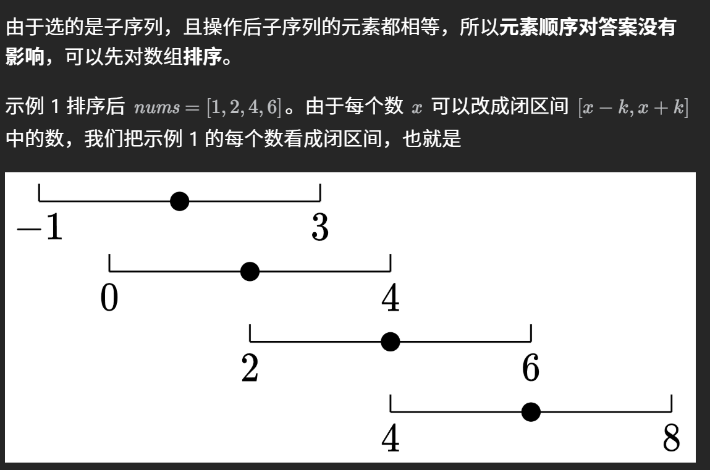
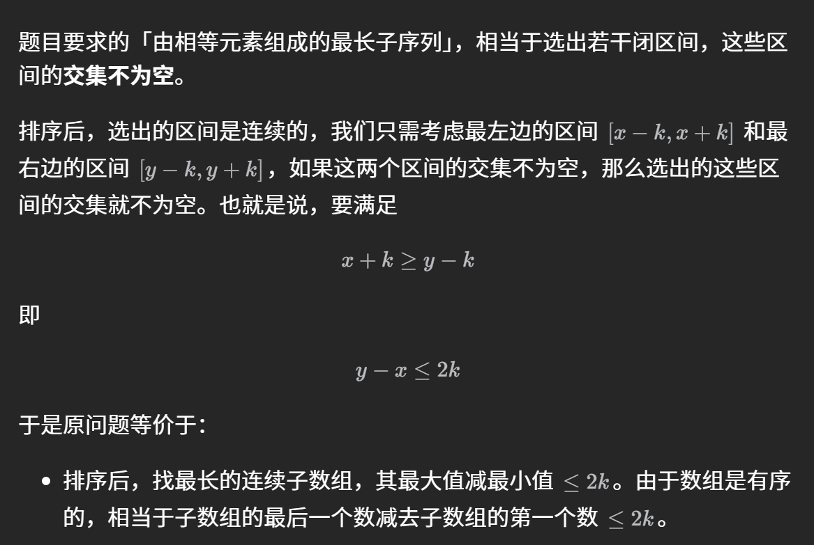

## 滑动窗口 
[题单](https://leetcode.cn/discuss/post/3578981/ti-dan-hua-dong-chuang-kou-ding-chang-bu-rzz7/)  
前置知识：[【滑动窗口【基础算法精讲 03】】](https://www.bilibili.com/video/BV1hd4y1r7Gq?vd_source=1e683c3cb93400956a910790b98ffccb)  
### ① 定长滑动窗口
例题： [1456.定长子串中元音的最大数目](https://leetcode.cn/problems/maximum-number-of-vowels-in-a-substring-of-given-length/solutions/2809359/tao-lu-jiao-ni-jie-jue-ding-chang-hua-ch-fzfo/)  
```python
class Solution:
    def maxVowels(self, s: str, k: int) -> int:
        ans = vowel = 0
        for i, c in enumerate(s):
            # 1. 进入窗口
            if c in "aeiou":
                vowel += 1
            if i < k - 1:  # 窗口大小不足k
                continue
            # 2. 更新答案
            ans = max(ans, vowel)
            # 3. 离开窗口
            if s[i - k + 1] in "aeiou":
                vowel -= 1
        return ans
```
**步骤：**  
1.入  
2.更新答案  
3.出

### ② 不定长滑动窗口
不定长滑动窗口主要分为三类：求**最长子数组**，求**最短子数组**，以及**求子数组个数**。  
一般都是枚举右端点，然后不断向右缩小左端点（while）（最后每次循环如果符合就更新答案）**（缩小左端点的过程相当于出了）**
- #### 最长子数组和最短子数组  
模板题1：[3.无重复字符的最长子串](https://leetcode.cn/problems/longest-substring-without-repeating-characters/)  
```python
class Solution:
    def lengthOfLongestSubstring(self, s: str) -> int:
        # dic = defaultdict(int)
        # left = 0
        # ans = 0
        # for right, x in enumerate(s):
        #     dic[x] += 1
        #     while dic[x] > 1:
        #         dic[s[left]] -= 1
        #         left += 1
        #     ans = max(ans, right - left + 1)
        # return ans
        dic = defaultdict(int)
        left = 0
        ans = 0
        for right, x in enumerate(s):
            dic[x] += 1
            while dic[x] > 1:
                dic[s[left]] -= 1
                left += 1
            ans = max(ans, right - left + 1) # 每次循环都更新答案(因为上面while已经把不符合的去掉了，剩下肯定符合，要更新)
        return ans
```
模板题2：[209.长度最短的子数组](https://leetcode.cn/problems/minimum-size-subarray-sum/submissions/626513482/)  
```python
class Solution:
    def minSubArrayLen(self, target: int, nums: List[int]) -> int:
        # 时间复杂度O(n)
        # 空间复杂度O(1)
        # n = len(nums)
        # left = 0
        # ans = n + 1
        # s = 0
        # for right, x in enumerate(nums):
        #     s += x
        #     """
        #     # left <= right and ? 若left=right， 此时s=0，不可能大于等于target
        #     while s - nums[left] >= target:
        #         s -= nums[left]
        #         left += 1
        #     if s >= target:
        #         ans = min(ans, right - left + 1)
        #     单调性
        #     """
        left = 0
        ans = inf
        s = 0
        for right, x in enumerate(nums):
            s += x
            while s >= target:
                ans = min(ans, right - left + 1)
                s -= nums[left]
                left += 1
        return ans if ans < inf else 0
```
需要注意的是，如果while这里模拟发现还有可以继续缩小的情况，那么就缩小左端点，直到不能缩小为止（加另一个条件即可，如 [2904](https://leetcode.cn/problems/shortest-and-lexicographically-smallest-beautiful-string/)中的while cnt1 > k or **s[left] == '0'**:  
**转换思路题：**  
[1658.将x减小到0的最少操作次数](https://leetcode.cn/problems/minimum-operations-to-reduce-x-to-zero/)：转换成求sum-k的最长子数组  
**技巧：排序+滑动窗口**  
[2779.数组的最大美丽值](https://leetcode.cn/problems/maximum-beauty-of-an-array-after-applying-operation/description/)：[x-k  <= 数字 <= x+k]? -> 找区间的max和min，直接排序后看right - left有没有大于2k就行了  
[灵神解释](https://leetcode.cn/problems/maximum-beauty-of-an-array-after-applying-operation/solutions/2345805/pai-xu-shuang-zhi-zhen-by-endlesscheng-hbqx/)


[1234.题解 超绝正难则反](https://leetcode.cn/problems/replace-the-substring-for-balanced-string/)

- #### 子数组个数
##### ① 越长越合法滑动窗口 （至少？）
模板题：[1358.包含所有三种字符的子字符串的数目](https://leetcode.cn/problems/number-of-substrings-containing-all-three-characters/)
```python
class Solution:
    def numberOfSubstrings(self, s: str) -> int:
        ans = left = 0
        cnt = defaultdict(int)
        for c in s:
            cnt[c] += 1
            while len(cnt) == 3: # 合法的时候把他变成不合法
                out = s[left]
                cnt[out] -= 1
                if cnt[out] == 0:
                    del cnt[out]
                left += 1
            ans += left # 左边全都可以
            '''
            内层循环结束后，[left,right] 这个子数组是不满足题目要求的，但在退出循环之前的最后一轮循环，[left−1,right] 是满足题目要求的。由于子数组越长，越能满足题目要求，所以除了 [left−1,right]，还有 [left−2,right],[left−3,right],…,[0,right] 都是满足要求的。也就是说，当右端点固定在 right 时，左端点在 0,1,2,…,left−1 的所有子数组都是满足要求的，这一共有 left 个。
            '''
        return ans
```
**思考题:** [3298.统计重新排列后包含另一个字符串的子字符串数目](https://leetcode.cn/problems/count-substrings-that-can-be-rearranged-to-contain-a-string-ii/description/)  （同[76](https://leetcode.cn/problems/minimum-window-substring/description/)题）  
**why说思考题呢?**   
是有先告诉你用滑窗做，但是直接写不会有提示的，题目要求用线性复杂度写，所以这一道题肯定不可能用排序 -> **转换** 只要遍历看看是否有包括word2的子串，同时发现是越长越合法的滑窗。
##### ② 越短越合法滑动窗口 （至多？）
模板题：[713.乘积小于k的子数组](https://leetcode.cn/problems/subarray-product-less-than-k/solutions/1959538/xia-biao-zong-suan-cuo-qing-kan-zhe-by-e-jebq/)
```python
class Solution:
    def numSubarrayProductLessThanK(self, nums: List[int], k: int) -> int:
        if k <= 1:
            return 0
        ans = 0
        prod = 1
        left = 0
        for right, x in enumerate(nums):
            prod *= x
            while prod >= k:
                prod /= nums[left]
                left += 1
            ans += right - left + 1
            '''
            内层循环结束后，[left,right] 这个子数组是满足题目要求的。由于子数组越短，越能满足题目要求，所以除了 [left,right]，还有 [left+1,right],[left+2,right],…,[right,right] 都是满足要求的。也就是说，当右端点固定在 right 时，左端点在 left,left+1,left+2,…,right 的所有子数组都是满足要求的，这一共有 right−left+1 个。
            '''
        return ans
```
